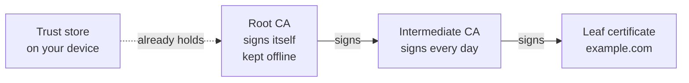

# How do signatures and certificates prove who you are?

## Introduction.

A server gets a connection from something that says it is device 0001. Why would the server believe that? And when somebody hands you a certificate, how can you tell who signed it? Both answers are in this note, and both start from the bytes.

Three ideas carry the whole note:

- A **signature** is a number. Only the owner of a private key can make it, for one exact piece of data. Anyone with the public key can check it.
- A **certificate** is a signed statement: "this public key belongs to this name". Whoever signs such statements is called a **CA**, short for Certificate Authority.
- **Identity** needs both. From the certificate you learn whose key it is. From a new signature, made at this very moment, you learn that the other side really holds that key.

Neither one is enough without the other. Certificates are public, which means anybody can copy one and show it to you. A signature, for its part, has no name written in it.

Read [RSA keys](what_is_an_rsa_key.md) first. This note uses `n`, `e` and `d` from there.

The commands are from OpenSSL 3, and each output is a real run. Your own run prints different keys and hashes.

## What is a signature?

Say you have some data and an RSA key, and you want to sign. Most certificates are signed with a method called PKCS#1 v1.5, so that is the one to follow here.

1. **Hash the data.** SHA-256 turns any data into 32 bytes. Change one bit of the data and the 32 bytes change completely.
2. **Pad the hash.** Build a block as long as the modulus: 256 bytes for RSA-2048. The block holds `00 01`, then many `FF` bytes, then `00`, then 19 fixed bytes that mean "SHA-256", then the hash.
3. **Use the private key.** Raise the block to `d`, modulo `n`: `s = blockᵈ mod n`. Those 256 bytes of `s` are the signature.

Checking is the other half, and everything it needs is public:

1. Compute `sᵉ mod n` with the public key. The right key gives you the block back. Any other key gives you bytes that look random.
2. Look at the padding. If it is right, the last 32 bytes of the block are the hash that the signer computed.
3. Hash the data on your side as well, and put the two hashes next to each other.

When the two hashes are equal, you have learned two things at once. Nobody touched the data after the signer hashed it. And the signer really had `d`.

Can someone make a signature without `d`? They have to find an `s` that gives the right block in step 1. That is as hard as breaking the key.

There is one more name you will meet: **PSS**. It is a second way to pad, with random bytes. Sign the same data twice with PSS and you get two different signatures. You meet both paddings in practice. In TLS 1.3, the signatures that the handshake makes must be PSS. The certificates are another matter: most of them are still signed with PKCS#1 v1.5.

## "Signing a CSR" means two signatures.

**CSR** stands for Certificate Signing Request. It is the file that goes to the CA when you want a certificate. People say "sign a CSR" for two different things, because two signatures happen around it:

| | Who signs | With which key | Over what | What it proves |
|---|---|---|---|---|
| the **CSR** | you, the requester | your own private key | your name and your public key | you hold the private key that matches the public key you sent |
| the **certificate** | the CA | the private key of the CA | your name and your key, plus dates and rules | the CA confirms that this key belongs to this name |

Here are both, one after the other.

### First, you sign your own CSR.

Do this part on the machine where the key is going to live, and nowhere else. First comes the key pair, and then the request that you build from it:

```bash
openssl genpkey -algorithm RSA -pkeyopt rsa_keygen_bits:2048 -out dev.key
openssl req -new -key dev.key -subj "/CN=device-0001" -out dev.csr
```

So what is in that file? Ask `openssl req -in dev.csr -noout -text` and it prints four things. You get the name `CN=device-0001` and the public key. You also get the algorithm, `sha256WithRSAEncryption`, and a signature at the end. The whole CSR is 607 bytes of DER. You could publish it, because none of it is secret.

Your private key made that signature, and your public key is inside the CSR. So anyone can check the CSR with the CSR alone:

```bash
openssl req -in dev.csr -noout -verify
```

```
Certificate request self-signature verify OK
```

What does that prove? Two things. Whoever made the CSR has `dev.key`, and the CSR is still the way they made it. What about the name? Nothing here proves it. A stranger can make a key in a second and type your name into a CSR.

### Then the CA signs your certificate.

The CA does four things:

1. It checks the signature of the CSR.
2. It checks that you have a right to the name. The CSR cannot prove that, so the CA uses another way.
3. It writes the part to sign, called the **TBS**, for "to be signed".
4. It signs the TBS with the private key of the CA, and puts the signature at the end.

About step 2: a public CA asks you to publish a token on your domain. A factory CA trusts the test station that sends the request.

About step 3: the TBS holds everything the certificate says.

- a serial number
- the **issuer**: the name of the CA
- the dates when the certificate starts and ends
- the **subject**: your name
- your public key, copied from the CSR
- the **extensions**: what the key is allowed to do, and if this certificate can sign other certificates

Every field is the decision of the CA. What you sent was a request, so the CA is free to ignore parts of it.

```bash
openssl x509 -req -in dev.csr -CA ca.pem -CAkey ca.key -days 365 -out dev.pem
```

```
Certificate request self-signature ok
subject=CN=device-0001
```

And `dev.key`? It stayed on your machine the whole time. The only key the CA ever saw was the public one inside the CSR, and that is the key it copied into the certificate.

A certificate, any certificate, has three parts in a row. The TBS comes first, the algorithm second and the signature last. Run `openssl asn1parse -in dev.pem` and look for the lines marked `d=1`:

```
    0:d=0  hl=4 l= 768 cons: SEQUENCE
    4:d=1  hl=4 l= 488 cons: SEQUENCE
  496:d=1  hl=2 l=  13 cons: SEQUENCE
  498:d=2  hl=2 l=   9 prim: OBJECT            :sha256WithRSAEncryption
  511:d=1  hl=4 l= 257 prim: BIT STRING
```

- The 488 bytes at offset 4 are the TBS, which means they are the bytes that the CA signed.
- The algorithm follows at offset 496.
- The last 257 bytes, from offset 511, hold the signature. BIT STRING puts one byte of its own in front, and the 256 bytes after it are `s`.

## So who signed this certificate?

A certificate names its signer in two fields:

- The **issuer** is the name of the CA.
- The **Authority Key Identifier** is a fingerprint of the public key of the CA. The certificate of the CA has the same value in its **Subject Key Identifier**.

```bash
openssl x509 -in dev.pem -noout -issuer -ext authorityKeyIdentifier
openssl x509 -in ca.pem -noout -subject -ext subjectKeyIdentifier
```

```
issuer=CN=Example Root CA
X509v3 Authority Key Identifier: 
    D4:AE:C0:C0:30:E6:A0:F6:5E:AA:D5:F2:E0:DF:1C:26:BD:25:F9:6C
subject=CN=Example Root CA
X509v3 Subject Key Identifier: 
    D4:AE:C0:C0:30:E6:A0:F6:5E:AA:D5:F2:E0:DF:1C:26:BD:25:F9:6C
```

Be careful here. These two fields prove nothing, because anyone can write any issuer name into a certificate. The fields only tell you which public key to try. The proof is the signature.

The fast way to check it is one command:

```bash
openssl verify -CAfile ca.pem dev.pem
```

```
dev.pem: OK
```

Now the slow way, so you see every step. You undo the signature with the public key of the CA. You hash the TBS yourself. Then you compare.

```bash
# 1. the public key of the CA
openssl x509 -in ca.pem -noout -pubkey > ca.pub
# 2. the signed part: the SEQUENCE at offset 4
openssl asn1parse -in dev.pem -strparse 4 -noout -out tbs.der
# 3. the signature: with an RSA-2048 CA, the last 256 bytes of the certificate
openssl x509 -in dev.pem -outform DER | tail -c 256 > sig.bin
# 4. s^e mod n, with the padding still there
openssl pkeyutl -verifyrecover -pubin -inkey ca.pub -in sig.bin -pkeyopt rsa_padding_mode:none | xxd
# 5. the hash of the signed part
openssl dgst -sha256 tbs.der
```

```
00000000: 0001 ffff ffff ffff ffff ffff ffff ffff  ................
...
000000c0: ffff ffff ffff ffff ffff ffff 0030 3130  .............010
000000d0: 0d06 0960 8648 0165 0304 0201 0500 0420  ...`.H.e....... 
000000e0: 2685 3ef3 196f 8a82 8bc0 9ec1 8f06 d751  &.>..o.........Q
000000f0: 5b4f d20b d8aa 9884 de48 e29d afef 6a4c  [O.......H....jL
SHA2-256(tbs.der)= 26853ef3196f8a828bc09ec18f06d7515b4fd20bd8aa9884de48e29dafef6a4c
```

Read the output from the top:

- `00 01`, then 202 bytes of `FF`, then `00`: the padding.
- From `3031` to `0420`: the 19 bytes that mean "SHA-256".
- The last 32 bytes, from `2685` to `6a4c`: a hash.

Now compare that hash with the last line, the SHA-256 of the TBS. They are the same.

That is the whole proof. The public key of the CA turned the signature into a correct block. So the private key of the CA made that signature, over exactly those bytes.

Do you want to see it fail? Make the public key of the device with `openssl pkey -in dev.key -pubout -out dev.pub`. Run command 4 with `dev.pub` in place of `ca.pub`. The first line comes out as `3ed6 dd80 6ef2 8517…`. There is no padding and no hash in it, so the check fails.

### Up a chain.

On the internet, the certificate of a server usually has two certificates above it:



- The **leaf** is the certificate of the server.
- An **intermediate CA** signed the leaf.
- A **root CA** signed the intermediate. The root also signed its own certificate.

You check each link the same way as above. You stop when you reach a certificate that is in your **trust store**. The trust store is the list of root certificates that came with your operating system, your browser or your firmware. It never comes over the network.

What about the signature on the root itself? The root made it, so it proves nothing at all. A root is trusted for a single reason, which is that your trust store has it. Everywhere else in the chain you check. Here, and only here, you trust.

How do you check a chain with OpenSSL? The command gets one more option: `openssl verify -CAfile root.pem -untrusted intermediate.pem leaf.pem`. The file after `-CAfile` plays the trust store. The file after `-untrusted` gets checked like any other certificate, and OpenSSL trusts it only if the check passes.

The intermediate looks like an extra step, and it has a good reason. With it, the private key of the root can stay offline, and it is normally kept inside an **HSM**. An HSM is a hardware box that signs for you and never lets the key out. And when an intermediate key gets stolen? The CA cancels that one intermediate and issues another. Your trust store does not change at all.

A good signature is not enough. Each certificate in the chain must pass four more checks:

- **The dates.** The current time is between `notBefore` and `notAfter`.
- **The right to sign.** A certificate that signs other certificates must say `CA:TRUE`. Without this check, anyone with a leaf could sign new certificates.
- **The key usage.** Each certificate lists the jobs that its key may do. Signing certificates is one job, proving a server is another, and proving a client is a third. The job in front of you has to be on that list.
- **The name.** The name in the leaf is the name you wanted to reach. For a website, that is the Subject Alternative Name.

There is a fifth check, called **revocation**. A CA can cancel a certificate before its end date. The CA publishes a list, or it answers a live query. Not every verifier makes this check.

## Identity: a certificate plus a fresh signature.

Here is the part that surprises people. A certificate is public. Every server sends its certificate to every client. So you can save any certificate and show it to someone later. Having a certificate proves nothing about you.

What proves identity is a short exchange, called **challenge–response**:

1. The verifier sends a new random number. This is the challenge.
2. You sign the challenge with your private key.
3. The verifier checks your signature with the public key in your certificate. The verifier also checks your certificate up to its trust store.

After those three steps, the verifier knows three things:

| The verifier knows that… | because… |
|---|---|
| the public key belongs to your name | the chain of your certificate ends in its trust store |
| you hold the private key that matches | you signed the challenge |
| you are there right now, and you are not a recording | the challenge is new, so no earlier signature fits it |

Once you know these three steps, you start to see them in many places:

- **TLS.** The message `CertificateVerify` is the signed challenge. The server signs a hash of all the handshake messages before it. Those messages contain a new random number from the client. In mutual TLS, the client signs too. See [TLS](how_does_tls_work.md).
- **SSH login with a key.** Here the challenge is data that contains the identifier of the session, and the client signs it. The server keeps a file, `authorized_keys`, with the public keys that may log in. If the signature matches one of those keys, the login succeeds. No chain is needed, because that file does the job of the chain.
- **The factory identity of a device.** The device makes its key inside its own chip, and the CA of the maker signs its CSR. In every connection, the device signs the challenge with that key. Nobody can read the key out of the chip, and that includes the maker.

## What breaks identity.

| If… | then… |
|---|---|
| your private key leaks | anyone can sign as you, until the certificate ends or the CA revokes it |
| a CA signs for the wrong requester | the certificate is genuine and wrong, and every verifier that trusts that CA accepts it |
| a trust store holds a root that it must not hold | the verifier accepts every certificate under that root |
| a verifier skips the name check | a valid certificate for any other name passes |
| the challenge is predictable, or the verifier repeats it | an attacker can send an earlier signature again |

The first row is why you make a key where it lives, and keep it in hardware when you can.

## Easy to get wrong.

- **"The CA makes my private key."** No. You are the one who makes the key pair, on your own machine, and the private half never reaches the CA. What the CA signs is your public key and your name.
- **"A valid CSR proves who sent it."** It proves that the sender has the private key. It proves nothing about the name.
- **"The issuer field proves who signed."** The issuer field is only text. The signature is the proof.
- **"Someone who has my certificate can pretend to be me."** They cannot. They need your private key to sign the challenge.
- **"A valid chain is enough."** Check the name too. Without the name check, a valid certificate for any other name passes.

## Related.

- [RSA keys](what_is_an_rsa_key.md) — the numbers `n`, `e` and `d`, and what a key file holds
- [TLS](how_does_tls_work.md) — a certificate and a fresh signature inside one handshake, plus a shared secret
