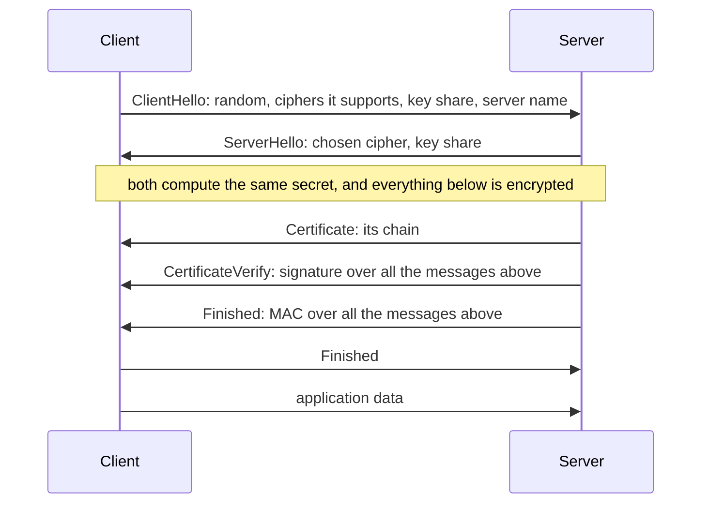

# How does TLS work?

## Introduction.

You type `https://` and your data crosses many machines that you do not control. Any of them can read the bytes, and any of them can change the bytes. TLS is the protocol that makes this safe. It is the S in `https`.

TLS gives you two things:

- **Secrecy.** Only the other side can read what you send.
- **Identity.** The other side is who it claims to be.

It gets them from three parts:

- A **key pair** for each identity. See [RSA keys](what_is_an_rsa_key.md).
- A **certificate** that ties the public key to a name, and a new **signature** that proves the other side has the private key. See [Signatures and identity](how_do_signatures_prove_identity.md).
- A **key agreement**. Both sides compute the same secret from values that they send in the open. The secret itself never travels.

All of this happens in the **handshake**, the first exchange of a connection. It takes one round trip. After the handshake, symmetric keys made from the secret encrypt every byte.

This note is the last of three. It is easier after the two notes linked above.

## Why two kinds of key?

Ciphers come in two kinds, and each kind has one big problem.

With a **symmetric** cipher, such as AES or ChaCha20, there is a single key, and it does both jobs. Whoever encrypts with it can also decrypt with it. Speed is not the problem, because these ciphers are very fast. The problem is how the two sides get the same key in the first place. All they have is a network that neither of them trusts.

An **asymmetric** scheme, such as RSA or elliptic curves, works with two keys. You can hand the public key to the whole world while the private key stays with you. That takes care of the first problem and brings a new one, which is speed. For large amounts of data it is far too slow.

So TLS uses both. The asymmetric keys work for a few milliseconds at the start. They prove who is who, and they help the two sides agree on a secret. Then a symmetric cipher takes over for all the data.

## The handshake in TLS 1.3.

The diagram shows the whole exchange, without a few small messages that add nothing to the idea. Read it from the top, because the order is what matters.

It starts with the two hellos. Your side sends a random number and something called a **key share**. The server answers with a random number and a key share of its own. At this point, take a key share to be the public half of a new Diffie–Hellman pair; the next section is all about it. What you need to know here is the effect. As soon as the two hellos have crossed, both sides hold the same secret, and from that moment nothing travels unencrypted. Even the certificate of the server goes encrypted.

That certificate is the next thing to arrive, and it comes with its whole chain. Your side does with it what [Up a chain](how_do_signatures_prove_identity.md#up-a-chain) describes. It goes up one link at a time and stops at a root that its own trust store has.

A good chain is still not proof that the server owns the certificate, because copying a certificate is easy. The proof is the message after it, `CertificateVerify`. To build it, the server hashes every message of the handshake up to that point and signs the hash with its private key. This is the [challenge–response](how_do_signatures_prove_identity.md#identity-a-certificate-plus-a-fresh-signature) from the other note, and it solves two problems at once. An old signature cannot be sent again, because your random number is in the hashed messages and it is new every time. And nobody in the middle can replace a key share with their own, because the key shares are in the hashed messages too.

The handshake ends with `Finished`, once from each side. A `Finished` message carries a **MAC** of all the handshake messages, and a MAC is a hash that takes a key to compute. Which key? One that both sides derive from the shared secret. Now imagine that someone changed a single byte of the handshake while it travelled. The client and the server would compute different MACs, notice it, and drop the connection before sending any data.

Sometimes the server wants proof too. That variant is called **mutual TLS**, and the only difference is one extra message, `CertificateRequest`, from the server. The client answers it with its own chain and its own `CertificateVerify`. A device that has to prove who it is to a server does exactly this.

## The secret that nobody sends.

This is the part that looks impossible. Two sides talk in public, and at the end they share a secret that no listener has. The method is called **Diffie–Hellman**. Here it is with small numbers.

Both sides agree on two public numbers: a prime `p = 23` and a base `g = 5`.

| | Client | What travels | Server |
|---|---|---|---|
| picks a secret number | `a = 6` | nothing | `b = 15` |
| sends | `A = gᵃ mod p = 8` | `8` one way, `19` the other way | `B = gᵇ mod p = 19` |
| computes | `Bᵃ mod p = 2` | nothing | `Aᵇ mod p = 2` |

Both sides end up with `2`, and that is not luck. You can raise `g` to `b` first and to `a` second, or the other way round, and you get the same number.

Now think about what a listener gets. All that went past was `23`, `5`, `8` and `19`. The secret needs `a` or `b`, and neither of them ever went past. Could the listener work `a` out from `gᵃ mod p`? Mathematicians call that the **discrete logarithm** problem. For toy numbers like these you solve it by trying every `a`, and there are only 22 to try. For the numbers that TLS uses, nobody has found a method that finishes in a reasonable time. In the classic form of Diffie–Hellman, `p` has 2048 bits. Most connections use a curve instead, a 256-bit one called X25519.

That is the whole method: two sides compute the same secret, each on its own machine, and the secret never has to travel.

The same method helps a second time, years later. Suppose somebody recorded your connection, kept the recording, and one day stole the private key of the server. Can they read the recording now? No, and it is worth seeing why. The stolen key is a signing key. It put a signature on the handshake and did nothing else, so it never touched the secret. What made the secret was `a` and `b`, and those two numbers existed only as long as the handshake did. Every connection gets a new pair. People call this property **forward secrecy**.

TLS did not always work this way. In earlier versions there was a mode where the client took the secret and encrypted it with the RSA public key of the server. With that mode, one stolen private key was enough to open every connection that somebody had recorded. TLS 1.3 left that mode out.

## From the secret to encrypted data.

You might expect the two sides to use the shared secret as their key. They do not, at least not directly. First they put it into **HKDF**, together with a hash of the handshake messages. HKDF is a function whose whole job is to turn one secret into as many keys as you need. Out of it come two sets of keys, one for each direction of the connection. And since both sides put in the same values, both sides get the same keys out.

After that, the real traffic can start. TLS does not send your data as one long stream. It cuts it into pieces first. A piece is called a **record**, it is never bigger than 16 KB, and it gets its own protection. For that protection TLS uses a kind of cipher known as **AEAD**. If you look at a real connection, the name you find is AES-GCM or ChaCha20-Poly1305. An AEAD cipher does two things to a record:

- it encrypts the record, so nobody on the way can read it;
- it adds a tag of 16 bytes, and the right tag can only be computed with the key.

If someone changes a record on the way, the tag is wrong and the connection closes. Each record also has a sequence number mixed into its encryption. So a record that someone repeats, removes or moves fails the same check.

## What stops each attack.

| An attacker on the network tries to… | What stops it |
|---|---|
| read the data | the session keys come from a secret that never travelled |
| change a byte | the AEAD tag on every record, and the two Finished MACs in the handshake |
| pretend to be the server | it needs a certificate for that name from a trusted CA, and a CertificateVerify that only the private key can make |
| replace the key shares | CertificateVerify signs all the messages, and the key shares are in them |
| record now and steal the private key of the server later | that key never encrypted anything, and `a` and `b` do not exist after the handshake |

One warning before the end: TLS does not hide everything. Somebody who watches the network still sees which two IP addresses are talking, and the `ClientHello` shows the name of the server. The same person can also see at what time you talk and how much data goes each way.

## Easy to get wrong.

- **"The RSA key of the server encrypts my data."** Not in TLS 1.3. All that key does is sign the handshake, and the data is encrypted with symmetric keys.
- **"The secret travels encrypted."** The secret never travels at all. Each side computes it.
- **"The client checks the certificate once and keeps it."** There is a new handshake for every connection, and in each one the server has to sign again.
- **"`https://` means the site is safe."** What it means is narrower. You are talking to the owner of that name, and nobody reads the data on the way. What the owner does with your data is a different question.
- **"TLS hides which site I visit."** Sadly not. Your side sends the `ClientHello` before there is any key to encrypt with, and the name of the server is right there in it.

## Related.

- [RSA keys](what_is_an_rsa_key.md) — what a key pair is, and how two primes make one
- [Signatures and identity](how_do_signatures_prove_identity.md) — CSRs, certificates, how to check who signed, and the challenge–response
