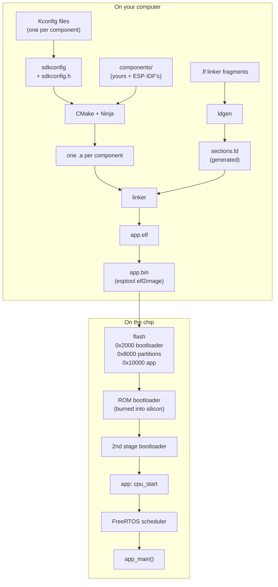
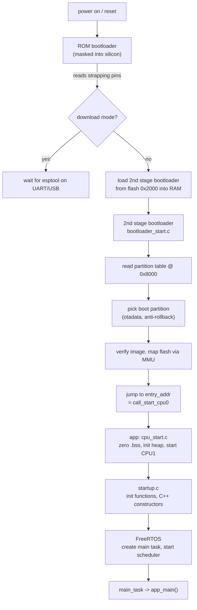

# How does ESP-IDF work?

In [How does an MCU get to `main()`?](how_does_an_mcu_boot.md) we booted an STM32 with three files we wrote ourselves: a vector table, a `Reset_Handler` that copied `.data` and zeroed `.bss`, and a linker script that said where everything lives. Nothing was hidden, because nothing was there that we hadn't typed.

Now open an ESP32 project and every one of those pieces is gone. There's no vector table in sight. There's no linker script in the project. Your entry point isn't `main`, it's `app_main` — and *nobody calls it* from any code you can see. You type `idf.py build`, a thousand files compile, and something works.

This note is about what those thousand files are doing. We'll build a real project, then take it apart: where components come from, how a setting in a menu becomes a `#define`, who writes the linker script, why your code runs from flash instead of RAM, and what actually happens between power-on and the first line of `app_main`.

## Introduction.

**ESP-IDF** stands for **Espressif IoT Development Framework**: the official C framework for their chips, as opposed to Arduino-ESP32 or MicroPython. The abbreviation turns up everywhere once you start looking — `$IDF_PATH` is where it is installed, `idf.py` is its command-line tool, `CONFIG_IDF_TARGET` is the chip you are building for.

And the first thing worth saying about it is that it is not one thing. It's four things that ship in one folder, and most confusion comes from mixing them up:

- **A build system.** CMake and Ninja, wrapped in a set of rules where the unit of code is a *component*.
- **A configuration system.** Kconfig — the same one the Linux kernel uses — which turns a menu of options into a `sdkconfig` file and a generated C header.
- **A pile of libraries.** 141 components in v6.0.2: FreeRTOS, drivers, WiFi, TCP/IP, a C library, the bootloader.
- **A pile of host tools.** `idf.py`, `esptool`, the partition table generator, the linker script generator, the component manager.

Everything below is one of those four wearing a costume.

I'll target an **ESP32-P4** on **ESP-IDF v6.0.2**, and every command, address, and log line in this note is copy-pasted from a real build running on a real board. Three facts about this target, because they shape everything else:

- It's **RISC-V**, so the toolchain is `riscv32-esp-elf-gcc`. (Older ESP32 and ESP32-S3 are Xtensa, `xtensa-esp32-elf-gcc`. Same ideas, different opcodes — see [How does a machine know C?](../programming/c-cpp/how_does_a_machine_know_c.md).)
- It has **two CPU cores**, which is why the startup code keeps talking about "CPU0" and "CPU1".
- Its **code lives in flash and is executed from there**, through a memory-management unit and a cache. This is the single biggest difference from the STM32 note, and half of this note is downstream of it.

Here's the shape of the whole thing:


## The example project.

Here's what we're building. It's small, but it has one of everything:

```
esp_idf_how_does_it_work/
|- CMakeLists.txt          the project
|- sdkconfig.defaults      our defaults, overriding ESP-IDF's own
|- partitions.csv          how flash is divided up
|- main/
|   |- CMakeLists.txt      registers the main component
|   |- main.c              app_main()
|- components/my_led/
    |- CMakeLists.txt      registers our own component
    |- Kconfig             adds options to the config menu
    |- linker.lf           tells the linker where to put one function
    |- include/my_led.h
    |- my_led.c
```

The root `CMakeLists.txt` is three lines, and their **order matters more than it looks**:

```cmake
cmake_minimum_required(VERSION 3.22)

include($ENV{IDF_PATH}/tools/cmake/project.cmake)

project(idf_tour)
```

That `include` does something sneaky. Deep inside [`tools/cmake/project.cmake`](https://github.com/espressif/esp-idf/blob/v6.0.2/tools/cmake/project.cmake) there's this:

```cmake
macro(project project_name)
    # ... a few hundred lines of ESP-IDF setup ...
    idf_build_process(${IDF_TARGET} ...)
    # ... and only then ...
    __project(${project_name} C CXX ASM)
endmacro()
```

CMake already has a command called `project()`. ESP-IDF **redefines it**, and the comment right above it in the source says so plainly:

```cmake
# Trick to temporarily redefine project(). When functions are overridden in CMake,
# the originals can still be accessed using an underscore prefixed function of the
# same name. The following lines make sure that __project calls the original project().
```

That's the whole mechanism: override a command in CMake and the original is still reachable under an underscore-prefixed name. So the real `project()` becomes `__project()`, and ESP-IDF's macro takes over the name you type.

So the last line of your `CMakeLists.txt` is not CMake's `project()`. It's ESP-IDF's, which scans for components, runs Kconfig, generates linker scripts, and *then* calls the real one. That's why `include()` must come first: put `project()` above it and you get a plain CMake project with no ESP-IDF in it at all.

Now, `main.c`. I've kept the two probes from the STM32 note, because they ask the same question in a new place:

```c
volatile uint32_t counter = 7;   /* initialized  -> lands in .data */
volatile uint32_t flag;          /* zero-init    -> lands in .bss  */

void app_main(void)
{
    ESP_LOGI(TAG, "counter = %" PRIu32 " (.data, expected 7)", counter);
    ESP_LOGI(TAG, "flag    = %" PRIu32 " (.bss,  expected 0)", flag);
    /* ... */
}
```

C promises that `counter` reads as `7` and `flag` reads as `0` by the time `app_main` runs. Silicon promises nothing of the sort: RAM is noise at power-on. So *something* has to copy that `7` out of flash into `counter`'s RAM address, and *something* has to write that `0` into `flag`'s.

On the STM32 that something was us — the copy loop and the zero loop we typed into `Reset_Handler`. Delete them and these two lines print garbage. This project has no `Reset_Handler`, no copy loop and no zero loop; nothing we wrote touches either variable before the log call reads it.

They print `7` and `0` anyway. So code we never wrote runs before `app_main` — and tracking down [who writes each value, and where that code lives](#booting-for-real), is most of what the rest of this note is about.

## What is a component?

A component is a folder with a `CMakeLists.txt` that calls `idf_component_register`. That's the entire definition. Here's ours:

```cmake
idf_component_register(SRCS "my_led.c"
                       INCLUDE_DIRS "include"
                       REQUIRES esp_driver_gpio
                       PRIV_REQUIRES log
                       LDFRAGMENTS "linker.lf")
```

Each component becomes **one static library** — this one becomes `libmy_led.a` — and the arguments say how it connects to the others:

- **`SRCS`** — the files compiled into the library.
- **`INCLUDE_DIRS`** — the *public* include path. Anything that depends on us gets `-I components/my_led/include` automatically. This is why you write `#include "my_led.h"` and never a relative path.
- **`REQUIRES`** — public dependencies. Our public header declares `gpio_num_t my_led_pin(void)`, so `my_led.h` itself has to `#include "driver/gpio.h"` — and so does anyone who includes *our* header, or their compile fails on a type they've never heard of. Public dependencies are contagious: they propagate to whoever depends on us.
- **`PRIV_REQUIRES`** — private dependencies. We use `esp_log.h` inside `my_led.c` only; it never appears in `my_led.h`. Nobody who uses us needs to know. Private dependencies stop at our boundary.
- **`LDFRAGMENTS`** — a linker fragment file, which we'll get to in [Linking](#linking-where-does-the-linker-script-come-from).

The `REQUIRES`/`PRIV_REQUIRES` split is exactly CMake's `target_link_libraries(PUBLIC ...)` versus `(PRIVATE ...)`, and the test for which list a component goes in is mechanical: **open your public header.** If another component's headers are reachable from it, that component is public. If it only ever appears in your `.c`, it's private.

The thing that trips people up is that this is not about whose code ends up in the binary. `esp_log` is linked into the image either way — `libmy_led.a` calls its functions and the linker pulls them in regardless of which list it's in. The only thing the split controls is **whose include path gets widened**. `main.c` can write `gpio_num_t` without ever naming `esp_driver_gpio`, and cannot write `esp_log.h` even though `esp_log`'s code is right there in the same binary.

It exists to keep include paths from becoming a free-for-all. **Nothing is on your include path unless a component asked for it.**

You find this out the first time you forget. While writing the example I added `#include "esp_app_desc.h"` to `main.c` without touching `main/CMakeLists.txt`, and the build stopped with:

```
main.c:18:10: fatal error: esp_app_desc.h: No such file or directory

Compilation failed because main.c (in "main" component) includes esp_app_desc.h,
provided by esp_app_format component(s).
However, esp_app_format component(s) is not in the requirements list of "main".
To fix this, add esp_app_format to PRIV_REQUIRES list of idf_component_register
call in .../main/CMakeLists.txt.
```

That is not a generic "file not found". The build system knows which component owns every header in the tree, so it can name the file, name the component that provides it, and name the line you need to edit. It's worth reading that message closely once, because it tells you the mental model: *components are the unit of dependency, and headers belong to components.*

### Where components come from.

Four places, searched in this order:

1. `$IDF_PATH/components/` — the 141 that ship with ESP-IDF.
2. Your project's `components/` folder — `my_led` lives here.
3. Anything in the `EXTRA_COMPONENT_DIRS` CMake variable.
4. `managed_components/` — downloaded by the component manager from the [ESP Component Registry](https://components.espressif.com) when a component declares them in an `idf_component.yml`.

**`main` is component number five, and it's special**: it's always included, it implicitly depends on everything (so beginners don't have to think about `REQUIRES`), and it's where `app_main` is expected to live. That implicit-everything rule is also why a `hello_world` build compiles so much — you can turn it off with `idf_build_set_property(MINIMAL_BUILD ON)`.

We can ask the build what it decided. Every build writes `build/project_description.json`, and reading the dependency fields back gives:

```
target        : esp32p4
toolchain     : riscv32-esp-elf-
components    : 137
  main             reqs=['my_led']          priv_reqs=['esp_app_format', 'app_update', 'esp_partition']
  my_led           reqs=['esp_driver_gpio'] priv_reqs=['log']
  esp_driver_gpio  reqs=['esp_hal_gpio']    priv_reqs=['esp_pm']
  esp_hal_gpio     reqs=['soc', 'hal']      priv_reqs=[]
  soc              reqs=[]                  priv_reqs=[]
```

137 components for a program that blinks an LED. But look at the right-hand column, top to bottom: `main` → `my_led` → `esp_driver_gpio` → `esp_hal_gpio` → `soc` → nothing. That chain isn't arbitrary. It's a deliberate layer cake, and it's worth one section.

### The layer cake.

Our `my_led.c` calls `gpio_set_level(27, 1)`. Follow it down:

**Layer 1 — the driver** ([`components/esp_driver_gpio/src/gpio.c`](https://github.com/espressif/esp-idf/blob/v6.0.2/components/esp_driver_gpio/src/gpio.c)). This is the API you call. It knows about the operating system: it validates arguments, returns `esp_err_t`, and can take locks.

```c
esp_err_t gpio_set_level(gpio_num_t gpio_num, uint32_t level)
{
    GPIO_CHECK(GPIO_IS_VALID_OUTPUT_GPIO(gpio_num), "GPIO output gpio_num error", ESP_ERR_INVALID_ARG);
    gpio_hal_set_level(gpio_context.gpio_hal, gpio_num, level);
    return ESP_OK;
}
```

**Layer 2 — the HAL**, and under it the **LL** ("low level") layer ([`components/esp_hal_gpio/esp32p4/include/hal/gpio_ll.h`](https://github.com/espressif/esp-idf/blob/v6.0.2/components/esp_hal_gpio/esp32p4/include/hal/gpio_ll.h)). No OS, no error codes, no locks. Just registers. This is the bottom:

```c
static inline void gpio_ll_set_level(gpio_dev_t *hw, uint32_t gpio_num, uint32_t level)
{
    if (level) {
        if (gpio_num < 32) {
            hw->out_w1ts.val = 1 << gpio_num;      /* write-1-to-set   */
        } else {
            hw->out1_w1ts.val = 1 << (gpio_num - 32);
        }
    } else {
        if (gpio_num < 32) {
            hw->out_w1tc.val = 1 << gpio_num;      /* write-1-to-clear */
        } else {
            hw->out1_w1tc.val = 1 << (gpio_num - 32);
        }
    }
}
```

**Layer 3 — `soc`**, which is where `gpio_dev_t` and the address of the GPIO block are defined. It contains no code at all: it's pure description of the silicon, generated from the chip's register spec.

So `gpio_set_level(27, 1)` bottoms out at `GPIO.out_w1ts.val = 1 << 27` — a single store to a hardware register. `w1ts` means *write 1 to set*: writing a `1` bit turns that pin on and writing `0` does nothing, so you never have to read-modify-write, and two tasks setting different pins can't clobber each other. That's a hardware feature, and the reason this layer needs no locks.

The reason for the layering is portability. `esp_driver_gpio` is written once and works on every chip; `esp_hal_gpio/esp32p4/`, `esp_hal_gpio/esp32c6/`, and so on hold the per-chip differences. When you see `esp_hal_*` and `esp_driver_*` as separate components, that's ESP-IDF 6 splitting what used to be one `hal` and one `driver` component. On v5.x the same code lives in `components/hal/` and `components/driver/`.

## Kconfig and sdkconfig.

Now the second of our four things: configuration.

Any component can drop a `Kconfig` file next to its `CMakeLists.txt`. Ours does:

```kconfig
menu "my_led"

    config MY_LED_GPIO
        int "LED GPIO number"
        range 0 56
        default 27
        help
            GPIO the LED is wired to.

    config MY_LED_ACTIVE_LOW
        bool "LED is active low"
        default n

endmenu
```

Run `idf.py menuconfig` and a "my_led" menu appears alongside ESP-IDF's own, with the range check and the help text wired up. But the menu is just an editor. What matters is what the value turns into, and it turns into **three different files**:

```
sdkconfig                     CONFIG_MY_LED_GPIO=27
build/config/sdkconfig.h      #define CONFIG_MY_LED_GPIO 27
build/config/sdkconfig.cmake  set(CONFIG_MY_LED_GPIO "27")
```

Those are real lines from the example's build. One value, three audiences: `sdkconfig` is the one you edit and commit, `sdkconfig.h` is for C code, and `sdkconfig.cmake` is so the build system itself can branch on settings.

Note the `CONFIG_` prefix — we wrote `MY_LED_GPIO` in the Kconfig file and the generator adds `CONFIG_`. Every `CONFIG_SOMETHING` you've ever seen in ESP-IDF source came from a Kconfig file this way.

Then `my_led.c` just uses it:

```c
#include "sdkconfig.h"

static const gpio_num_t s_pin = (gpio_num_t)CONFIG_MY_LED_GPIO;
```

To the compiler that line reads `static const gpio_num_t s_pin = 27;`. **The setting is baked into the machine code** — there's no lookup table and nothing to read at run time. Disassembling `my_led_set` from the built ELF shows the `27` as a literal instruction operand:

```
40014d6a <my_led_set>:
40014d6a:  addi  sp,sp,-16
40014d6e:  mv    a1,a0
40014d74:  sb    a0,-924(a5)        # s_state
40014d78:  li    a0,27              <-- CONFIG_MY_LED_GPIO
40014d7a:  jal   4000c746 <gpio_set_level>
```

`li a0,27` — "load immediate 27". Change the value in `menuconfig` and that instruction changes.

One small mystery worth clearing: `sdkconfig.h` lives in `build/config/`, which is nowhere near your source. Why does `#include "sdkconfig.h"` find it? Because of one line in [`tools/cmake/kconfig.cmake`](https://github.com/espressif/esp-idf/blob/v6.0.2/tools/cmake/kconfig.cmake):

```cmake
idf_build_set_property(INCLUDE_DIRECTORIES ${config_dir} APPEND)
```

`build/config/` gets appended to the include path of *every* component in the build. That's the whole trick. It's an ordinary `#include` of an ordinary generated file.

Two more things about config files:

- **`sdkconfig.defaults`** is the one you commit; `sdkconfig` is generated from it on first build and then edited by `menuconfig`, so `sdkconfig` normally goes in `.gitignore`. If you delete `sdkconfig`, the next build regenerates it from the defaults — which is exactly how you undo an afternoon of menu-poking.
- **`Kconfig.projbuild`** is a variant that hoists a component's menu to the *top level* of `menuconfig` instead of burying it under "Component config". The partition table menu uses it, which is why it's the first thing you see.

Here is the example's `sdkconfig.defaults` in full. It's four settings and a comment block, and every one of them shows up again somewhere later in this note:

```
# Defaults for the note's example project.
#
# sdkconfig.defaults is the *checked-in* file. sdkconfig is generated from it
# on the first build (and then edited by `idf.py menuconfig`), which is why
# sdkconfig itself is gitignored.

# Use our own partition table instead of the built-in single-app one.
CONFIG_PARTITION_TABLE_CUSTOM=y
CONFIG_PARTITION_TABLE_CUSTOM_FILENAME="partitions.csv"

# The board this was written against has 16 MB of flash.
CONFIG_ESPTOOLPY_FLASHSIZE_16MB=y

# The board is ESP32-P4 silicon revision v1.3. ESP-IDF 6 builds for rev >= v3.1
# by default, which is a different die, and esptool refuses to flash an image
# whose header asks for a revision the chip does not have. These two options
# lower the minimum written into the image header. Drop them if your P4 is v3+.
CONFIG_ESP32P4_SELECTS_REV_LESS_V3=y
CONFIG_ESP32P4_REV_MIN_100=y

# Our own component's option (declared in components/my_led/Kconfig).
# Set here so the note can follow one value all the way from this file to a
# #define in build/config/sdkconfig.h and into the compiled code.
CONFIG_MY_LED_GPIO=27
```

`CONFIG_MY_LED_GPIO=27` is the value we just followed into `sdkconfig.h`. The two `PARTITION_TABLE` lines are why `partitions.csv` is used at all. And the two `ESP32P4_*_REV_*` lines are the ones that let a v1.3 board accept the image — which only makes sense once you've seen the image header, so they come back later.

### Which file does `menuconfig` write?

Not the one you commit. `menuconfig` writes `sdkconfig`, and never touches `sdkconfig.defaults`. The arrow points one way only:

```
sdkconfig.defaults  --first build-->  sdkconfig  --generates-->  sdkconfig.h
        ^                                 ^
        |                                 |
   you, by hand                      menuconfig
```

This is worth internalizing because of how it fails. You spend an afternoon in `menuconfig`, the build finally does what you want, you commit — and you have committed nothing. `sdkconfig` is gitignored, and `sdkconfig.defaults` is exactly as it was. Someone clones the repo, builds, and gets a different configuration.

So the real loop is: poke at `menuconfig`, test, and then move the settings you care about into `sdkconfig.defaults` yourself. That last step has a tool:

```sh
idf.py save-defconfig
```

It reads the current `sdkconfig`, discards every option still sitting at its factory value, and writes a minimal `sdkconfig.defaults` with only what you actually changed — for this project, essentially the file printed above.

The reason it isn't automatic is worth a sentence. `sdkconfig` is your *working state*: it includes the `LOG_LEVEL=5` you set an hour ago to chase a bug. `sdkconfig.defaults` is your *intent*. ESP-IDF does not assume the first is the second, so `save-defconfig` is you saying so explicitly.

Config also decides what gets compiled at all. ESP-IDF source is full of this pattern — from [`components/freertos/app_startup.c`](https://github.com/espressif/esp-idf/blob/v6.0.2/components/freertos/app_startup.c):

```c
#if CONFIG_ESP_INT_WDT
    esp_int_wdt_init();
    esp_int_wdt_cpu_init();
#endif
```

Turn off the interrupt watchdog in `menuconfig` and that code is not disabled at run time — it isn't in your binary.

## What `idf.py` actually runs.

`idf.py` is a Python script ([`tools/idf.py`](https://github.com/espressif/esp-idf/blob/v6.0.2/tools/idf.py)). It compiles nothing. It's a friendly front end that runs other programs:

| You type | It runs |
|---|---|
| `idf.py set-target esp32p4` | wipes `sdkconfig`, picks `toolchain-esp32p4.cmake`, re-runs CMake |
| `idf.py menuconfig` | the `kconfgen` tool, then regenerates `sdkconfig.h` |
| `idf.py build` | CMake (if needed), then **Ninja** |
| `idf.py flash` | **esptool**, with arguments read from `build/flasher_args.json` |
| `idf.py monitor` | `esp_idf_monitor`, a serial terminal that also decodes crash dumps |
| `idf.py size` | a script that parses the `.map` file |

Everything it can do is a subcommand in [`tools/idf_py_actions/`](https://github.com/espressif/esp-idf/tree/v6.0.2/tools/idf_py_actions), and you can always run the underlying tool yourself. In fact `idf.py build` tells you how, at the end of every build:

```
Project build complete. To flash, run:
 idf.py flash
or
 python -m esptool --chip esp32p4 -b 460800 --before default-reset --after hard-reset \
   write-flash --flash-mode dio --flash-size 16MB --flash-freq 80m \
   0x2000 build/bootloader/bootloader.bin \
   0x8000 build/partition_table/partition-table.bin \
   0x10000 build/idf_tour.bin
```

Three files, at three fixed addresses. Hold on to those numbers — we'll meet all three again when the chip boots.

The other thing worth knowing is what's in `build/`, because it's all readable:

- **`idf_tour.elf`** — the linked program, with symbols and debug info.
- **`idf_tour.bin`** — the flat image actually written to flash.
- **`idf_tour.map`** — the linker's report of where every symbol went. Huge, and the ground truth when you're wondering why something is in RAM.
- **`config/sdkconfig.h`** — from the previous section.
- **`compile_commands.json`** — every compiler invocation, which is how your editor's autocomplete knows anything.
- **`project_description.json`** — the component list we read earlier.
- **`flasher_args.json`** — offsets and flash settings, so `esptool` doesn't need to be told.
- **`bootloader/`** and **`partition_table/`** — two *separate* sub-projects, built independently. The bootloader is its own program with its own `sdkconfig`-driven build; it just happens to be built for you.

And `idf.py size` reads the map file back:

```
┃ Memory Type/Section ┃ Used [bytes] ┃ Used [%] ┃ Remain [bytes] ┃ Total [bytes] ┃
┡━━━━━━━━━━━━━━━━━━━━━╇━━━━━━━━━━━━━━╇━━━━━━━━━━╇━━━━━━━━━━━━━━━━╇━━━━━━━━━━━━━━━┩
│ Flash               │       124180 │          │                │               │
│    .text            │        85484 │          │                │               │
│    .rodata          │        38168 │          │                │               │
│ DIRAM               │        68716 │    12.01 │         503652 │        572368 │
│    .text            │        52688 │     9.21 │                │               │
│    .data            │         9772 │     1.71 │                │               │
│    .bss             │         6256 │     1.09 │                │               │
└─────────────────────┴──────────────┴──────────┴────────────────┴───────────────┘
```

Notice there are **two** `.text` rows: 85,484 bytes of code in flash, and another 52,688 bytes of code sitting in RAM. On the STM32 all code was in flash and that was that. Here code is split across both, and *which* code goes where is a decision somebody made deliberately. That's the next section.

## Linking: where does the linker script come from?

In the STM32 note we wrote `linker.ld` by hand — 40 lines, one `MEMORY` block, a handful of sections. An ESP-IDF project has no linker script in it. So where does one come from?

It gets **generated, on every build**, from two kinds of input.

**Input one: templates.** [`components/esp_system/ld/esp32p4/memory.ld.in`](https://github.com/espressif/esp-idf/blob/v6.0.2/components/esp_system/ld/esp32p4/memory.ld.in) and `sections.ld.in` are ordinary linker scripts with `#if CONFIG_...` sprinkled in. They go through the C preprocessor, so your `sdkconfig` choices change the memory map itself.

**Input two: linker fragments.** Every component may ship a `.lf` file listing where its code should go. Here's the default one, [`components/esp_system/app.lf`](https://github.com/espressif/esp-idf/blob/v6.0.2/components/esp_system/app.lf), which is the rule for everything that doesn't say otherwise:

```
[scheme:default]
entries:
    if APP_BUILD_USE_FLASH_SECTIONS = y:
        text -> flash_text
        rodata -> flash_rodata
    else:
        text -> iram0_text
        rodata -> dram0_data
    data -> dram0_data
    bss -> dram0_bss
    common -> dram0_bss
    iram -> iram0_text
    iram_data -> iram0_data
    iram_bss -> iram0_bss
```

Read it as a table of "this kind of thing goes to that place". By default `text` (code) goes to `flash_text` and `bss` goes to `dram0_bss`.

A tool called **ldgen** ([`tools/ldgen/`](https://github.com/espressif/esp-idf/tree/v6.0.2/tools/ldgen)) reads the templates and every `.lf` in the build, and writes `build/esp-idf/esp_system/ld/sections.ld`. *That* is the linker script — thousands of lines, generated fresh, and the reason you never find one in your project.

### Making it do something for us.

Our component ships a four-line fragment:

```
[mapping:my_led]
archive: libmy_led.a
entries:
    my_led:my_led_toggle_fast (noflash)
```

Read as: *in the library `libmy_led.a`, in the object file `my_led.o`, take the symbol `my_led_toggle_fast` and apply the `noflash` scheme* — which means put its code in IRAM and its constants in DRAM instead of leaving them in flash.

Did it work? Search the generated script for our library and exactly two lines come back, from two different output sections:

```
 515: *libmy_led.a:my_led.*(.literal.my_led_toggle_fast .text.my_led_toggle_fast)
 989: *libmy_led.a:my_led.*(.text .text.my_led_init .text.my_led_set)
```

Line 515 sits inside the IRAM section and names **one function**. Line 989 sits inside the flash section and names **the other two**. ldgen split our single object file across two regions because our four lines told it to.

And the symbol table proves it landed (`riscv32-esp-elf-nm -n`, filtered to our own symbols):

```
4000ac3c T app_main
40014d14 T my_led_init
40014d6a T my_led_set
4ff01e78 T app_blink_isr_safe
4ff0b202 T my_led_toggle_fast
4ff0cecc D counter
4ff10c60 B flag
```

Two clean groups. `0x400xxxxx` is flash; `0x4ffxxxxx` is internal RAM. `my_led_init` and `my_led_set` are in flash; `my_led_toggle_fast` — same source file, same object file — is in RAM.

`app_blink_isr_safe` got to RAM a different way. It's in `main.c` with an attribute:

```c
IRAM_ATTR void app_blink_isr_safe(void) { my_led_toggle_fast(); }
```

which is defined in [`components/esp_common/include/esp_attr.h`](https://github.com/espressif/esp-idf/blob/v6.0.2/components/esp_common/include/esp_attr.h) as nothing more exotic than:

```c
#define IRAM_ATTR _SECTION_ATTR_IMPL(".iram1", __COUNTER__)
```

A `__attribute__((section(".iram1")))`, and the linker script collects `.iram1` into IRAM. **Two roads to the same place**: `IRAM_ATTR` decides in the source, a linker fragment decides at link time. Use the attribute for your own code; use a fragment when you need to move code you can't edit — somebody else's library, or a single function out of a big file.

### Why any of this exists: code runs from flash.

Here's the part that has no equivalent in the STM32 note.

On the STM32, flash was at `0x08000000` and the CPU fetched instructions straight from it. Simple, and the address in the linker script was the address on the chip.

The ESP32-P4 has **no internal flash at all**. The flash is a separate chip on the other end of a SPI bus — a serial bus, a few wires. You cannot fetch instructions over it one at a time and expect to run at 360 MHz.

So there's hardware in between: an **MMU** that maps a window of the address space onto flash, and a **cache** that holds recently used chunks. When the CPU reads `0x40014d14`, the cache either has that chunk already (fast) or fetches a 64 KB page over SPI and then serves it (slow, but amortized). This is **XIP**, execute in place. Code lives in flash, appears at a normal address, and mostly runs at full speed.

Look at the section headers of the ELF (`riscv32-esp-elf-objdump -h`, trimmed):

```
Idx Name                Size      VMA       LMA       File off  Algn
  7 .iram0.text         0000cdd0  4ff00000  4ff00000  00041000  2**6
 13 .dram0.data         0000262c  4ff0ce00  4ff0ce00  0004de00  2**3
 15 .dram0.bss          00001870  4ff0f430  4ff0f430  0005042c  2**4
 19 .flash.text         00014dec  40000020  40000020  00002020  2**1
 21 .flash.appdesc      00000100  40020020  40020020  00037020  2**4
 22 .flash.rodata       00009518  40020120  40020120  00037120  2**4
 25 .dram0.heap_start   00000000  4ff10ca0  4ff10ca0  00051000  2**0
```

The ESP32-P4 address map, straight from [`components/soc/esp32p4/include/soc/soc.h`](https://github.com/espressif/esp-idf/blob/v6.0.2/components/soc/esp32p4/include/soc/soc.h):

- **`0x40000000` – `0x44000000`** — the flash window. `.flash.text` and `.flash.rodata` live here. Nothing is physically at these addresses; the MMU points them at flash.
- **`0x4FF00000` – `0x4FFC0000`** — internal RAM, 768 KB. `.iram0.text`, `.dram0.data`, `.dram0.bss`, and the heap.
- **`0x48000000`** — external PSRAM, if the board has it.

Now the payoff question: **if flash works fine, why put any code in RAM?**

Because sometimes the cache is turned off. To write to flash you must disable the cache first — you can't read a chip you're busy programming. During that window, *any* code in the flash window is unreachable, and touching it doesn't cause a slow read, it causes a crash. So anything that might run during a flash write must already be in RAM:

- interrupt handlers registered with `ESP_INTR_FLAG_IRAM`,
- the flash driver itself,
- the panic handler, which has to work when everything else is broken.

That's what `my_led_toggle_fast` is standing in for — at the cost of permanently occupying RAM you can't get back. RAM is 768 KB and flash is 16 MB, which is why the default is flash and IRAM is opt-in.

But there's a catch, and our own example walks straight into it. Disassemble the IRAM copy:

```
4ff0b202 <my_led_toggle_fast>:
4ff0b202:  addi   sp,sp,-16
4ff0b20a:  lbu    a1,-924(a5)        # s_state, in DRAM  — fine
4ff0b216:  li     a0,27
4ff0b218:  auipc  ra,0xf0101
4ff0b21c:  jalr   1326(ra)           # 4000c746 <gpio_set_level>  <-- flash!
```

The function itself is in IRAM, but it *calls* `gpio_set_level`, which is at `0x4000c746` — in flash. **Putting a function in IRAM does not move the functions it calls.** If this ran with the cache disabled it would get as far as that `jalr` and then crash.

So making something genuinely interrupt-safe means moving the whole call chain, which is why ESP-IDF ships so many `.lf` fragments: they're the accumulated list of every function that has to be reachable with the cache off. Our fragment demonstrates the mechanism; it doesn't finish the job.

Finishing it is a config option, and ESP-IDF fixes it the same way we did. Here is [`components/esp_driver_gpio/linker.lf`](https://github.com/espressif/esp-idf/blob/v6.0.2/components/esp_driver_gpio/linker.lf), in full:

```
archive: libesp_driver_gpio.a
entries:
    if GPIO_CTRL_FUNC_IN_IRAM = y:
        gpio: gpio_set_level (noflash)
        gpio: gpio_intr_disable (noflash)
        gpio: gpio_get_level (noflash)
```

Same syntax as ours, one `if` richer: turn on `CONFIG_GPIO_CTRL_FUNC_IN_IRAM` in `menuconfig` and `gpio_set_level` moves to IRAM too, and the call chain is clean. The four lines we wrote are not a toy version of the mechanism — they're the mechanism, and ESP-IDF uses it on itself.

Last detail from that dump. Compare `.flash.text` at `0x40000020` (file offset `0x2020`) with `.dram0.bss` at `0x4ff0f430`: `.bss` has an address but **no file offset worth loading** — same as the STM32's `NOLOAD`. Nothing stores a block of zeros. Somebody zeroes it at boot, and we're about to meet them.

## From `.elf` to `.bin`: the image format.

The `.elf` is a rich file full of symbols and debug info. Flash gets a flat image instead, produced by `esptool elf2image`. Its layout is defined by a struct you can read: `esp_image_header_t` in [`components/bootloader_support/include/esp_app_format.h`](https://github.com/espressif/esp-idf/blob/v6.0.2/components/bootloader_support/include/esp_app_format.h).

```c
typedef struct {
    uint8_t magic;              /*!< Magic word ESP_IMAGE_HEADER_MAGIC */
    uint8_t segment_count;      /*!< Count of memory segments */
    uint8_t spi_mode;           /*!< flash read mode */
    uint8_t spi_speed: 4;       /*!< flash frequency */
    uint8_t spi_size: 4;        /*!< flash chip size */
    uint32_t entry_addr;        /*!< Entry address */
    uint8_t wp_pin;
    uint8_t spi_pin_drv[3];
    esp_chip_id_t chip_id;      /*!< Chip identification number */
    uint8_t min_chip_rev;
    uint16_t min_chip_rev_full;
    uint16_t max_chip_rev_full;
    uint8_t reserved[4];
    uint8_t hash_appended;      /*!< If 1, a SHA256 digest is appended */
} __attribute__((packed)) esp_image_header_t;
```

24 bytes, packed. So let's read the first 24 bytes of our actual image (`od -A d -t x1 -N 24 build/idf_tour.bin`):

```
0000000    e9  06  02  4f  28  0a  f0  4f  ee  00  00  00  12  00  00  64
0000016    00  c7  00  00  00  00  00  01
```

Field by field, against the struct:

- **`e9`** — the magic byte. Every ESP32 app image and bootloader starts with `0xE9`. If the first byte isn't `E9`, the bootloader stops right there.
- **`06`** — six segments.
- **`02`** — SPI mode 2, DIO.
- **`4f`** — two 4-bit fields in one byte. Low nibble `spi_speed = 0xF` (80 MHz), high nibble `spi_size = 0x4` (16 MB).
- **`28 0a f0 4f`** — `entry_addr`, little-endian, so `0x4FF00A28`. **The address the bootloader jumps to.** This is the ESP32's answer to the STM32's reset vector — except it's in a header the bootloader reads, not a table the silicon reads.
- **`ee`** — `wp_pin`, `0xEE` meaning "disabled".
- **`00 00 00`** — SPI pin drive strengths.
- **`12 00`** — `chip_id = 0x0012` = 18 = ESP32-P4. Flash an ESP32-C6 image onto a P4 and this is the byte that catches it.
- **`00`** — legacy `min_chip_rev`.
- **`64 00`** — `min_chip_rev_full = 0x0064` = 100, encoded as `major*100 + minor`, so **v1.0**.
- **`c7 00`** — `max_chip_rev_full = 0x00C7` = 199, so **v1.99**.
- **`00 00 00 00`** — reserved.
- **`01`** — `hash_appended`: a SHA-256 of the whole image is stapled to the end.

Every one of those readings checks out against esptool's own decoder (`esptool image-info`):

```
ESP32-P4 Image Header
=====================
Image version: 1
Entry point: 0x4ff00a28
Segments: 6
Flash size: 16MB
Flash freq: 80m
Flash mode: DIO

Chip ID: 18 (ESP32-P4)
Minimal chip revision: v1.0, (legacy min_rev = 0)
Maximal chip revision: v1.99

Segments Information
====================
Segment   Length   Load addr   File offs  Memory types
-------  -------  ----------  ----------  ------------
      0  0x09728  0x40020020  0x00000018  DROM, IROM
      1  0x00088  0x30100000  0x00009748
      2  0x06838  0x4ff00000  0x000097d8  DRAM, BYTE_ACCESSIBLE, IRAM
      3  0x14dec  0x40000020  0x00010018  DROM, IROM
      4  0x06598  0x4ff06838  0x00024e0c  DRAM, BYTE_ACCESSIBLE, IRAM
      5  0x0262c  0x4ff0ce00  0x0002b3ac  DRAM, BYTE_ACCESSIBLE, IRAM

ESP32-P4 Image Footer
=====================
Checksum: 0xa1 (valid)
Validation hash: cb72d2832321a0d4...e691b7fb09e574ecf3 (valid)
```

Those two chip-revision fields are not academic. The board I used is silicon **v1.3**, and ESP-IDF 6 builds for v3.1+ by default. The first flash attempt was refused outright:

```
A fatal error occurred: 'bootloader/bootloader.bin' requires chip revision in
range [v3.1 - v3.99] (this chip is revision v1.3).
```

The two lines we saw in `sdkconfig.defaults` earlier — `CONFIG_ESP32P4_SELECTS_REV_LESS_V3=y` and `CONFIG_ESP32P4_REV_MIN_100=y` — lower the minimum, which changes those bytes in the header, which makes esptool agree to flash it. Config → header bytes → tool behaviour, all visible.

**The segment table** is the other half of the format. After the header comes a list of segments, each just `{load_addr, data_len}` followed by that many bytes — `esp_image_segment_header_t`, two words. There's no relocation and no clever loader: each segment says "put these bytes at this address". Segments at `0x4ffxxxxx` get copied into RAM. Segments at `0x400xxxxx` are *not* copied — they're the flash-window ones, and the bootloader just points the MMU at them where they already sit.

Finally, the image carries a description of itself: `esp_app_desc_t` from [`components/esp_app_format/include/esp_app_desc.h`](https://github.com/espressif/esp-idf/blob/v6.0.2/components/esp_app_format/include/esp_app_desc.h), placed at a fixed offset right after the header — that's the `.flash.appdesc` section we saw at `0x40020020`. It's the project name, version, IDF version, and compile time, and both esptool and your running program can read it:

```
Application Information
=======================
Project name: idf_tour
Compile time: Aug  4 2026 15:17:34
ESP-IDF: v6.0.2
```

## Where it all lands: the partition table.

We have an image. Where in a 16 MB flash chip does it go, and how does anything know?

Flash is divided by a **partition table**: a 3 KB binary blob at a fixed offset, `0x8000`. You write it as a CSV — ours is:

```csv
# Name,     Type, SubType, Offset,  Size, Flags
nvs,        data, nvs,     ,        24K,
phy_init,   data, phy,     ,        4K,
factory,    app,  factory, 0x10000, 2M,
```

[`components/partition_table/gen_esp32part.py`](https://github.com/espressif/esp-idf/blob/v6.0.2/components/partition_table/gen_esp32part.py) turns that into the blob, and can turn it back:

```
# ESP-IDF Partition Table
# Name, Type, SubType, Offset, Size, Flags
nvs,data,nvs,0x9000,24K,
phy_init,data,phy,0xf000,4K,
factory,app,factory,0x10000,2M,
```

Blank offsets got filled in: `nvs` at `0x9000` (the first free sector after the table), then `phy_init` right after it at `0xf000`. Only `factory` had a fixed offset, because app partitions must be aligned to 64 KB.

**Type and subtype** are what make partitions more than bookkeeping. `type=app` partitions can be booted; `type=data` ones hold data. Of the subtypes below, our table uses exactly three — `factory`, `nvs` and `phy_init`. The other two are **not in this project**: they are what the table grows into once you want over-the-air updates, and they are listed here for the contrast.

- **`factory`** — *in our table.* The default app, and the only bootable partition here: a single-app setup boots it unconditionally, with nothing to decide.
- **`ota_0`, `ota_1`** — *not in our table.* Two app slots for over-the-air updates. You run from one, download into the other, then switch. `factory` usually disappears when these arrive: it would be a third copy of the app that nobody boots.
- **`otadata`** — *not in our table.* Exactly 8 KB, two sectors, recording *which* OTA slot to boot. The bootloader reads it to decide, and without it there is no OTA.
- **`nvs`** — *in our table.* Key/value storage. WiFi credentials live here, which is why they survive a reflash of the app but not an erase of `nvs`.
- **`phy_init`** — *in our table.* Radio calibration data.

!!! warning "This project has no OTA"
    `ota_0`, `ota_1` and `otadata` are listed above for contrast only. They are
    **not** in `partitions.csv`, they are never built, and they never appear on
    the chip. Our table has three entries — `nvs`, `phy_init`, `factory` — which
    is why the boot log further down lists exactly three partitions and then
    stops. Turning this into an OTA project means adding an `otadata` partition
    and replacing the single `factory` with two app slots, at which point a
    16 MB flash chip starts to feel small.

So the fixed flash layout for an ESP32-P4 project is:

```
0x0000    (empty)
0x2000    bootloader.bin        <- ROM bootloader loads this
0x8000    partition-table.bin   <- bootloader reads this
0x9000    nvs
0xf000    phy_init
0x10000   idf_tour.bin          <- the app
```

Those are exactly the three offsets `idf.py build` printed earlier.

One thing to be explicit about, because the wording usually trips people up. `0x2000` is a **flash offset**, and what sits there is the *second-stage* bootloader: `bootloader.bin`, compiled from source in your own build, sitting in `build/bootloader/` right now. The ROM bootloader is not at `0x2000`, and not at any other flash address either — it lives in ROM inside the chip and never appears in flash at all.

What the ROM fixes is the **address**, not the program. It is hardwired to go looking for a second-stage image at `0x2000` on the ESP32-P4, and at `0x1000` on the original ESP32, so that number is not yours to pick. `CONFIG_BOOTLOADER_OFFSET_IN_FLASH` reports it; it does not let you change it.

At run time your program can read the table back, because `esp_partition` parses the same blob:

```c
const esp_partition_t *running = esp_ota_get_running_partition();
ESP_LOGI(TAG, "running from partition '%s' at 0x%" PRIx32, running->label, running->address);
```

which on the board prints `running from partition 'factory' at 0x10000`. The program can see the map it was loaded from.

## Booting, for real.

Everything so far was preparation. Now: power-on to `app_main`, on hardware.

The STM32 had **one** stage — the silicon loads SP and PC from the vector table, and you're running. The ESP32 has **three**, because the code isn't in the CPU's address space until somebody puts it there.



Here's the real log from the board, in four pieces.

### Stage 1 — the ROM bootloader.

```
ESP-ROM:esp32p4-eco2-20240710
Build:Jul 10 2024
rst:0x1 (POWERON),boot:0x30f (SPI_FAST_FLASH_BOOT)
SPI mode:DIO, clock div:1
load:0x4ff33ce0,len:0x15e0
load:0x4ff28ed0,len:0xe54
load:0x4ff2bbd0,len:0x35dc
entry 0x4ff28eda
```

This code is **burned into the silicon** and cannot be changed — note `Build:Jul 10 2024`, the date Espressif compiled it, years before your project existed. It's the true equivalent of the STM32's `Reset_Handler`: the first instructions after reset, at an address fixed by hardware.

Reading it line by line:

- **`rst:0x1 (POWERON)`** — the reset reason, read from a register. Other values appear here for a watchdog reset, a software reset, or a deep-sleep wake, and your program can read the same value with `esp_reset_reason()`.
- **`boot:0x30f (SPI_FAST_FLASH_BOOT)`** — the *strapping pins*, latched at reset. A few GPIOs are sampled the instant the chip comes out of reset, and their level picks the boot mode. This one says "boot normally from flash". Hold the other combination — which is what the BOOT button on a dev board does — and the ROM enters **download mode** and waits for esptool instead. That is the whole mechanism behind flashing a chip, and it's why a board can never be permanently bricked by bad firmware: the decision is made before your code exists.
- **`load:` ×3, then `entry`** — the ROM copying the second-stage bootloader out of flash `0x2000` into RAM, in three chunks, then jumping to it. It's parsing exactly the image format from the last section: `0xE9`, segment list, `entry_addr`.

The ROM's job ends here. It knows how to read the SPI flash and how to parse an image, and nothing else — no partition tables, no OTA, no signatures.

### Stage 2 — the second-stage bootloader.

```
I (25) boot: ESP-IDF v6.0.2 2nd stage bootloader
I (26) boot: compile time Aug  4 2026 15:17:31
I (26) boot: Multicore bootloader
I (27) boot: chip revision: v1.3
I (32) boot.esp32p4: SPI Speed      : 80MHz
I (36) boot.esp32p4: SPI Mode       : DIO
I (40) boot.esp32p4: SPI Flash Size : 16MB
I (48) boot: Partition Table:
I (51) boot: ## Label            Usage          Type ST Offset   Length
I (57) boot:  0 nvs              WiFi data        01 02 00009000 00006000
I (64) boot:  1 phy_init         RF data          01 01 0000f000 00001000
I (70) boot:  2 factory          factory app      00 00 00010000 00200000
I (78) boot: End of partition table
I (80) esp_image: segment 0: paddr=00010020 vaddr=40020020 size=09728h ( 38696) map
I (95) esp_image: segment 1: paddr=00019750 vaddr=30100000 size=00088h (   136) load
I (97) esp_image: segment 2: paddr=000197e0 vaddr=4ff00000 size=06838h ( 26680) load
I (108) esp_image: segment 3: paddr=00020020 vaddr=40000020 size=14dech ( 85484) map
I (125) esp_image: segment 4: paddr=00034e14 vaddr=4ff06838 size=06598h ( 26008) load
I (132) esp_image: segment 5: paddr=0003b3b4 vaddr=4ff0ce00 size=0262ch (  9772) load
I (138) boot: Loaded app from partition at offset 0x10000
```

This is *our* code — a normal ESP-IDF program, built from [`components/bootloader/subproject/main/bootloader_start.c`](https://github.com/espressif/esp-idf/blob/v6.0.2/components/bootloader/subproject/main/bootloader_start.c), whose whole body is:

```c
void __attribute__((noreturn)) call_start_cpu0(void)
{
    // 1. Hardware initialization
    if (bootloader_init() != ESP_OK) {
        bootloader_reset();
    }

    // 2. Select the number of boot partition
    bootloader_state_t bs = {0};
    int boot_index = select_partition_number(&bs);
    if (boot_index == INVALID_INDEX) {
        bootloader_reset();
    }

    // 3. Load the app image for booting
    bootloader_utility_load_boot_image(&bs, boot_index);
}
```

Three steps, and each one is a block of log above. `bootloader_init()` sets up clocks and the flash — that's the `SPI Speed / Mode / Size` lines. `select_partition_number()` loads the partition table and picks a slot, printing it. `bootloader_utility_load_boot_image()` produces the `esp_image:` lines and never returns.

Now look closely at those six segment lines, because they show the whole XIP idea in one place. Every line has a `paddr` (where it sits in flash) and a `vaddr` (where it should appear to the CPU) — but the last word differs:

- **`map`** — segments 0 and 3, with `vaddr` at `0x400xxxxx`. **Nothing is copied.** The bootloader programs the MMU so that flash address `0x00020020` appears at CPU address `0x40000020`. 85 KB of code becomes readable by pointing at it. This is the LMA/VMA distinction from the STM32 note taken to its conclusion: the load address stays in flash forever.
- **`load`** — segments 1, 2, 4 and 5, with `vaddr` at `0x4ffxxxxx`. These *are* copied, byte by byte, into internal RAM. That includes `.dram0.data` at `0x4ff0ce00` — 9772 bytes containing, among other things, the `7` in our `counter`.

And there's the answer to half of the probe question. **Our `.data` copy loop is this line of the boot log.** On the STM32 we wrote that loop by hand in `Reset_Handler`; here the bootloader does it while loading the image, because the image format already describes it as a segment.

Two things this stage does that the ROM couldn't, worth knowing even though our simple setup skips them: it reads `otadata` to decide between `ota_0` and `ota_1`, and — with secure boot enabled — it verifies a signature before jumping. Both live here because both need to know about partitions.

Then it jumps to `entry_addr` from the image header, which we decoded as `0x4FF00A28`. And that address is not a mystery:

```
$ riscv32-esp-elf-nm -n build/idf_tour.elf | grep 4ff00a28
4ff00a28 T call_start_cpu0
```

The bytes in the header, the number esptool printed, and a real symbol in our ELF are the same address. That's the handoff.

### Stage 3 — the app starts.

```
I (151) cpu_start: Multicore app
I (161) cpu_start: GPIO 38 and 37 are used as console UART I/O pins
I (162) cpu_start: Pro cpu start user code
I (162) cpu_start: cpu freq: 360000000 Hz
I (164) app_init: Application information:
I (167) app_init: Project name:     idf_tour
I (176) app_init: Compile time:     Aug  4 2026 15:17:34
I (185) app_init: ESP-IDF:          v6.0.2
I (189) efuse_init: Min chip rev:     v1.0
I (197) efuse_init: Chip rev:         v1.3
I (201) heap_init: Initializing. RAM available for dynamic allocation:
I (207) heap_init: At 4FF10CA0 len 0002A320 (168 KiB): RETENT_RAM
I (213) heap_init: At 4FF3AFC0 len 00004BF0 (18 KiB): RAM
I (218) heap_init: At 4FF40000 len 00060000 (384 KiB): RAM
I (234) spi_flash: detected chip: generic
```

We're in `call_start_cpu0` in [`components/esp_system/port/cpu_start.c`](https://github.com/espressif/esp-idf/blob/v6.0.2/components/esp_system/port/cpu_start.c) — our code now, running from the image the bootloader just placed. And buried in that file is an old friend:

```c
memset(&_bss_start, 0, (uintptr_t)&_bss_end - (uintptr_t)&_bss_start);
```

That is, line for line, the zero loop we hand-wrote for the STM32:

```c
for (uint32_t *p = &_sbss; p < &_ebss; p++) { *p = 0; }
```

Same idea, same linker-provided symbols, same reason. `.bss` is not in the image (nothing stores zeros), so somebody has to write them. **That's the other half of the probe answer**: the bootloader's `load` line handled `counter`, and this `memset` handles `flag`.

Notice also the log line `At 4FF10CA0 ... RAM` and compare it to the `.dram0.heap_start` section at `0x4ff10ca0` from the objdump earlier. The heap is not a fixed region — it starts where the linker happened to stop putting static data, and runs to the end of RAM.

`cpu_start.c` also starts the second core, then calls `SYS_STARTUP_FN()`, which lands in `start_cpu0_default()` in [`components/esp_system/startup.c`](https://github.com/espressif/esp-idf/blob/v6.0.2/components/esp_system/startup.c):

```c
static void start_cpu0_default(void)
{
    do_core_init();

    extern void __libc_init_array(void);
    __libc_init_array();

    do_secondary_init();

    esp_startup_start_app();

    ESP_INFINITE_LOOP();
}
```

Four calls. `__libc_init_array()` is the one the STM32 note listed as "what we're skipping" — it runs C++ static constructors and anything in `.init_array` (that's the `.flash.init_array` section, 256 bytes in our build). The other three are worth a closer look.

### The init functions nobody calls.

`do_core_init()` and `do_secondary_init()` are where every ESP-IDF component gets to run its own setup — the heap, the flash driver, the console, the watchdogs, all the `heap_init:` and `spi_flash:` lines above. But there's no list of them anywhere. So how does `esp_system` know what to call?

A component registers a function like this ([`components/esp_system/startup_funcs.c`](https://github.com/espressif/esp-idf/blob/v6.0.2/components/esp_system/startup_funcs.c)):

```c
ESP_SYSTEM_INIT_FN(init_brownout, CORE, BIT(0), 105)
{
    /* ... set up the brownout detector ... */
}
```

and the macro ([`components/esp_system/include/esp_private/startup_internal.h`](https://github.com/espressif/esp-idf/blob/v6.0.2/components/esp_system/include/esp_private/startup_internal.h)) expands to a function *plus a small struct placed in its own section*:

```c
#define ESP_SYSTEM_INIT_FN(f, stage_, c, priority, ...) \
    static esp_err_t __VA_ARGS__ __esp_system_init_fn_##f(void); \
    static __attribute__((used)) _SECTION_ATTR_IMPL(".esp_system_init_fn", priority) \
        esp_system_init_fn_t esp_system_init_fn_##f = { \
            .fn = ( __esp_system_init_fn_##f), \
            .cores = (c), \
            .stage = ESP_SYSTEM_INIT_STAGE_##stage_ \
        }; \
    static esp_err_t __esp_system_init_fn_##f(void)
```

The generated linker script then sweeps every one of those structs into a contiguous array, sorted by the priority number, and marks the boundaries:

```ld
. = ALIGN(4);
_esp_system_init_fn_array_start = ABSOLUTE(.);
KEEP (*(SORT_BY_INIT_PRIORITY(.esp_system_init_fn.*)))
_esp_system_init_fn_array_end = ABSOLUTE(.);
```

And `startup.c` walks it:

```c
extern esp_system_init_fn_t _esp_system_init_fn_array_start;
extern esp_system_init_fn_t _esp_system_init_fn_array_end;

for (p = &_esp_system_init_fn_array_start; p < &_esp_system_init_fn_array_end; ++p) {
    if (p->stage == stage_num && (p->cores & BIT(core_id)) != 0) {
        esp_err_t err = (*(p->fn))();
        ...
    }
}
```

That's the trick, and it's a good one. A component in a folder `esp_system` has never heard of gets its init function called at exactly the right moment, with no registry, no list, and no `#include`. **The linker builds the list**, by collecting sections and sorting them — the same mechanism that put `my_led_toggle_fast` in IRAM, used for something completely different. The `KEEP` and the `used` attribute are there for the same reason as in the STM32 vector table: nothing references these structs, so without them the optimizer would throw the lot away.

You can see them in the built binary:

```
$ riscv32-esp-elf-nm build/idf_tour.elf | grep __esp_system_init_fn
4000065c t __esp_system_init_fn_esp_security_init
4000102c t __esp_system_init_fn_init_brownout
40001060 t __esp_system_init_fn_init_bootloader_offset
40002444 t __esp_system_init_fn_esp_hw_stack_guard_init
40003e54 t __esp_system_init_fn_esp_sleep_startup_init
40008776 t __esp_system_init_fn_esp_timer_init_nonos
```

### Stage 4 — FreeRTOS, and finally `app_main`.

```
I (254) main_task: Started on CPU0
I (284) main_task: Calling app_main()
```

The last call in `start_cpu0_default()` was `esp_startup_start_app()`, and it lives in [`components/freertos/app_startup.c`](https://github.com/espressif/esp-idf/blob/v6.0.2/components/freertos/app_startup.c):

```c
void esp_startup_start_app(void)
{
#if CONFIG_ESP_INT_WDT
    esp_int_wdt_init();
    esp_int_wdt_cpu_init();
#endif
    esp_crosscore_int_init();

    BaseType_t res = xTaskCreatePinnedToCore(main_task, "main",
                                             ESP_TASK_MAIN_STACK, NULL,
                                             ESP_TASK_MAIN_PRIO, NULL, ESP_TASK_MAIN_CORE);
    assert(res == pdTRUE);

    vTaskStartScheduler();
}
```

It creates **one task**, called `"main"`, and starts the scheduler. From this point the CPU belongs to FreeRTOS. And `main_task` is the function that finally does it:

```c
static void main_task(void* args)
{
    ESP_LOGI(MAIN_TAG, "Started on CPU%d", (int)xPortGetCoreID());
    /* ... watchdog setup, wait for the other core ... */
    ESP_LOGI(MAIN_TAG, "Calling app_main()");
    extern void app_main(void);
    app_main();
    ESP_LOGI(MAIN_TAG, "Returned from app_main()");
    vTaskDelete(NULL);
}
```

There it is — the one place in the entire system that calls `app_main`. Note `extern void app_main(void);` declared right there: `esp_system` and FreeRTOS don't include any header of yours, they just declare the symbol and let the linker find it. If you never define `app_main`, the failure is a link error, not a missing call.

Two consequences of `app_main` being a task, and they trip people up:

- **You can return from it.** `vTaskDelete(NULL)` deletes the main task and the rest of the system carries on — timers, WiFi, and any tasks you created keep running. That is the opposite of bare metal, where returning from `main()` falls into a `while(1)` because there's nothing else.
- **Its stack is fixed and separate.** `ESP_TASK_MAIN_STACK` is a config option (`CONFIG_ESP_MAIN_TASK_STACK_SIZE`, 3584 bytes by default), not "all of RAM". A big local array in `app_main` overflows a task stack, not the system stack.

### The probes.

```
I (284) app: counter = 7 (.data, expected 7)
I (284) app: flag    = 0 (.bss,  expected 0)
I (284) app: app_main            @ 0x4000ac3c (flash, via cache)
I (294) app: app_blink_isr_safe  @ 0x4ff01e78 (IRAM, via IRAM_ATTR)
I (294) app: my_led_toggle_fast  @ 0x4ff0b202 (IRAM, via linker.lf)
I (304) app: counter             @ 0x4ff0cecc (DRAM)
I (304) app: project 'idf_tour', IDF v6.0.2, built Aug  4 2026 15:17:34
I (314) app: running from partition 'factory' at 0x10000, size 0x200000
I (324) app: task 'main', free heap 608576 bytes
I (324) my_led: init on GPIO 27
```

`counter` is `7` and `flag` is `0`, and now we know precisely who did it: the `7` was copied into RAM by the bootloader's `load` of segment 5, and the `0` was written by the `memset` in `cpu_start.c`. Neither happened by magic, and neither happened for free — they're just two lines of code, a long way from your project, doing exactly what our `Reset_Handler` did on the STM32.

And the four addresses the program printed about itself match the symbol table we dumped from the ELF earlier, byte for byte:

| Symbol | printed at run time | `nm` on the ELF | where |
|---|---|---|---|
| `app_main` | `0x4000ac3c` | `4000ac3c T app_main` | flash, via the MMU |
| `app_blink_isr_safe` | `0x4ff01e78` | `4ff01e78 T app_blink_isr_safe` | IRAM, via `IRAM_ATTR` |
| `my_led_toggle_fast` | `0x4ff0b202` | `4ff0b202 T my_led_toggle_fast` | IRAM, via `linker.lf` |
| `counter` | `0x4ff0cecc` | `4ff0cecc D counter` | DRAM |

The last line, `my_led: init on GPIO 27`, is `CONFIG_MY_LED_GPIO` from `sdkconfig.defaults` — through Kconfig, into `sdkconfig.h`, compiled into an immediate, and finally written to a `w1ts` register. The whole chain, end to end.

## So what is ESP-IDF, then?

Four things, and now with names attached:

- **A build system** where a folder plus one `idf_component_register` call is a unit of code, and dependencies are declared rather than discovered.
- **A configuration system** that turns a menu into `sdkconfig.h`, which is an ordinary header on an ordinary include path.
- **A layered set of libraries** — `soc` describes the silicon, `esp_hal_*` pokes registers, `esp_driver_*` adds an OS-aware API — with FreeRTOS underneath everything.
- **A set of host tools**, none of which `idf.py` hides from you: it prints the esptool command it runs.

The parts that felt like magic all turned out to be a linker doing bookkeeping. `app_main` is called by a task in `app_startup.c`. The linker script is generated by ldgen from `.lf` files. The init functions are an array the linker built by sorting sections. The vector table and `Reset_Handler` we wrote by hand for the STM32 still exist — they're just in the ROM, in the bootloader, and in `cpu_start.c`, written by somebody else.

There's exactly one thing here with no bare-metal equivalent, and it's the flash cache. Everything else is the STM32 note with more layers.

!!! note "One caveat, in fairness"
    Bare metal is not entirely innocent here. On an STM32 with a single flash
    bank you cannot execute from flash while erasing or programming it either,
    which is what ST's `__RAM_FUNC` is for — the same idea as `IRAM_ATTR`.

    The difference is scope. STM32s integrate their flash: it sits inside the
    chip, at a real address, and running from RAM is an exception you make for
    a handful of functions. The ESP32 has no internal flash at all, so the
    `0x40000000` window is a view onto a separate chip, and running from flash
    is itself the arrangement — which is precisely why it is the arrangement
    that can be switched off underneath you.

!!! note "Grab the code"
    The complete, buildable project is in the repo at
    [`examples/embedded-systems/esp_idf_how_does_it_work/`](https://github.com/jbenedictocenteno/jbenedictocenteno/tree/main/examples/embedded-systems/esp_idf_how_does_it_work):
    `main/`, `components/my_led/`, `partitions.csv`, `sdkconfig.defaults`, and an
    `inspect.sh` that reproduces every dump in this note in order.

    ```sh
    . $IDF_PATH/export.sh
    idf.py set-target esp32p4
    idf.py build
    ./inspect.sh
    ```
