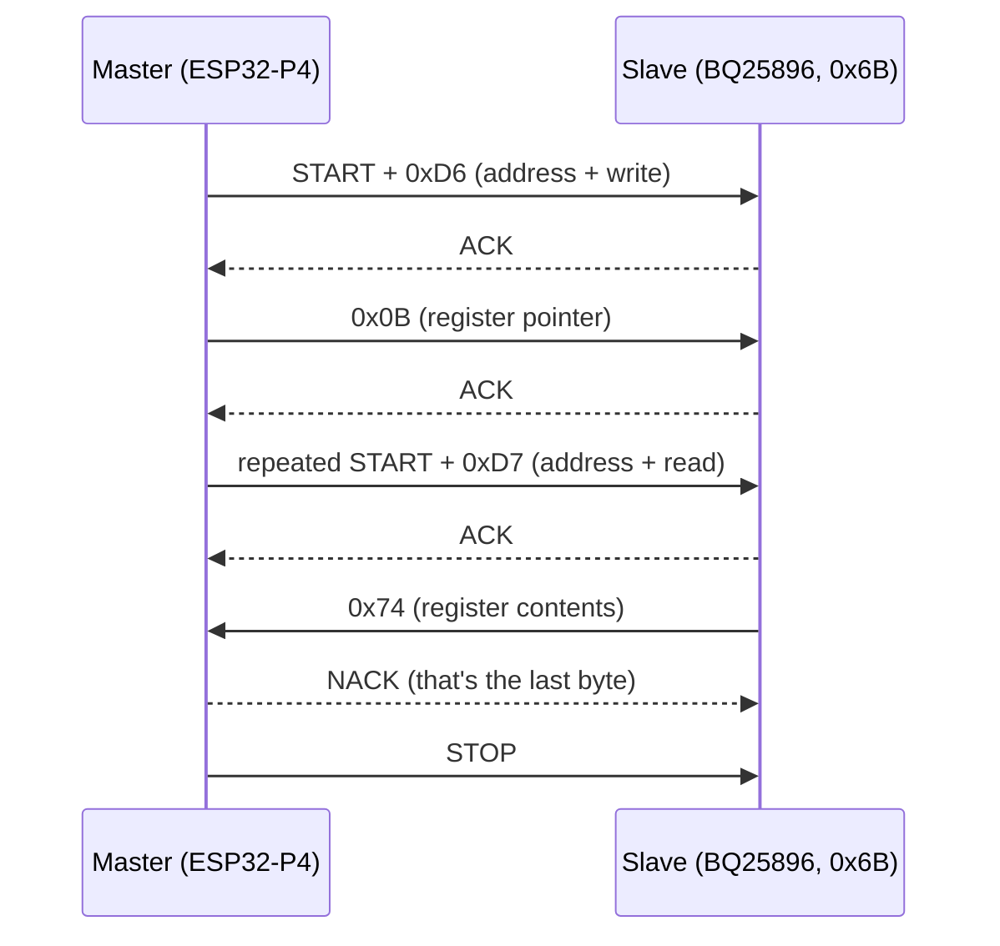

# How does I²C actually work?

## Introduction.

I'll target a real bus: an **ESP32-P4** as the master on `GPIO4`/`GPIO5`, with a **BQ25896** battery charger sitting on it at address `0x6B`, pulled up by a pair of **2.2 kΩ** resistors to 3.3 V. The exact parts barely matter — I²C is I²C — but pinning it to real silicon lets us use real addresses and real byte values instead of `0xAA` and `0x55`.

Three pieces of vocabulary first, because the spec and everyone's datasheets disagree slightly:

- **Master / slave**, or **controller / target** in the current NXP spec. The master is whoever generates the clock and starts transactions. I'll say master/slave because that's still what every register name and API you'll meet uses.
- **`SDA`** is the data line, **`SCL`** is the clock line. That's it. There is no chip select, no reset, no interrupt line — anything extra you see next to an I²C bus belongs to the device, not to the protocol.
- The **spec** is NXP's [UM10204](https://www.nxp.com/docs/en/user-guide/UM10204.pdf). Every timing number below comes from it.

## Two wires, and nobody can push high.

This is the fact the whole protocol is built on, so it goes first.

Every device on an I²C bus connects its `SDA` and `SCL` pins as **open-drain** (or open-collector). An open-drain output has exactly one transistor, wired between the pin and ground. It can do two things:

- turn the transistor **on** → the pin is pulled to `0`
- turn the transistor **off** → the pin is *released*, left floating

There is no second transistor to ground and no path to 3.3 V. **No device on the bus can output a `1`.** The high level comes from somewhere else entirely: the pull-up resistor, quietly holding the line up whenever nobody is pulling it down.

```
        3.3 V
          │
          ⌇  2.2 kΩ          ← the only thing that produces a '1'
          │
  ────────┴──────────────────────  SDA
          │        │        │
        ──┴──    ──┴──    ──┴──
        │ ▼ │    │ ▼ │    │ ▼ │    ← each device: one transistor to GND
        ──┬──    ──┬──    ──┬──
          │        │        │
         GND      GND      GND
     master    BQ25896   everyone else
```

Look at what that shape means: the line is `1` only if **every** device has released it, and `0` if **any single one** is pulling. That's a logical AND implemented in copper, and it's normally called a **wired-AND**.

Three consequences fall straight out of it, and they're most of what makes I²C pleasant:

- **Contention is physically impossible.** Two devices can drive at the same time all day and nothing burns; the worst case is that the line reads `0`. Compare with a push-pull bus, where one chip driving high while another drives low is a dead short through two output stages.
- **Collision detection is free.** A device that releases the line and then *reads back a `0`* knows for certain that somebody else is pulling. We'll use exactly this for arbitration later.
- **The bus is voltage-agnostic-ish.** Since nobody sources current, the bus voltage is set purely by where the pull-ups go. A 1.8 V device and a 3.3 V-tolerant device can share a bus pulled to 1.8 V, which is why level shifting on I²C is often just two MOSFETs.

The price is that the rising edge is not driven — it's an RC charge curve. Hold that thought; it comes back and bites in the pull-up section.

## The golden rule.

With the electrical model settled, the protocol is almost one sentence:

!!! note "The rule everything else is built on"
    **`SDA` may only change while `SCL` is low. While `SCL` is high, `SDA` must be stable.**

The receiver samples `SDA` during the high phase of `SCL`. The transmitter sets up the next bit during the low phase.

```
          set up bit      sample       set up bit      sample
              │             │              │             │
              ▼             ▼              ▼             ▼
        ┌───────────┐               ┌───────────┐
SCL ────┘           └───────────────┘           └───────────────
                    ╲             ╱
SDA  ═══╳═══════════════════════════╳═══════════════════════════
        ▲                           ▲
     may change here           may change here
     (SCL is low)              (SCL is low)
```

That's the entire data-transfer mechanism. Which raises an obvious question: if `SDA` can never legally move while `SCL` is high, what happens if it does anyway?

## START and STOP: breaking the rule on purpose.

That illegal transition is exactly how the bus signals framing. It's a lovely piece of design — the one pattern data can never accidentally produce is reserved for "this is not data".

**START (S)** — `SDA` falls **while `SCL` is still high**:

```
        ▔▔▔▔▔▔▔╲________________
SDA            │
        ▔▔▔▔▔▔▔▔▔▔▔▔▔╲__________
SCL                  │
               ├─────┤
                t_HD;STA
```

**STOP (P)** — `SDA` rises **while `SCL` is high**. The mirror image:

```
        ______________╱▔▔▔▔▔▔▔▔▔
SDA                   │
        ______╱▔▔▔▔▔▔▔▔▔▔▔▔▔▔▔▔▔
SCL           │
              ├───────┤
                t_SU;STO
```

Between a START and its STOP the bus is **busy**, and every device that isn't being addressed stays out of the way. Before the START and after the STOP, the bus is **idle**: both lines high, held there by the pull-ups, nobody driving anything.

Note that "idle" is not a special mode the devices enter. It is literally just *nobody doing anything*, which the pull-ups render as two `1`s. If you probe a healthy bus at rest and see anything other than 3.3 V on both lines, something is stuck.

## A byte is nine clock pulses.

Here's the first thing that surprises people reading a logic-analyzer capture. Every byte on the bus takes **nine** clock pulses: eight for the bits, **MSB first**, and a ninth for the acknowledge.

```
pulse    │  1  │  2  │  3  │  4  │  5  │  6  │  7  │  8  │  9  │
─────────┼─────┼─────┼─────┼─────┼─────┼─────┼─────┼─────┼─────┤
bit      │ b7  │ b6  │ b5  │ b4  │ b3  │ b2  │ b1  │ b0  │ ACK │
drives   │◄────────────── transmitter ──────────────►│receiver│
```

That ninth pulse is where **the direction of the data line flips mid-byte**, and it's worth being very precise about the choreography:

1. After the falling edge of pulse 8, the transmitter **releases** `SDA`. It stops pulling. Left alone, the pull-up would drag the line to `1`.
2. The receiver now owns the line for one pulse. To acknowledge, it **pulls `SDA` low** before pulse 9 goes high, and holds it there for the whole high phase.
3. On the falling edge of pulse 9, the receiver releases, and the transmitter takes the line back for the next byte.

So:

- **ACK** = the line reads `0` on pulse 9 → someone actively pulled it down → "got it".
- **NACK** = the line reads `1` on pulse 9 → *nobody did anything* and the pull-up won by default.

That asymmetry matters more than it looks. **NACK is not a signal — it's an absence.** A device that is unpowered, unsoldered, held in reset, or simply not present produces a NACK that is bit-for-bit identical to one from a working device deliberately refusing a byte. When you're debugging and the analyzer says NACK, it is telling you strictly less than you'd like: it means *nobody pulled*, not *somebody objected*.

## The address byte.

The first byte after a START is always an address, and it's the eight bits everyone miscounts:

```
pulse    │  1  │  2  │  3  │  4  │  5  │  6  │  7  │  8  │  9  │
─────────┼─────┼─────┼─────┼─────┼─────┼─────┼─────┼─────┼─────┤
name     │ A6  │ A5  │ A4  │ A3  │ A2  │ A1  │ A0  │ R/W │ ACK │
value    │  1  │  1  │  0  │  1  │  0  │  1  │  1  │  0  │  0  │
         └────────── 0x6B ─────────────┘  └─┬─┘     └──┬──┘
                                          write     slave answers
```

Seven bits of address, then one bit of **transfer direction**: `0` = master writes, `1` = master reads. On the wire those eight bits form a single byte, which is why the same device shows up as three different numbers depending on who's writing the documentation:

| Notation | BQ25896 | What it is |
|---|---|---|
| 7-bit address | `0x6B` | what the datasheet and Linux use |
| 8-bit write | `0xD6` | `(0x6B << 1) + 0` |
| 8-bit read | `0xD7` | `(0x6B << 1) + 1` |

Half the "my device is at the wrong address" bug reports in the world are this shift. If a datasheet quotes an address above `0x7F`, it's the 8-bit form and you want to shift it right by one.

Every slave on the bus decodes this byte. The one that recognises itself ACKs; the rest go quiet until the next STOP. Which explains the neat trick that is **bus scanning**: `i2cdetect` and every `i2c_master_probe()` do nothing but emit `START` + address byte at each address in turn and record who ACKed. There is no discovery mechanism, no enumeration, no ID register. Presence on an I²C bus is defined as *"pulls SDA low when called"*.

The 7-bit space holds 128 addresses, but **16 are reserved** by the spec (`0000 000x`, `0000 001x`, `0000 010x`, `0000 011x`, `1111 0xxx`, `1111 1xxx` — general call, CBUS compatibility, 10-bit addressing escape, device ID), leaving **112 usable**. That's why scans run `0x08`–`0x77` and why address collisions between two sensors that both insist on `0x68` are such a common headache. There *is* a 10-bit addressing mode that escapes through the `1111 0xxx` prefix, but I have never met it in the wild.

## Anatomy of a full frame.

Now the teardown. Here's the skeleton, and then each piece in order:

```
 ┌─ start                                ┌─ 9th pulse          ┌─ stop
 │  condition                            │  of each byte       │  condition
 ▼                                       ▼                     ▼
 S │ A6 A5 A4 A3 A2 A1 A0 │ R/W │ ACK │ D7…D0 │ ACK │ D7…D0 │ ACK │ P
   └────── 7-bit address ─┘  └─┬─┘        └──── n data bytes ─────┘
                          direction
```

There is **no length field** anywhere. A transfer is however many bytes fit between the START and the STOP, and both ends just keep going until the master decides to stop. This is why a master that loses track mid-frame can't resynchronise by counting — it has to wait for a STOP or force one.

**Piece 0 — idle.** Both lines high. `t_BUF` must have elapsed since the last STOP before a new START is legal.

**Piece 1 — START.** `SDA` falls with `SCL` high. Bus becomes busy. After `t_HD;STA` the master pulls `SCL` low and clocking begins.

**Piece 2 — address byte.** Nine pulses as dissected above. If no device ACKs, the master's only sensible move is to emit a STOP and report "no such device" — which is exactly what an ESP-IDF call returning `ESP_ERR_NOT_FOUND` is telling you.

**Piece 3 — the ACK slot.** The handover described earlier. Worth internalising *who* drives it, because it flips with the R/W bit:

| Phase | Data bits driven by | ACK slot driven by |
|---|---|---|
| Master writing (`R/W = 0`) | master | **slave** |
| Master reading (`R/W = 1`) | slave | **master** |

**Piece 4 — data bytes.** Structurally identical to the address byte: 8 bits MSB-first plus an ACK slot. In a read, the master's ACK means "keep going" and its **NACK means "that was the last one"**. This is not optional politeness: if the master ACKs the final byte and then issues a STOP, the slave was already loading the next byte and can be left mid-transfer. Always NACK the last byte you read.

**Piece 5 — STOP.** `SDA` rises with `SCL` high. Bus returns to idle.

And the timing budget the whole thing has to fit inside:

| Parameter | Standard (100 kHz) | Fast (400 kHz) | Meaning |
|---|---|---|---|
| `t_LOW` min | 4.7 µs | 1.3 µs | `SCL` low period |
| `t_HIGH` min | 4.0 µs | 0.6 µs | `SCL` high period |
| `t_HD;STA` min | 4.0 µs | 0.6 µs | START hold before `SCL` falls |
| `t_SU;STA` min | 4.7 µs | 0.6 µs | setup for a *repeated* START |
| `t_SU;DAT` min | 250 ns | 100 ns | data setup before `SCL` rises |
| `t_HD;DAT` min | 0 ns | 0 ns | data hold after `SCL` falls |
| `t_SU;STO` min | 4.0 µs | 0.6 µs | setup before STOP |
| `t_BUF` min | 4.7 µs | 1.3 µs | bus free between STOP and START |
| `t_r` **max** | 1000 ns | 300 ns | rise time |
| `t_f` max | 300 ns | 300 ns | fall time |

Every row is a minimum except the last two. Those two maximums are the ones you'll actually violate, and they're the subject of the pull-up section below.

## Repeated START, and why it matters.

Instead of `STOP` then `START`, a master can issue another START **without ever releasing the bus**. It lets `SDA` rise, lets `SCL` rise, then pulls `SDA` down again with `SCL` still high:

```
        ▔▔▔╲____________╱▔▔▔▔▔╲__________
SDA        │            │     │
        ▔▔▔▔▔▔╲______╱▔▔▔▔▔▔▔▔▔▔▔╲_______
SCL                    │
                    ├──┴──┤
                    t_SU;STA
```

Notated `Sr`. The point is **atomicity**. The overwhelmingly common I²C operation is "write a register number, then read that register" — two transfers with opposite R/W bits. If you split them with a STOP, the bus goes idle in between, and any other master (or, on a single-master bus, any other RTOS task using a non-locking driver) can slip in, address the same chip, and move its internal register pointer. Your read then returns the wrong register, intermittently, under load. Classic.

With a repeated START the bus is never free, so nobody can interleave. In ESP-IDF this is `i2c_master_transmit_receive()` rather than a `transmit()` followed by a `receive()`; on Linux it's what an `i2c_msg` array with `I2C_M_RD` on the second message compiles down to.

## Clock stretching.

`SCL` is generated by the master, but — open-drain again — the master can only *release* it high. A slave that needs time can keep pulling `SCL` down after the ACK, and the master, on releasing the clock, will see the line stay low and simply wait.

That's **clock stretching**, and it's the bus's only flow control. An EEPROM in the middle of a write cycle, or a sensor that needs to fetch a conversion result, uses it to say "not yet".

Two practical notes:

- **Some masters implement it badly or not at all.** Bit-banged GPIO masters frequently forget to poll `SCL` after releasing it, and older Raspberry Pi hardware is famous for broken stretching. If a device works at 100 kHz and corrupts data at 400 kHz, suspect this.
- **A slave stretching forever hangs the entire bus**, since `SCL` is shared. There's no timeout in the protocol itself; masters implement their own (`i2c_master_bus_config_t` has one in ESP-IDF).

## Multi-master and arbitration.

Two masters can share a bus with no extra wiring, and the wired-AND does all the work.

Both start transmitting. On every bit, each master compares what it *intended* to put on `SDA` with what the line *actually reads*. As long as they match, both carry on. The moment one master releases the line for a `1` and reads back a `0`, it knows another master is pulling — so it **loses arbitration**, immediately stops driving, and waits for the next idle bus.

The elegant part: because they only diverge at the first differing bit, and the loser drops out *before* that bit reaches the slave, **the winner's transfer is never corrupted**. No collision, no retry, no lost data — the loser just quietly reschedules. And since the highest-priority (lowest-value) address wins, arbitration is deterministic rather than random.

On a board like mine there's exactly one master, so none of this ever fires. It's still the reason the bus is shaped the way it is.

## Speed, pull-ups, and the thing that actually limits you.

The spec defines several modes; in practice you'll use the first two:

| Mode | Max `SCL` |
|---|---|
| Standard | 100 kHz |
| Fast | 400 kHz |
| Fast-mode Plus | 1 MHz |
| High-speed | 3.4 MHz |

But the number in your `i2c_config_t` is rarely the real constraint. **The rising edge is.**

Nothing drives the line high — the pull-up charges the bus capacitance through its own resistance. That's an RC curve with a time constant of `R_pullup × C_bus`, and the spec caps the resulting `t_r` at 300 ns in Fast mode. Bus capacitance comes from trace length, connectors, and every pin hanging off the bus (a few pF each); the spec's own ceiling is 400 pF total.

So the sizing is a squeeze from both sides:

- **Resistor too large** → slow rising edge → the line hasn't reached a valid `1` before the receiver samples → corrupted bits that get worse as you add devices or lengthen the bus.
- **Resistor too small** → fast edge, but a large current every time a device pulls low. The spec limits sink current to **3 mA**, which sets a floor of roughly 1.1 kΩ at 3.3 V.

Running the numbers on my board: 3.3 V / 2.2 kΩ = **1.5 mA** of sink current, comfortably inside the 3 mA budget, and with a typical short-trace capacitance of ~50 pF the rise time lands around 2.2 kΩ × 50 pF × 0.85 ≈ 95 ns — well under the 300 ns ceiling. Room to spare on both ends, which is what you want.

This is also the exact reason for the rule about **not stacking pull-ups**. Every breakout board helpfully ships its own pair. Chain four of them and you have four pairs in parallel: 2.2 kΩ / 4 = 550 Ω, which at 3.3 V demands 6 mA from every device that tries to pull low — double the spec. Some chips can't sink it and never reach a valid `0`. **One pair per bus, at one point.** Cut the jumpers on the rest.

## What I²C does not define.

This is the part that trips people up when they come back to the protocol after a while, so it deserves its own heading.

I²C defines: start, address, move bytes, acknowledge, stop. **That's the whole standard.** It says nothing about what those bytes *mean*.

The near-universal convention that "the first byte you write is a register number, and subsequent bytes are that register's contents" is **a convention, not the protocol**. Chip designers adopted it because it's obviously useful, and now ~90% of I²C devices work that way — but there's no bit anywhere on the wire that marks a byte as an address rather than data. When we send `0x0B` to the BQ25896 below, the bus sees a completely ordinary data byte. It's the BQ that decides to treat it as a pointer.

Devices that break the convention are perfectly legal and do exist: some sensors just stream their measurement when read with no pointer at all, some need a two-byte pointer for a 16-bit register space, and some ADCs are configured with a command byte that isn't an address in any sense. Which is why you always read the datasheet's transaction diagrams rather than assuming.

## Two real transactions, byte by byte.

Enough theory. Here's the same protocol as an actual capture.

### Reading a register.

Read `REG0B` (charge status) from the BQ25896 at `0x6B`. This is the write-pointer / repeated-START / read pattern:



On the wire:

```
S  D6  A   0B  A   Sr  D7  A   74  N   P
```

Piece by piece:

1. **START** — not a byte. `SDA` falls with `SCL` high; the bus becomes busy.
2. **`0xD6`** — `1101011` + `0`. Seven address bits (`0x6B`) plus a write bit. Every slave decodes it; the BQ recognises itself and pulls `SDA` low on pulse 9. **ACK.**
3. **`0x0B`** — an ordinary data byte as far as the bus is concerned. The BQ, following the convention, loads it into its internal register pointer. **ACK.**
4. **Repeated START** — no STOP. The bus stays busy so nothing can move that pointer before we read it.
5. **`0xD7`** — same address, read bit set. **ACK.**
6. **`0x74`** — now the *slave* drives the data bits and the *master* drives the ACK slot. Decoded against the BQ25896's `REG0B`:

    ```
    0x74 = 0 1 1 1 0 1 0 0
           └─┬─┘ └┬┘ │ │ └── VSYS_STAT = 0    not in minimum-system regulation
             │    │  │ └──── (reserved)
             │    │  └────── PG_STAT   = 1    external power is valid
             │    └───────── CHRG_STAT = 10b  fast charging
             └────────────── VBUS_STAT = 011b USB DCP adapter
    ```

7. **NACK** — the master declines to pull `SDA` low. "No more bytes." Had it ACKed, the BQ would have loaded the next register and waited.
8. **STOP** — bus released.

### Writing a register.

Set the fast-charge current to 1024 mA in `REG04`. No repeated START needed, because there's no direction change:

```
S  D6  A   04  A   10  A   P
```

1. **START.**
2. **`0xD6`** — address + write. **ACK.**
3. **`0x04`** — register pointer. **ACK.**
4. **`0x10`** — the payload:

    ```
    0x10 = 0 0010000
           │ └──┬───┘
           │    └────── ICHG[6:0] = 16 → 16 × 64 mA/LSB = 1024 mA
           └─────────── EN_PUMPX  = 0
    ```

    **ACK.**
5. **STOP.**

Note that the pointer byte appears exactly once. After it, everything is data, and most chips auto-increment the pointer — so `S D6 A 04 A 10 A 20 A P` would write `REG04` *and* `REG05` in one frame. Check the datasheet before relying on it; not every device does.

### Why read-modify-write exists.

One more, because it's the mistake that costs people an afternoon. Registers pack unrelated fields into one byte. `REG07` on this chip holds the watchdog timer, the charge-termination enable, and the safety timer *in the same eight bits*. To change only the watchdog you must read, mask, and write back:

```
read     S D6 A 07 A Sr D7 A 9C N P     ← 0x9C = 1 0 01 1 10 0
                                                 │ │ └┬┘│ └┬┘└─ JEITA_ISET
                                                 │ │  │ │  └─── CHG_TIMER = 12 h
                                                 │ │  │ └────── EN_TIMER  = on
                                                 │ │  └──────── WATCHDOG  = 40 s  ← target
                                                 │ └─────────── STAT_DIS
                                                 └───────────── EN_TERM   = on

mask     0x9C & ~0x30 = 0x8C            ← clear bits [5:4] only, in the host

write    S D6 A 07 A 8C A P
```

Blasting `0x00` to "turn off the watchdog" would also clear `EN_TERM` and `EN_TIMER`, and the charger would then never terminate a charge cycle. The bus would report a perfectly successful transaction the whole time.

## Counting clock pulses.

Handy for estimating bus load and for sanity-checking a capture:

| Transaction | `SCL` pulses |
|---|---|
| Write one register | 27 |
| Read one register (with `Sr`) | 36 |
| Read *n* sequential registers | 27 + 9n |

Nine per byte, plus nothing for START/STOP (they're conditions, not clocked bits). A single-register read at 400 kHz is therefore 36 / 400 000 ≈ **90 µs** of bus time, before overhead.

That number is worth having in your head. Polling a charger's status ten times a second costs under 0.1% of the bus — so if you're weighing an interrupt line against a polling loop, do the arithmetic before assuming polling is expensive. It usually isn't.

## When the bus hangs.

Since I've mentioned it twice: the classic failure is `SDA` **stuck low** with the bus supposedly idle. It happens when a slave was interrupted mid-byte — the master reset, or was reflashed, while the slave was in the middle of driving a `0`. The slave is still patiently holding the line, waiting for a clock edge that will never come.

The recovery is entirely mechanical, and it works because the slave is only waiting for clocks:

1. Bit-bang up to **9 pulses** on `SCL` (nine, so the slave can finish whatever byte it was in the middle of and reach its ACK slot, where it releases).
2. Watch `SDA` — as soon as it goes high, the slave has let go.
3. Emit a **STOP** to put everyone back into a known idle state.

Most decent drivers do this automatically at init. If yours doesn't, it's about fifteen lines of GPIO toggling and it will save you at least one confusing afternoon.

---

Looking back, almost everything above is downstream of that first diagram: one transistor per pin, one resistor per line, and no way to output a `1`. Nine clock pulses per byte, NACK meaning silence, free arbitration, the pull-up arithmetic, the bus recovery trick — none of it is arbitrary. It's all the wired-AND, seen from a different angle each time.

!!! note "Reference"
    The authoritative document is NXP's **UM10204, *I²C-bus specification and user manual***. Every timing value in this note is from its Table 10. It's readable, it's short, and it settles arguments.
