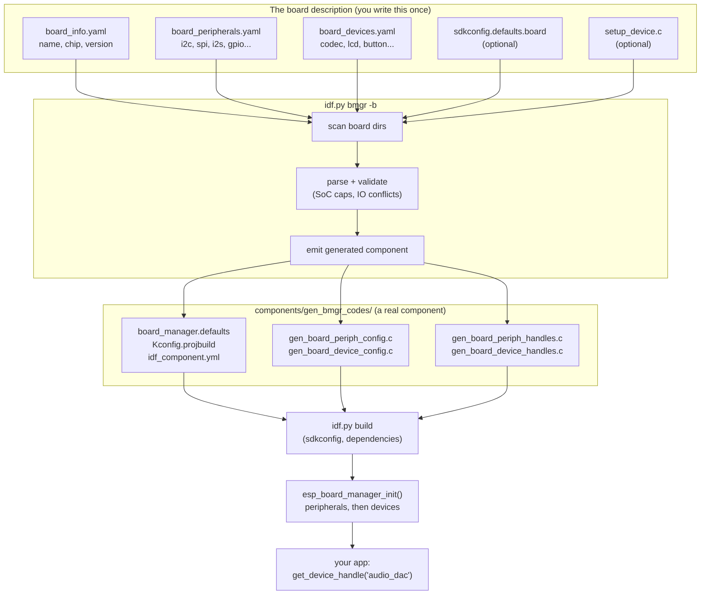

# What is the Espressif board manager and how does it work?

In [How does ESP-IDF work?](esp_idf_how_does_it_work.md) we took a project apart and found that almost nothing was magic: components are folders, `sdkconfig.h` is a generated header, the linker script is written by `ldgen`, and `app_main` is called by a FreeRTOS task in `app_startup.c`.

But there's one thing that note never answered, because ESP-IDF itself doesn't answer it: **where does the number `27` come from?** Our `my_led` component blinked GPIO 27 because a `Kconfig` option said so, and that option said so because I looked at a schematic once and typed a number. Change the board and every one of those numbers is wrong. There is nothing in ESP-IDF that knows what *your* board is.

That gap is what **ESP Board Manager** — `esp_board_manager`, `esp-bmgr`, or just **BMGR** — is trying to close. This note is about what it actually does: what you write, what a Python script turns it into, when that script runs relative to CMake, what the generated C looks like, and what happens at run time between `esp_board_manager_init()` and your first `esp_board_manager_get_device_handle()`.

!!! note "Versions"
    Written against **`esp_board_manager` v0.7.0** (August 2026) and the
    [ESP Board Manager Guide](https://docs.espressif.com/projects/esp-board-manager/en/latest/index.html).
    BMGR is young and moves fast — the component was at v0.5.x a few months ago and
    board definitions have already been moved out of it once. Check the
    [README](https://github.com/espressif/esp-board-manager/blob/main/esp_board_manager/README.md)
    for the ESP-IDF minimum it wants (currently the `release/v5.4` and `release/v5.5`
    branches, plus `master`).

## Introduction.

BMGR is built around one sentence, and everything else follows from it: **the board is not part of your application**.

Concretely, three things ship together:

- **A description format.** Three YAML files per board that say what silicon is on it, which buses are wired to which pins, and which chips hang off those buses.
- **A code generator.** A Python script that reads those YAML files and writes an ordinary ESP-IDF component full of `const` C structures — plus a Kconfig file, an `sdkconfig` defaults file, and a component manifest.
- **A tiny runtime.** A few hundred lines of C that walk those generated structures in order, call each driver's `init`, and hand your application a handle when you ask for one by name.

Nothing there is exotic. It's the [Kconfig → `sdkconfig.h`](esp_idf_how_does_it_work.md) trick from the ESP-IDF note applied one level up: *description outside the code, generator in the middle, plain C at the end.*

Here's the shape of the whole thing, and it's worth keeping this picture in your head for the rest of the note:



Two details in that diagram matter more than they look, and both are covered later:

- `components/gen_bmgr_codes/` is **not a cache**. It is a real component that is compiled into your binary. If it's missing or half-written, you get link errors, not a helpful message.
- The generator runs **before** CMake, not during it. That's why `idf.py bmgr` is a separate command you have to remember to run.

## Normally how do you define the pins, ports and interfaces in an embedded system?

Before looking at what BMGR does, it's worth being precise about the problem, because "where do I put my pin numbers" has about five standard answers and each one fails in a different way.

**Level 0 — literals in the code.**

```c
gpio_set_level(27, 1);
i2c_master_bus_config_t cfg = { .sda_io_num = 17, .scl_io_num = 18 };
```

Works on exactly one board, and you find every place it broke by grepping for numbers.

**Level 1 — a `board.h` full of macros.** The classic:

```c
#if defined(BOARD_REV_A)
#define LED_GPIO        27
#define I2C_SDA_GPIO    17
#elif defined(BOARD_REV_B)
#define LED_GPIO        21
#define I2C_SDA_GPIO     8
#endif
```

Better, and it survives one board revision. It stops scaling the moment two boards differ not in *which pin* but in *which parts exist*: rev B has a touch controller, rev A doesn't. Now the `#ifdef` isn't around a number, it's around a call, and it spreads into your application.

**Level 2 — Kconfig.** Turn the numbers into `CONFIG_*` symbols so they live in `sdkconfig` instead of a header. This is what we did with `CONFIG_MY_LED_GPIO` in the ESP-IDF note, and it's genuinely better: the value is data, `menuconfig` can validate a range, and the build system knows about it. But Kconfig only stores *scalars*. "An ILI9341 on SPI2, MOSI on 11, SCLK on 12, 16-bit colour, 240×320, backlight on LEDC channel 0 through a PNP transistor" is not a scalar. You end up with thirty flat symbols and no structure, and *someone still has to write the C that reads them and calls the driver in the right order*.

**Level 3 — a BSP component.** Espressif's own [`esp-bsp`](https://github.com/espressif/esp-bsp) does this: one component per board, exposing `bsp_display_start()`, `bsp_audio_init()`, and so on. This is a real improvement — the board description and the init code live together, outside your app. The catch is that it's *code*, so every board is a fresh pile of hand-written C, each BSP invents its own function names, and adapting your own board means writing a BSP from scratch by copying one that's close.

**Level 4 — a machine-readable description.** This is what Linux and Zephyr do with **devicetree**: the hardware is a data file (`.dts`), a compiler (`dtc`, or Zephyr's `gen_defines.py`) turns it into something the code can read, and drivers bind themselves to nodes by `compatible` string. The application stops knowing pin numbers at all; it asks for "the display" and gets whatever the description says the display is.

BMGR is level 4, with a deliberately smaller ambition. The comparison is worth making because if you've met devicetree, three quarters of BMGR is already familiar:

| | Devicetree (Zephyr) | ESP Board Manager |
|---|---|---|
| Source format | `.dts` / `.dtsi`, custom syntax | plain YAML, three files |
| Schema | `.yaml` bindings, per-compatible | `periph_<type>.yml` / `dev_<type>.yaml` in the component |
| Compiler | `dtc` + Python, runs inside CMake | `gen_bmgr_config_codes.py`, run by hand via `idf.py bmgr` |
| Output | macros in `devicetree_generated.h` | a whole C component in `components/gen_bmgr_codes/` |
| Binding to drivers | `compatible` string, `DEVICE_DT_DEFINE` | `type` + `sub_type`, a generated table of `init`/`deinit` pointers |
| Init order | priority levels, resolved at build | declaration order in YAML + `depends_on`, resolved at run time |

The one structural difference worth internalising: **devicetree is compiled into your build, BMGR is generated beside it.** Zephyr can't build without running the devicetree step; ESP-IDF happily builds a stale or missing `gen_bmgr_codes` and only complains at link time.

## How does the sdkconfig file actually work?

Recap in one paragraph, because [the ESP-IDF note](esp_idf_how_does_it_work.md) covers the mechanism: every component may ship a `Kconfig` file; ESP-IDF's build collects them all into one menu; your answers land in a plain text `sdkconfig` at the project root; and from that file the build generates `build/config/sdkconfig.h` (for C), `sdkconfig.cmake` (for CMake) and friends. `sdkconfig` is generated on first build from `sdkconfig.defaults`, and after that it's yours — which is why `sdkconfig.defaults` is checked in and `sdkconfig` is gitignored.

BMGR hooks into that chain in two places, and both are worth understanding because most "why is my board misbehaving" questions live here.

### It writes a defaults file, not your sdkconfig.

Generation produces `components/gen_bmgr_codes/board_manager.defaults`. It's an ordinary `sdkconfig.defaults`-shaped file and it contains three kinds of line:

```sh
# 1. the target, taken from `chip:` in board_info.yaml
CONFIG_IDF_TARGET="esp32s3"

# 2. board identity
CONFIG_ESP_BOARD_ESP32_S3_KORVO_2_3=y
CONFIG_ESP_BOARD_NAME="esp32_s3_korvo_2_3"

# 3. capability symbols, derived from what the YAML declares
CONFIG_ESP_BOARD_PERIPH_I2C_SUPPORT=y
CONFIG_ESP_BOARD_PERIPH_I2S_SUPPORT=y
CONFIG_ESP_BOARD_DEV_AUDIO_CODEC_SUPPORT=y
CONFIG_ESP_BOARD_DEV_DISPLAY_LCD_SUPPORT=y
CONFIG_ESP_BOARD_DEV_DISPLAY_LCD_SUB_SPI_SUPPORT=y
```

Group 1 is why **you never run `idf.py set-target` on a BMGR project** — the board already knows its chip. Group 3 is how BMGR keeps the binary small: every peripheral and device implementation inside the component is wrapped in `#if CONFIG_ESP_BOARD_*_SUPPORT`, so a board that declares no camera compiles no camera code. Those symbols are *derived from your YAML*, which is why the docs are blunt about it: don't hand-write `CONFIG_ESP_BOARD_*` in your project's `sdkconfig.defaults`. You're not configuring the board there, you're lying to the generator.

### It injects that file into `SDKCONFIG_DEFAULTS`.

ESP-IDF reads a `;`-separated list of defaults files from the `SDKCONFIG_DEFAULTS` variable, later entries winning. BMGR uses an `idf.py` global callback (more on those [below](#how-does-idfpy-work)) to assemble that list before CMake starts:

```text
project sdkconfig.defaults          (lowest)
components/gen_bmgr_codes/board_manager.defaults
$SDKCONFIG_DEFAULTS  (environment)
-D SDKCONFIG_DEFAULTS=...           (highest)
```

Read that order twice, because the consequence is counter-intuitive: **the board beats your project.** If your `sdkconfig.defaults` sets a symbol the board also sets, the board's value wins and BMGR prints a non-blocking warning. The reasoning is that `sdkconfig.defaults` is for cross-board policy (log level, compiler optimisation) while board-specific things (PSRAM mode, flash size, partition table) belong to the board — in its `sdkconfig.defaults.board`, or in an [amend](#escape-hatches-when-yaml-isnt-enough) if you need to override someone else's board without forking it.

Two more behaviours that will bite at some point:

- All of this applies **only when the project has no `sdkconfig` yet**. Once `sdkconfig` exists it is the source of truth, and BMGR falls back to *checking* it against `board_manager.defaults` and warning about mismatches. Set `ESP_BOARD_MANAGER_SKIP_SDKCONFIG_CHECK=1` to silence that.
- When you **switch boards**, the generator backs up and deletes your `sdkconfig`, leaving the copy at `components/gen_bmgr_codes/sdkconfig.bmgr_board.old`. It has to: the old file pins `CONFIG_IDF_TARGET` to the old chip. Losing a hand-tuned `sdkconfig` to a board switch is a rite of passage; the backup is right there.

When two sections of the merge set the same symbol, BMGR keeps the last one and rewrites the earlier line as a comment:

```sh
# BMGR_CONFIG_OVERRIDE by board_amend: CONFIG_SPIRAM_SPEED_80M=y
CONFIG_SPIRAM_SPEED_120M=y
```

Which means `board_manager.defaults` is also a log of who overrode what. It's the first file to open when a setting isn't what you expected.

## How does idf.py work?

`idf.py` is a Python program that runs other programs. That's the whole idea, and the ESP-IDF note showed it printing the exact `esptool.py` command line it was about to run. What matters here is one layer up: **`idf.py` is built out of *actions*, and actions are extensible.**

An action is a subcommand — `build`, `flash`, `monitor`, `menuconfig`, `set-target`. Each is a Python function with a click-style option list. ESP-IDF finds extra actions in two ways:

- **`IDF_EXTRA_ACTIONS_PATH`** — a directory containing an `idf_ext.py`. Anything that file exports becomes a first-class `idf.py` subcommand. This is the mechanism on ESP-IDF before v6.0.
- **Component discovery** — on ESP-IDF v6.0+, a component that ships an `idf_ext.py` is picked up because the project depends on it.

`esp_board_manager` ships exactly that file, and it declares two things:

1. The **`bmgr` action** (with `gen-bmgr-config` kept as a legacy alias), which is the front-end to `gen_bmgr_config_codes.py`.
2. A **global callback**, which is the more interesting half. Global callbacks run *before any action*, and they can modify the arguments and environment the rest of `idf.py` will see. That's the hook BMGR uses to prepend `board_manager.defaults` to `SDKCONFIG_DEFAULTS`, which is why the board's defaults reach CMake even though you typed plain `idf.py build`.

So there are two entirely different moments in play, and confusing them is the single most common BMGR mistake:

| When | What happens |
|---|---|
| `idf.py bmgr -b <board>` | YAML is parsed and validated; `components/gen_bmgr_codes/` is written. **Only when you run it.** |
| `idf.py build` (any action) | Global callback wires `board_manager.defaults` into `SDKCONFIG_DEFAULTS`; CMake then compiles `gen_bmgr_codes` like any other component. |

The generator is **not** wired into CMake's dependency graph. Change a pin in `board_devices.yaml`, run `idf.py build`, and you will happily flash the old configuration. Re-run `idf.py bmgr -b <board>` after every board YAML edit — that's the discipline the tool asks of you in exchange for not slowing down every build.

## How do you add esp_bmgr to idf.py?

Two independent pieces, and it's worth knowing which does what, because the failure modes look identical from the outside.

**1. The component** — this is what gets compiled into your firmware. Declare it like any other dependency, in `main/idf_component.yml`:

```yaml
dependencies:
  espressif/esp_board_manager:
    version: "*"
    require: public
```

or from the command line, `idf.py add-dependency esp_board_manager`. `require: public` matters: it puts BMGR's headers on the include path of everything that depends on `main`, not just `main` itself — the `REQUIRES`/`PRIV_REQUIRES` distinction from the [components section](esp_idf_how_does_it_work.md#what-is-a-component) of the ESP-IDF note. The component manager downloads it to `managed_components/espressif__esp_board_manager/` on the next `idf.py menuconfig`, `set-target` or `build`.

Developing your own copy? Point at it instead:

```yaml
dependencies:
  espressif/esp_board_manager:
    override_path: /path/to/esp_board_manager
    version: "*"
    require: public
```

**2. The `idf.py` plumbing** — this is host-side only, and it exists purely so `idf.py bmgr` is a command that resolves. The supported way is a small pip package installed into the ESP-IDF Python environment:

```sh
. $IDF_PATH/export.sh
pip install esp-bmgr-assist          # once per IDF environment
```

`esp-bmgr-assist` hooks the `idf.py` startup, finds `esp_board_manager` in the current project (managed *or* `override_path`), and sets `IDF_EXTRA_ACTIONS_PATH` for you. Install it once and every project sharing that environment gets `idf.py bmgr`.

If you'd rather not install anything, set the variable yourself:

```sh
# component downloaded from the registry
export IDF_EXTRA_ACTIONS_PATH=$PWD/managed_components/espressif__esp_board_manager
# or a local checkout
export IDF_EXTRA_ACTIONS_PATH=/path/to/esp_board_manager
```

Then check it took:

```sh
idf.py bmgr -l          # list every board the scanner can see
```

That command is the real installation test. If it prints a board list, both halves are wired up. If `bmgr` isn't a known action, it's the host half (step 2). If it *is* known but finds no boards, it's the component half (step 1) or your scan paths.

### Where boards are scanned from.

`idf.py bmgr -l` looks in several places, and when the same board name appears twice, the earlier one wins:

1. Your project's `components/` directory.
2. `managed_components/` — including the board packs that come down as dependencies.
3. Board components named in `main/idf_component.yml` (registry or `override_path`/`path`).
4. Anything passed with `-c/--customer-path` (semicolon-separated for several roots; later paths take precedence).

Since v0.5.12 the boards themselves no longer live inside `esp_board_manager`. They're separate components: [`espressif/esp_boards`](https://components.espressif.com/components/espressif/esp_boards) for the officially sold dev kits (pulled in by default), plus `espressif/esp_friends_boards` and `espressif/m5stack_boards` for the rest. Your own board is just another one of these — a folder in `components/`, or eventually a component you publish.

## How do you define your board inside the esp_bmgr and what it actually does?

Now the centre of the thing. A board is **a directory with three YAML files**; the scanner uses the presence of all three as its definition of "this is a board". The directory name is the board name, and it must match the `board:` field. Letters, digits and underscores only — a hyphen makes your board invisible, silently.

```text
my_board/
|- board_info.yaml           required   what this board is
|- board_peripherals.yaml    required   buses and pins
|- board_devices.yaml        required   chips hanging off those buses
|- sdkconfig.defaults.board  optional   board-level CONFIG_*
|- setup_device.c            optional   C that YAML can't express
|- Kconfig.projbuild         optional   board-specific menu entries
|- packages/                 optional   board-local components
```

Let's write one. I'll build a small ESP32-P4 board — the same chip as [the ESP-IDF note](esp_idf_how_does_it_work.md) — with an I²C bus, an LED, and a button, because that's enough to hit every concept without a page of LCD timings.

### `board_info.yaml` — what this board is.

```yaml
board: kode_p4_demo        # must equal the directory name
chip: esp32p4              # becomes CONFIG_IDF_TARGET
version: "1.0.0"           # YAML schema version, NOT your hardware revision
description: "P4 demo board: I2C sensor bus, status LED, boot button"
manufacturer: "Kode"
```

Only `board` and `chip` are required. The one field people misread is `version`: it identifies the *YAML parsing contract* (currently `1.0.0`), not your PCB revision and not the BMGR release. Put your hardware revision in `description`.

Everything here is metadata — it ends up in `gen_board_info.c` as a `const esp_board_info_t` and gets printed by `esp_board_manager_print_board_info()`. Nothing in it changes how a device is initialised, with the single exception of `chip`, which drives the target and the SoC capability checks.

### `board_peripherals.yaml` — the buses.

A peripheral is a *controller inside the SoC*: an I²C port, an SPI host, an I²S interface, one GPIO. Not the thing on the other end of the wire.

```yaml
peripherals:
  - name: i2c_main           # names MUST start with the type
    type: i2c
    role: master
    config:
      port: -1               # -1 = let the driver pick a free port
      clk_source: I2C_CLK_SRC_DEFAULT
      pins:
        sda: 7               # [IO] from the schematic
        scl: 8               # [IO] from the schematic
      enable_internal_pullup: true
      glitch_count: 7
      intr_priority: 1

  - name: gpio_led           # type-prefixed again
    type: gpio
    config:
      pin: 27                # [IO]
      mode: "GPIO_MODE_OUTPUT"
      default_level: 0

  - name: gpio_boot_btn
    type: gpio
    config:
      pin: 35                # [IO]
      mode: "GPIO_MODE_INPUT"
      pull_up: true
      intr_type: "GPIO_INTR_ANYEDGE"
```

Four rules are doing the work here:

- **`name` must be prefixed with `type`.** `i2c_main`, `gpio_led`, `spi_lcd`. Devices refer to peripherals by this string, and a typo is a run-time "peripheral not found", not a compile error. The runtime also parses a trailing number out of the name into the descriptor's `id` field.
- **`type` picks the parser.** `type: i2c` means the fields under `config:` are validated against `peripherals/periph_i2c/periph_i2c.yml` inside the component. That file is the actual reference — it lists every field, its default, and its legal values, in comments. When the docs and your intuition disagree, open the `periph_*.yml`.
- **`role` is required for types that have modes** — `master`/`slave` for I²C and SPI, `tx`/`rx` for UART and RMT, `oneshot`/`continuous` for ADC. I²S additionally needs `format` (`std-out`, `tdm-in`, `pdm-out`).
- **Enum fields take the ESP-IDF enum name, spelled exactly.** `GPIO_MODE_OUTPUT`, not `1`, not `"output"`. The generator copies that string straight into C, so a typo becomes a compiler error — which is the point: it fails at build time, in a file you can read, instead of at run time.

About that I²C block: `enable_internal_pullup: true` is convenient and, on a real bus, usually wrong. The SoC's internal pull-ups are tens of kΩ; [I²C](i2c_explained.md) generally wants a few kΩ on the board. Treat it as a bring-up crutch, not a design.

### `board_devices.yaml` — the chips.

A device is *the functional thing*: the codec, the display, the button, the SD card. It references the peripherals it needs by name.

```yaml
devices:
  - name: status_led
    type: gpio_ctrl
    config:
      # nothing chip-specific: the pin lives in the peripheral
    peripherals:
      - name: gpio_led         # must match board_peripherals.yaml exactly

  - name: button_boot
    type: button
    sub_type: gpio             # gpio | adc_single | adc_multi | custom
    config:
      active_level: 0          # [TO_BE_CONFIRMED] check the schematic
      long_press_time: 2000
      short_press_time: 100
      events_cfg:
        press_down: true
        press_up: true
        single_click: true
        double_click: true
        long_press_start: true
        long_press_up: true
    peripherals:
      - name: gpio_boot_btn
    dependencies:
      espressif/button: "4.1.4"    # pulled into the build for us
```

And the fields you'll reach for as boards get real:

| Field | What it does |
|---|---|
| `name` | Instance name. Unique, lowercase, **not** required to be type-prefixed. This is the string your application passes to `get_device_handle()`, so name it for its function: `audio_dac`, `display_main`, `button_boot`. |
| `type` | Picks the driver implementation and the config schema in `devices/dev_<type>/`. |
| `sub_type` | The variant within a type — `display_lcd` splits into `spi`/`i80`/`dsi`/`parlio`/`rgb`/`rgb_3wire_spi`. |
| `chip` | The *external* part number (`ili9341`, `es8311`), not the SoC. Only for devices that need to identify a specific part. |
| `peripherals` | The buses this device sits on. Entries may carry device-side extras, like `addr: 0x18` for an I²C part — read by the device parser, and **not** written back into the peripheral's own config. |
| `dependencies` | Extra ESP-IDF components this device's driver needs. Copied into the generated `idf_component.yml`, so the component manager downloads them. This is how a board pulls `esp_lcd_ili9341` into your build without you knowing the name. |
| `init_skip` | `true` means "declared but don't start it automatically". |
| `depends_on` | Other **devices** that must be initialised first. Recursive, and it beats declaration order. |
| `power_ctrl_device` | A `power_ctrl` device that must power this one up before `init` and down after `deinit`. |

`depends_on` versus `power_ctrl_device` is the distinction worth learning early. Both guarantee ordering; only `power_ctrl_device` also *does* something — it triggers the power-on and power-off actions, and it gives you `esp_board_device_power_ctrl("display_main", false)` at run time so you can cut power to a panel without tearing down the driver. Use `depends_on` for "must exist first", `power_ctrl_device` for "must have power first".

### The conventions inside the YAML.

BMGR adds four small dialects on top of plain YAML, and the reference blocks you copy from the docs are full of them:

- **`[IO]`** in a comment means *this is a physical pin, get it from the schematic*. The template value is almost always `-1`, and shipping a board with `-1` still in it is the number one adaptation bug.
- **`[TO_BE_CONFIRMED]`** means *this is a plausible default that is probably wrong for your part*: I²C addresses, panel resolutions, voltage thresholds, active levels. Datasheet, not vibes.
- **`${BOARD_PATH}`** expands to the board's own directory. Use it when depending on a component vendored under `packages/`, because the generated `idf_component.yml` lives somewhere else and relative paths will resolve from the wrong place:

  ```yaml
  dependencies:
    kode/my_sensor_driver:
      version: "*"
      override_path: ${BOARD_PATH}/packages/my_sensor_driver
  ```

  Only that exact spelling is substituted — `$BOARD_PATH` and `{{BOARD_PATH}}` pass through untouched and break at generation time.

- **Anchors and merge keys** are plain YAML and BMGR doesn't get in the way, which is the tidy way to declare two SPI hosts that differ in three pins:

  ```yaml
  - name: spi_lcd
    type: spi
    role: master
    config: &spi_master_default
      mosi_io_num: 11        # [IO]
      miso_io_num: -1        # write-only panel
      sclk_io_num: 12        # [IO]
      max_transfer_sz: 32768

  - name: spi_touch
    type: spi
    role: master
    config:
      <<: *spi_master_default
      mosi_io_num: 35        # [IO]
      sclk_io_num: 36        # [IO]
  ```

### What the generator actually does.

Run it:

```sh
idf.py bmgr -b kode_p4_demo
```

and the script executes nine steps, in this order:

1. **Scan** every board directory it can reach (defaults, `-c` paths, components).
2. **Select** the board from `-b <name|index>`, or from `sdkconfig` if you don't pass one.
3. **Locate** that board's `board_info.yaml`, `board_peripherals.yaml`, `board_devices.yaml`, and the optional `sdkconfig.defaults.board` / `Kconfig.projbuild`.
4. **Parse peripherals** against each `periph_<type>.yml` and emit their config structs and handle tables.
5. **Parse devices**, resolve their `peripherals` references and `dependencies`, and emit theirs.
6. **Validate** — SoC capabilities (does this chip *have* two I²C ports?), hardware limits, GPIO range, and IO conflicts (are two peripherals claiming pin 27?).
7. **Generate Kconfig** — static capability symbols in `gen_codes/Kconfig.in`, current-board symbols in `components/gen_bmgr_codes/Kconfig.projbuild`, with the board's own `Kconfig.projbuild` appended.
8. **Generate `board_manager.defaults`**, merged and de-duplicated as described earlier.
9. **Write the component** — sources, `CMakeLists.txt`, `idf_component.yml`, and `gen_board_metadata.yaml`.

Step 6 is the one that earns its keep. Pin conflicts and "this chip only has one I²C" are exactly the mistakes a schematic-to-firmware transcription produces, and they normally show up as a device that silently doesn't work. Here they're a generation-time error with a file and a field name. When the check is wrong — a capability BMGR hasn't modelled yet — there's an escape hatch, and it's deliberately awkward to type:

```sh
idf.py bmgr -b kode_p4_demo --skip-soc-capability-check
```

The output lands in `components/gen_bmgr_codes/`:

| File | What's in it |
|---|---|
| `gen_board_periph_config.c` | one `const` config struct per peripheral |
| `gen_board_periph_handles.c` | the peripheral descriptor list and `init`/`deinit` function table |
| `gen_board_device_config.c` | one `const` config struct per device |
| `gen_board_device_handles.c` | the device descriptor list, handle list, and function table |
| `gen_board_info.c` | the `esp_board_info_t` from `board_info.yaml` |
| `gen_board_device_custom.h` | structs for `type: custom` devices |
| `board_manager.defaults` | board `CONFIG_*` and capability symbols |
| `Kconfig.projbuild` | this board's menu entries |
| `idf_component.yml` | every component named in any device's `dependencies` |
| `gen_board_metadata.yaml` | a machine-readable summary — devices, peripherals, dependencies, occupied IO |

That last file is the one to read when you want to know what BMGR *thinks* your board is:

```yaml
version: 1
board: kode_p4_demo
chip: esp32p4

devices:
  button_boot:
    type: button
    sub_type: gpio
    peripherals:
    - gpio_boot_btn
    dependencies:
      espressif/button: '4.1.4'

peripherals:
  i2c_main:
    type: i2c
    role: master
    io:
      sda: 7
      scl: 8
```

### What the generated C looks like.

The shape is the same for peripherals and devices: a **descriptor** that is `const` (so it lives in flash), holding a pointer to a `const` config blob, plus a **handle** in RAM that holds the live pointer and a reference count. Both are singly-linked lists built at compile time, which is why the component's pitch mentions a low RAM footprint — the configuration never gets copied into RAM.

Here are the two structures, verbatim from `include/esp_board_device.h`:

```c
typedef struct esp_board_device_desc {
    const struct esp_board_device_desc  *next;               /*!< Pointer to next device descriptor */
    const char                          *name;               /*!< Device name */
    const char                          *chip;               /*!< Device chip type */
    const char                          *type;               /*!< Device type */
    const char                          *sub_type;           /*!< Device sub-type */
    const void                          *cfg;                /*!< Device configuration data */
    uint16_t                             cfg_size;           /*!< Size of configuration data */
    uint8_t                              init_skip : 1;      /*!< Skip initialization when manager initializes all devices */
    const char                          *power_ctrl_device;  /*!< Power control device name for this device */
    const char * const                  *depends_on;         /*!< Array of device names this device depends on */
    uint8_t                              depends_on_num;     /*!< Number of dependencies */
} esp_board_device_desc_t;

typedef struct esp_board_device_handle {
    struct esp_board_device_handle *next;           /*!< Pointer to next device handle */
    const char                     *name;           /*!< Device name */
    const char                     *chip;           /*!< Device chip type */
    const char                     *type;           /*!< Device type */
    void                           *device_handle;  /*!< Device-specific handle */
    uint8_t                         ref_count;      /*!< Reference count */
    esp_board_device_init_func      init;           /*!< Device initialization function */
    esp_board_device_deinit_func    deinit;         /*!< Device deinitialization function */
} esp_board_device_handle_t;
```

Line them up with the YAML and the mapping is exact: `name`, `type`, `sub_type`, `chip`, `init_skip`, `depends_on`, `power_ctrl_device` are all fields you typed. `cfg` points at the struct the generator built from your `config:` block, and `cfg_size` is `sizeof` it — which is how a generic runtime can hand a driver a config it knows nothing about:

```c
typedef int (*esp_board_device_init_func)(void *cfg, int cfg_size, void **device_handle);
```

That signature *is* the abstraction. The runtime doesn't know what a codec config contains. It knows a pointer, a size, and where to put the handle that comes back. Everything type-specific lives on the two ends: the YAML parser that built the struct, and the `dev_<type>` implementation that casts it back.

So, conceptually, what step 5 writes is a table of exactly this shape (the real generated file has longer names and more `#if` guards, but nothing you can't follow):

```c
/* gen_board_device_config.c — one const config per device */
const dev_button_config_t button_boot_cfg = {
    .active_level     = 0,
    .long_press_time  = 2000,
    .short_press_time = 100,
    /* ... */
};

/* gen_board_device_handles.c — the descriptor list, in YAML order */
const esp_board_device_desc_t g_dev_button_boot = {
    .next     = &g_dev_status_led,
    .name     = "button_boot",
    .type     = "button",
    .sub_type = "gpio",
    .cfg      = &button_boot_cfg,
    .cfg_size = sizeof(button_boot_cfg),
};
```

Which explains the error message everybody meets once. If `gen_bmgr_codes` is missing, incomplete, or excluded from the build, those symbols don't exist and the link fails:

```text
undefined reference to `g_esp_board_devices'
undefined reference to `g_esp_board_device_handles'
undefined reference to `g_esp_board_peripherals'
```

Two causes, both mundane. Either you never ran `idf.py bmgr -b <board>` (or it failed halfway and left `.c` files without a `CMakeLists.txt`, so ESP-IDF never registered the folder as a component), or your project trims its build — `idf_build_set_property(MINIMAL_BUILD ON)` or `set(COMPONENTS main)` — and `gen_bmgr_codes` isn't in scope. Nothing subtle: the table simply isn't in the binary.

### Escape hatches: when YAML isn't enough.

YAML describes buses, pins and parameters. It cannot call a constructor. And for an LCD, that last line is the one that matters:

```c
esp_lcd_new_panel_ili9341(io, cfg, &panel);   /* ILI9341 */
esp_lcd_new_panel_st7789(io, cfg, &panel);    /* ST7789  */
esp_lcd_new_panel_gc9a01(io, cfg, &panel);    /* GC9A01  */
```

BMGR does the generic nine tenths — configure the SPI bus, create the `panel_io`, wire up the backlight — and then has to instantiate *your* controller. So the board supplies that call, conventionally in `setup_device.c` (BMGR compiles every C/C++/asm file it finds in the board directory).

#### But didn't I already say which panel it is?

You did, and this is the part that confused me for an afternoon, so it's worth being explicit. A board that declares an LCD names the part **three times**, and BMGR joins none of them for you:

```yaml
- name: display_main
  type: display_lcd
  sub_type: spi
  chip: ili9341                      # 1. the intent, as a string
  dependencies:
    espressif/esp_lcd_ili9341: "*"   # 2. the component, so it gets downloaded
```

```c
/* 3. the call, in setup_device.c */
return esp_lcd_new_panel_ili9341(io, cfg, ret_panel);
```

**`chip:` is a string and stays a string.** It ends up as the `const char *chip` field of the `esp_board_device_desc_t` we looked at earlier — used to identify the part, print it in `esp_board_manager_print()`, and populate `gen_board_metadata.yaml`. It is never turned into a function name.

**`dependencies:` isn't the call either.** The docs are blunt about it: *"`dependencies` only adds the chip-driver component to the build; it does not generate these functions."* Downloading a driver is not the same as calling it.

Why not do it automatically? Because generating that line means maintaining a table of `"ili9341"` → header name → constructor signature for every controller in the ecosystem, and those signatures aren't uniform: some panels ship inside `esp_lcd`, others as separate registry components, some need a `vendor_config` carrying a driver-specific init-command list, and RGB panels are built a different way entirely. That table would be a permanent, always-slightly-stale registry of other people's components.

Read the table below backwards and the rule comes out clean: **you write a factory exactly where the ecosystem has N different constructors for one device type.** LCDs, touch controllers and IO expanders are in that situation. Audio codecs aren't in the table — `esp_codec_dev` already unifies them, so BMGR can make the call itself. Nor are buttons or GPIO: one API covers every board.

| Device / sub-type | Function you write |
|---|---|
| `display_lcd/spi`, `/i80`, `/parlio`, `/rgb_3wire_spi` | `lcd_panel_factory_entry_t` |
| `display_lcd/dsi` | `lcd_dsi_panel_factory_entry_t` |
| `lcd_touch/i2c` | `lcd_touch_factory_entry_t` |
| `gpio_expander` | `io_expander_factory_entry_t` |
| `button/custom`, `power_ctrl/custom` | `DEVICE_EXTRA_FUNC_REGISTER` |
| `custom` | `CUSTOM_DEVICE_IMPLEMENT` |

!!! warning "That `_t` is not a typo, and it is not a type"
    `lcd_panel_factory_entry_t` looks like a typedef and reads like a typedef. It
    isn't. It is the **literal name of the function you must define**, with external
    linkage — `static` will not do. BMGR's `dev_display_lcd` code calls that symbol;
    the symbol doesn't exist inside BMGR; your board provides it or the link fails.
    Read the table as *"declare `display_lcd`/`spi` and you owe the build a function
    called `lcd_panel_factory_entry_t`"*.

And the trap that falls out of all this: **nothing checks that the three agree.** Write `chip: ili9341`, depend on `esp_lcd_ili9341`, and have your factory call `esp_lcd_new_panel_st7789` — it compiles, it links, it boots, and `esp_board_manager_print()` will cheerfully report an ILI9341. Consistency is a convention here, not something the generator enforces. When you write a new board by copying a close one, the stale name in `chip:` is exactly what survives the edit.

The idiom Espressif's own boards use is worth copying wholesale:

```c
/* setup_device.c */
#if __has_include(<esp_lcd_ili9341.h>)
#include "esp_lcd_ili9341.h"

__attribute__((weak)) esp_err_t lcd_panel_factory_entry_t(esp_lcd_panel_io_handle_t io,
                                                          const esp_lcd_panel_dev_config_t *cfg,
                                                          esp_lcd_panel_handle_t *ret_panel)
{
    return esp_lcd_new_panel_ili9341(io, cfg, ret_panel);
}
#endif  /* __has_include(<esp_lcd_ili9341.h>) */
```

Two tricks stacked, and both exist so somebody else can replace your panel without editing your board.

**`__attribute__((weak))`** makes your version the default-if-nobody-objects. A downstream project that defines a function with the same name, without `weak`, wins at link time and yours is dropped. No fork, no patch.

**`__has_include`** covers the mess that follows. Say that project wants an ST7789: it provides its own strong factory (fine, yours is discarded) *and* removes the `esp_lcd_ili9341` dependency, because nothing uses it any more. Your `setup_device.c` is still compiled — BMGR compiles everything in the board directory — and its `#include "esp_lcd_ili9341.h"` now points at a header that isn't in the build. A compile error, from code nobody wants. With the guard, the header's absence makes the whole block vanish instead.

Together they make your implementation *replaceable and disposable*, which is the property the next section depends on.

#### Amend: changing a board that isn't yours.

**This one is almost entirely about boards you didn't write.** You picked up a board definition from someone else — an Espressif dev kit out of `esp_boards`, a partner board, a colleague's — it already exists and it is already correct, and you need to change *one thing*. That's the whole use case.

Take a concrete version of it. You're on an `esp32_s3_korvo_2_3`, which lives in `managed_components/` because it came down as a dependency. Your unit has a different touch controller, or you've bolted a gas sensor onto the I²C bus, or you want PSRAM at 120 MHz. Two obvious moves, both bad:

- **Edit the files in `managed_components/`.** They're regenerated on the next download. Your change evaporates, usually on somebody else's machine.
- **Copy the whole board into `components/` and edit it.** Now it's yours: four hundred lines of YAML to maintain, and you're disconnected from every fix Espressif makes upstream.

An **amend** is the third option: leave the original untouched and put a small directory beside it that says *"that board, plus this"*. It's the same idea as a devicetree overlay versus editing the board's `.dts`.

```text
my_amend/
|- board_amend.yaml          required   the manifest
|- tweak.yaml                a fragment of devices/peripherals
|- extra_setup.c             optional   C that overrides the board's
|- sdkconfig.defaults.board  optional
```

The manifest is almost insultingly simple:

```yaml
version: "1.0"
description: "Add external sensor power control"

apply:                        # ordered list; later entries win
  - tweak.yaml
  - extra_setup.c
  - sdkconfig.defaults.board
```

And the fragment carries only the delta:

```yaml
# tweak.yaml
peripherals:
  - name: gpio_sensor_power
    type: gpio
    config:
      pin: 4                  # [IO]
      mode: GPIO_MODE_OUTPUT

devices:
  - name: sensor_power
    type: power_ctrl
    sub_type: gpio
    peripherals:
      - name: gpio_sensor_power
        active_level: 1
```

Apply it with `-a`:

```sh
idf.py bmgr -b esp32_s3_korvo_2_3 -a path/to/my_amend
```

**How the merge works.** A `name` that already exists in the base board is merged field by field, with `config` merged deeply; a `name` that doesn't exist is appended to the list. So moving one pin is a fragment with a `name` and a pin in it — you don't restate the block. That's what keeps an amend genuinely small.

**And this is where the previous two tricks pay off.** The `.c` files listed in `apply:` are compiled into the generated component, and that component is linked with `WHOLE_ARCHIVE`. Which means a strong symbol from your amend beats the base board's `weak` one. That's the whole reason boards mark their factories `weak` and wrap them in `__has_include`: so you can swap the panel from a five-line `.c` in an overlay directory, without touching a file you don't own. Weak symbols and amend are one mechanism seen from its two ends.

**Why an explicit `apply:` list** instead of "everything in the folder"? Two reasons, and the second is the interesting one. First, the order of that list *is* the override order, so the merge is deterministic. Second, the entries can point outside the amend directory:

```yaml
apply:
  - ../sensors/gas_sensor/gas_sensor.yaml
  - ../sensors/gas_sensor/gas_sensor.c
  - extra_periph.yaml        # this board's own tweak
```

Keep a shared directory of feature modules — the gas sensor, the LTE modem, the test jig — and every board composes the ones it needs by reference. Adapting a new board turns into picking fragments rather than retyping YAML. (Files sitting in the directory but *not* listed are ignored, with an INFO log; directories aren't accepted, so subdirectory files need their full relative path.)

**Two conveniences worth knowing.** If the amend directory lives *inside* the board directory, you pass just the subdirectory name — which is how Espressif ships screen variants of one motherboard:

```sh
idf.py bmgr -b esp32_s3_lcd_ev_board -a sub_board_800_480_lcd
```

And **auto-amend** removes the `-a` entirely. A directory on the scan paths that is named after the selected board, contains a `board_amend.yaml`, and isn't itself a complete board, is applied automatically:

```text
board_overlays/                     # point -c here
|- esp32_s3_box_3/board_amend.yaml
|- esp32_p4_function_ev_board/board_amend.yaml
```

```sh
idf.py bmgr -b esp32_s3_box_3             -c board_overlays
idf.py bmgr -b esp32_p4_function_ev_board -c board_overlays
```

Same command, only `-b` changes; BMGR matches the overlay by name, and a board with no overlay just builds the base without complaining. That's the property you want when a CI script loops over a list of boards. Explicit `-a` still wins over auto-amend, discovery recurses three levels below each scan root, and `ESP_BOARD_MANAGER_DISABLE_AUTO_AMEND=1` turns it off.

For your own hardware the same mechanism does variants: `kode_p4` as the base board, then `rev_b`, `no_display` and `factory_test` as amends, instead of three near-identical copies drifting apart.

#### custom devices: hardware BMGR has never heard of.

Different problem, and it doesn't belong with amend — amend *replaces* something that already exists, `type: custom` is for hardware that has no built-in type at all. A PMIC, an odd sensor, an FPGA hanging off SPI.

There's no generic driver to patch here, so you write the whole `init` and `deinit` and register the pair:

```c
CUSTOM_DEVICE_IMPLEMENT(axp2101_power_manager,
                        cores3_power_manager_init,
                        cores3_power_manager_deinit);
```

In exchange, the generator expands your `config:` block into a real struct in `gen_board_device_custom.h` and your part joins the model: a name, a typed configuration, a place in the init order, `depends_on`, a reference-counted handle — everything a built-in device gets. The escape hatch takes you out of the catalogue, not out of the framework.

### And at run time.

Everything above happens on your computer. On the chip, it comes down to `esp_board_manager_init()`, and the rules it follows are short enough to list:

- **Peripherals first, then devices.** Always, no exception. Buses before the chips on them.
- **YAML declaration order** is the traversal order within each group. So if a panel needs its regulator up first, put the regulator earlier in `board_devices.yaml` — or use `depends_on` and stop thinking about it.
- **`depends_on` is recursive and wins over order.** Initialising a device initialises its dependencies first, wherever they sit in the file.
- **Reference counting everywhere.** Both devices and peripherals carry a `ref_count`. Initialising something that's already up increments the count instead of creating a second instance; it's only really torn down when the count hits zero. That's how two devices can share one I²C bus without either of them owning it.
- **`init_skip: true`** means the device is described but not started. You bring it up later with `esp_board_manager_init_device_by_name()`, or it comes up as somebody else's dependency.
- **`power_ctrl_device`** fires power-on before `init` and power-off after `deinit`.

The application side is deliberately dull:

```c
#include "esp_board_manager_includes.h"

void app_main(void)
{
    ESP_ERROR_CHECK(esp_board_manager_init());

    esp_board_manager_print_board_info();   /* name, chip, version, manufacturer */
    esp_board_manager_print();              /* every periph and device, with ref counts */

    /* Optional hardware: ask before you take, and skip the noisy error log. */
    if (esp_board_manager_check_name("lcd_touch")) {
        void *touch = NULL;
        ESP_ERROR_CHECK(esp_board_manager_get_device_handle("lcd_touch", &touch));
    }

    dev_audio_codec_config_t *codec_cfg;
    ESP_ERROR_CHECK(esp_board_manager_get_device_config("audio_dac", (void **)&codec_cfg));
}
```

The strings are the whole interface. `"audio_dac"` is the `name:` you wrote in `board_devices.yaml`, and your application knows nothing else about the board — not the pin, not the part number, not the bus. Port to a different board by pointing `idf.py bmgr` at a different directory, provided that board names its devices the same way. (Which is the catch, and it's the same catch devicetree has: shared vocabulary is a convention, not something the tool enforces.)

One asymmetry worth remembering, because it's easy to trip over. At the manager level, `get_device_handle()` and `get_periph_handle()` only return handles for things already initialised — they never start anything. One level down, `esp_board_periph_get_handle()` *will* initialise a peripheral on demand. Same-sounding names, different contracts.

The rest of the runtime API is small and mostly does what you'd guess:

| Function | Use it for |
|---|---|
| `esp_board_manager_init_device_by_name()` | starting an `init_skip` device, or lazy init |
| `esp_board_manager_deinit_device_by_name()` | selective teardown |
| `esp_board_device_callback_register()` | button events, touch interrupts |
| `esp_board_device_power_ctrl()` | toggling a device's power at run time |
| `esp_board_device_override_config()` / `restore_config()` | patching a generated config in RAM (deinit + init to apply it) |
| `esp_board_device_iterate_name_by_type()` | "give me every button on this board" |
| `esp_board_manager_register_device_handle()` | handing the manager a device you built yourself |
| `esp_board_device_get_i2c_effective_addr()` | reading the address a device actually answered on, when it probes several |

`override_config()` is the interesting one: it stores a shallow copy in RAM and hands *that* to future `init` calls. Shallow — pointers inside your config aren't deep-copied, so whatever they point at has to outlive the override. Handy for a factory-test build that wants one pin different, without touching the board.

## What's the regular workflow using idf.py + esp_bmgr?

Day to day, it's four commands and one habit.

**First time on a project:**

```sh
. $IDF_PATH/export.sh
pip install esp-bmgr-assist                # once per IDF environment
idf.py add-dependency esp_board_manager    # or edit main/idf_component.yml
idf.py reconfigure                         # downloads the component
idf.py bmgr -l                             # do I see boards?
idf.py bmgr -b kode_p4_demo                # generate
idf.py build flash monitor                 # no set-target: the board said esp32p4
```

**After editing any board YAML** — and this is the habit:

```sh
idf.py bmgr -b kode_p4_demo && idf.py build
```

Nothing re-runs the generator for you. Getting this wrong doesn't produce an error, it produces yesterday's pin map, which is a considerably worse failure mode. If you're going to add one alias to your shell, make it this one.

**Switching boards:**

```sh
idf.py bmgr -x                  # clean generated files
idf.py bmgr -b other_board      # regenerate
```

`-x` deletes the generated `.c`/`.h`, resets the generated `CMakeLists.txt` and `idf_component.yml`, and removes `board_manager.defaults`. Strictly, `-b <other_board>` alone handles the switch — it backs up your `sdkconfig` and cleans the old board's symbols — but `-x` first is the version that always works, and it's also what clears a stale `gen_bmgr_codes` that would otherwise fail to resolve its dependencies.

**Creating a new board:**

```sh
idf.py bmgr -n my_new_board                   # annotated skeleton in components/
idf.py bmgr -n path/to/boards/my_new_board    # or somewhere specific
```

There's also a [web configurator](https://board-manager.espressif.com) that exports the three YAML files from a browser, and the shortest path of all for a board close to an existing one: copy that board's directory and edit the pins.

**Options worth knowing:**

| Option | What it's for |
|---|---|
| `-l` | list boards — your installation smoke test |
| `-b <name\|index>` | select by name or by the index `-l` printed |
| `-c <path[;path]>` | extra board roots; later paths win |
| `-a <dir>` | apply an amend overlay |
| `-n <name\|path>` | scaffold a new board |
| `-x` | clean the generated component |
| `--kconfig-only` | regenerate only Kconfig (fast, for menu work) |
| `--skip-sdkconfig-check` | keep an existing `sdkconfig` that disagrees with the board |
| `--skip-soc-capability-check` | you're sure the validator is wrong |
| `--log-level DEBUG` | when generation does something you don't believe |

The same script runs standalone, which is what you want in CI where `idf.py` extensions may not be set up:

```sh
python gen_bmgr_config_codes.py -b kode_p4_demo -c ./boards
```

**Should `components/gen_bmgr_codes/` be in git?** It's generated, it's board-specific, and it's rewritten on every board switch — so no, gitignore it, and make `idf.py bmgr -b $BOARD` a step in your build script. Commit the board directory instead; that's the source.

## So what is esp_bmgr, then?

Three things, and now with names attached:

- **A description format** — three YAML files that say what your board is, validated against per-type schemas that live in the component itself (`periph_i2c.yml`, `dev_button.yaml`), with pins and unconfirmed values flagged as `[IO]` and `[TO_BE_CONFIRMED]` so an unadapted board is visibly unadapted.
- **A generator** — a Python script you run by hand through `idf.py bmgr`, which parses that description, checks it against what the SoC can actually do, and writes an ordinary ESP-IDF component: `const` structs in flash, a linked list of descriptors, a Kconfig file and a defaults file.
- **A runtime** — a few hundred lines that walk those lists in a defined order, honour `depends_on`, `init_skip` and `power_ctrl_device`, count references so two devices can share a bus, and answer `get_device_handle("audio_dac")`.

The parts that felt like magic all turned out to be bookkeeping again. `CONFIG_IDF_TARGET` is set because `board_info.yaml` said `chip:`. The codec's driver got downloaded because a `dependencies:` block was copied into a generated `idf_component.yml`. `app_main` obtains an LCD handle without knowing a single pin because a `void *cfg, int cfg_size` pair lets a generic list call a specific driver.

What BMGR is really doing is moving one boundary. In the [ESP-IDF note](esp_idf_how_does_it_work.md) the boundary between "code you write" and "code that's given to you" sat at the driver API: you called `gpio_set_level(27, 1)` and everything below was ESP-IDF's. BMGR pushes it up one floor. Now the pin number isn't yours either — it belongs to a description that can be swapped, shared, and version-controlled separately from the application that uses it.

That's the same bet devicetree made, and it comes with the same bill. You get portability across boards, board definitions you can publish and reuse, and validation that catches pin conflicts before they become a scope session. You pay with a generation step that isn't in the build graph, a generated component that must be present at link time, a `sdkconfig` precedence chain with four levels, and a fast-moving YAML schema. For a one-board hobby project, `#define LED_GPIO 27` is still the right answer. For a product with three hardware revisions and a firmware team, that macro is the thing that eventually costs you a week.

!!! note "Where to look next"
    - [ESP Board Manager Guide](https://docs.espressif.com/projects/esp-board-manager/en/latest/index.html) — the official docs; the *Design Principles* chapter is the closest thing to this note.
    - [`espressif/esp-board-manager`](https://github.com/espressif/esp-board-manager) — the source. The `periph_*.yml` and `dev_*.yaml` files under `esp_board_manager/peripherals/` and `.../devices/` are the real field reference, comments and all.
    - [`espressif/esp_boards`](https://components.espressif.com/components/espressif/esp_boards) — dozens of finished board definitions to read. `esp32_s3_korvo_2_3` is a good one: audio codec, LCD, touch, ADC button group, and a `setup_device.c` that shows the weak-symbol idiom in situ.
    - [Board Manager web configurator](https://board-manager.espressif.com) — click a board together and export the YAML.
