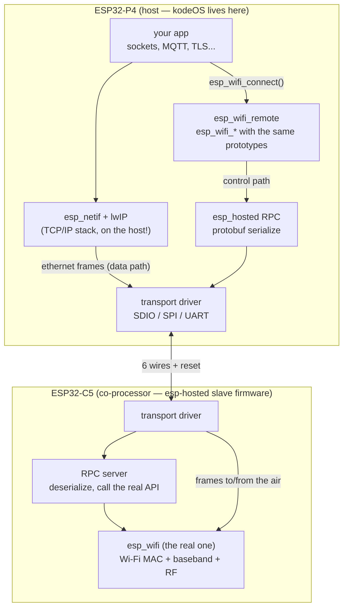
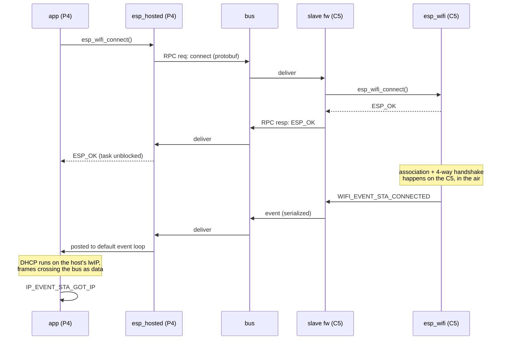

# What is ESP-Hosted and how does it work?

In [What is the Espressif board manager and how does it work?](what_is_esp_bmgr_and_how_does_work.md) we built a board around an **ESP32-P4**, and if you went looking for the Wi-Fi section of that chip's datasheet you already know the punchline: there isn't one. The P4 is Espressif's big application chip — dual-core RISC-V at 400 MHz, MIPI-DSI, MIPI-CSI, a 2D pixel engine, enough pins to feel like a small FPGA — and it has **no radio at all**. No Wi-Fi, no Bluetooth, nothing.

That is not an oversight, it's a product decision, and on the **kode dot** it stops being abstract: the P4 is the chip running kodeOS — the display, LVGL, the apps, the whole user-facing machine — and sitting next to it on the board is an **ESP32-C5**, there for exactly one job: dual-band Wi-Fi 6. Which creates a very concrete engineering question: *how does the application on the P4 talk to the radio on the C5?*

**ESP-Hosted** is Espressif's answer, and this note is about what it actually does on a board like ours: what runs on each chip, how a call like `esp_wifi_connect()` crosses a ribbon of six PCB traces and comes back with an IP address, what `esp_wifi_remote` is and why kodeOS compiles unchanged — and then the two questions every product team hits after the demo works: **how does the C5 get its firmware in the first place**, and **how do we update it once the device is in someone's hands**. Both get their own sections, because the C5 is not a modem, it's a second ESP-IDF project you own.

!!! note "Versions"
    Written against the **`esp_hosted` component v3.0.6** and **`esp_wifi_remote` v1.6.4**
    (August 2026), with sources at
    [`espressif/esp-hosted-mcu`](https://github.com/espressif/esp-hosted-mcu).
    ESP-Hosted moves fast: the 2.x → 3.x jump restructured the examples (each one now
    ships its co-processor firmware in a `cp/` subdirectory) and unified the docs with
    the Linux-host flavour. An **ESP32-C5 co-processor needs ESP-IDF v5.5 or newer**;
    a C6 gets away with v5.3.2. Check the
    [registry page](https://components.espressif.com/components/espressif/esp_hosted)
    for what's current before trusting any number in this note.

    One more disclaimer: the kode dot's own pin assignment stays out of this
    note. Where a pin number appears below, it is either fixed by the C5's
    silicon or taken from Espressif's public reference board.

## Introduction.

ESP-Hosted is built around one sentence, and everything else follows from it: **the Wi-Fi API your application calls and the Wi-Fi hardware that executes it do not have to be on the same chip.**

Concretely, three things ship together:

- **A thin API shim** — [`esp_wifi_remote`](https://components.espressif.com/components/espressif/esp_wifi_remote), a component that provides the entire `esp_wifi_*` API on chips that don't have it. Your application keeps calling `esp_wifi_init()`, `esp_wifi_scan_start()`, `esp_wifi_connect()`; nothing in your code knows the radio is elsewhere.
- **An RPC layer** — every one of those calls is serialized (protobuf), given a header, and shipped to the co-processor, which deserializes it, calls the *real* `esp_wifi_*` function from its own ESP-IDF, and ships the return value back. Wi-Fi events make the same trip in the opposite direction.
- **A transport** — the physical bus carrying all of it: SDIO, SPI (full-duplex or dual/quad half-duplex), or UART, plus a couple of side-band GPIOs for reset and handshake.

And one decision that shapes the whole system more than any of those parts: **the TCP/IP stack runs on the host.** The C5 does not terminate TCP connections for you the way an old AT-command modem did. It hands raw 802.3 frames to the P4, and lwIP, mbedTLS, your sockets, your MQTT client — all of it runs on the P4, exactly as it would on a chip with a built-in radio. The cut is at layer 2.

Here's the shape of the whole thing, and it's worth keeping this picture in your head for the rest of the note:



Two details in that diagram matter more than they look, and both get their own section below:

- There are **two parallel paths** over the same bus. The *control path* carries serialized API calls and events; the *data path* carries network frames with no transformation at all beyond a small encapsulation header. Your throughput is decided by the data path; your latency on `esp_wifi_scan_start()` by the control path.
- The co-processor runs **firmware you build** (or at least version-manage). Half of all ESP-Hosted grief is a host and a slave speaking slightly different dialects because one side got updated and the other didn't.

## Why doesn't the ESP32-P4 have a radio in the first place?

Worth a short detour, because the answer explains why ESP-Hosted exists at all and why it's suddenly everywhere.

A radio is expensive in ways that have nothing to do with silicon area. The RF front-end constrains the process node and the packaging; the radio needs regulatory certification (FCC, CE, and friends) in every market, per product; and the Wi-Fi MAC drags a real-time firmware blob along with it that fights your application for CPU and RAM. Chips like the P4 — big CPU, big pin count, multimedia — sell into products that already have those problems solved elsewhere, or that want to pick their radio independently of their compute.

So Espressif split the roles. The P4 computes; a small sidecar chip does wireless; and which sidecar is a per-product choice:

| Co-processor | Radio | Why you'd pick it |
|---|---|---|
| ESP32-C6 | Wi-Fi 6 (2.4 GHz), BLE 5, 802.15.4 | The default pairing — it's the chip soldered next to the P4 on Espressif's own [ESP32-P4-Function-EV-Board](https://github.com/espressif/esp-hosted-mcu/blob/main/docs/esp32_p4_function_ev_board.md) |
| **ESP32-C5** | **Wi-Fi 6 dual-band (2.4 + 5 GHz)**, BLE 5, 802.15.4 | You need 5 GHz: crowded 2.4 GHz environments, more bandwidth, lower latency. **This is the kode dot's chip** |
| ESP32-C3 / C2 | Wi-Fi 4 (2.4 GHz), BLE | Cost-driven designs |

The C5 is the interesting one for us: it's Espressif's first dual-band chip, and 5 GHz is the difference between "works in the lab" and "works in a home with two hundred 2.4 GHz devices shouting over each other" — which, for a consumer device like the kode dot, is not a corner case, it's the median living room. Modules pairing a P4 and a C5 in one can are already appearing, so this combination is on its way to being the second reference pairing after P4 + C6.

And to place ESP-Hosted among its siblings — Espressif ships three different ways to bolt their radio onto a host, and they are *not* interchangeable:

| | ESP-AT | Wi-Fi over EPPP | ESP-Hosted |
|---|---|---|---|
| Host API | AT text commands over UART | standard `esp_wifi` (via `esp_wifi_remote`) | standard `esp_wifi` (via `esp_wifi_remote`) |
| Where does TCP/IP run? | on the slave | on the host (PPP netif) | on the host (L2 frames) |
| Transport | UART | UART/SPI, PPP framing, optional TLS | SDIO / SPI / UART |
| Rough throughput | ~2 Mbps | ~20 Mbps | **~50+ Mbps** |
| Bluetooth | limited AT commands | no | yes — HCI over the same bus |

ESP-AT is the "modem" model: fine for sending a sensor reading, hopeless for streaming. EPPP is a clever middle path that reuses PPP so the host only needs a serial port. ESP-Hosted is the full-fat option: the co-processor disappears behind the standard API, and the bus is fast enough that the radio — not the wire — is usually the bottleneck. All three plug into the same `esp_wifi_remote` front-end as selectable backends, which is a nice piece of layering we'll come back to.

## How does esp_wifi_remote work?

This is my favourite part of the design, because the problem it solves is sneaky. Think about what "your application compiles unchanged" actually requires: code that calls `esp_wifi_init(&cfg)` must link against *something* named `esp_wifi_init` with *exactly* the right prototype — on a chip whose ESP-IDF build doesn't provide it, because there's no Wi-Fi to drive.

`esp_wifi_remote` provides it. The component is, in its own README's words, a thin interface made of ESP-IDF Wi-Fi APIs backed by remote implementations, and it's built out of three tricks:

**Trick 1 — generated mirrors, not handwritten ones.** The `esp_wifi` API is large and moves with every ESP-IDF release. So `esp_wifi_remote` doesn't hand-maintain its copy: the function prototypes are *extracted from the real `esp_wifi` headers* and the forwarding shims are generated per ESP-IDF version. When you build for IDF v5.5 you get shims that match v5.5's signatures, structs and enums exactly. The same generation pass mirrors the Kconfig: every `CONFIG_ESP_WIFI_*` option reappears as `CONFIG_WIFI_RMT_*`, evaluated against `CONFIG_SLAVE_IDF_TARGET` instead of `CONFIG_IDF_TARGET` — because the question "how many static RX buffers?" is now a question about the *C5's* memory, not the P4's.

**Trick 2 — weak symbols as a plug socket.** Each generated `esp_wifi_*` shim forwards to a matching `esp_wifi_remote_*` function, and those are declared **weak and empty**. A backend — ESP-Hosted, EPPP, or the AT bridge — provides the strong definitions. Link `esp_hosted` into the build and every `esp_wifi_remote_*` call resolves to "serialize this and put it on the bus". It's the same weak-symbol plug-socket idiom we saw in [the BMGR note](what_is_esp_bmgr_and_how_does_work.md#escape-hatches-when-yaml-isnt-enough) with `lcd_panel_factory_entry_t`, used for the same reason: the component in the middle defines the *shape* of the hole, somebody else brings the peg.

**Trick 3 — the netif glue comes too.** `esp_netif_create_default_wifi_sta()`, the event base `WIFI_EVENT`, the default event handlers that kick lwIP's DHCP client when the station associates — all of that plumbing is reproduced, so the *ecosystem around* the API works, not just the API. This is the part that makes the standard station example run on a P4 without edits:

```c
/* This is the stock ESP-IDF station example, and on the P4 it is ALSO
 * the ESP-Hosted example. Nothing here knows the radio is another chip. */
void app_main(void)
{
    ESP_ERROR_CHECK(nvs_flash_init());
    ESP_ERROR_CHECK(esp_netif_init());
    ESP_ERROR_CHECK(esp_event_loop_create_default());
    esp_netif_create_default_wifi_sta();

    wifi_init_config_t cfg = WIFI_INIT_CONFIG_DEFAULT();
    ESP_ERROR_CHECK(esp_wifi_init(&cfg));      /* transport comes up under here */

    /* handlers for WIFI_EVENT / IP_EVENT, esp_wifi_set_config(), ... */
    ESP_ERROR_CHECK(esp_wifi_set_mode(WIFI_MODE_STA));
    ESP_ERROR_CHECK(esp_wifi_start());
}
```

The first Wi-Fi call is where ESP-Hosted wakes up: bringing up the transport, resetting the slave through the dedicated GPIO, and running a handshake where the two sides exchange capabilities and versions. From the application's point of view `esp_wifi_init()` just takes a little longer than it used to.

One honest caveat: "unchanged" applies to code, not to physics. Every control call now includes a bus round-trip plus a protobuf encode/decode on both ends. For `esp_wifi_connect()` — dwarfed by the association handshake itself — you will never notice. If you were calling `esp_wifi_sta_get_rssi()` in a tight loop, you now have a reason not to.

## How does the RPC layer work?

The control path is a classic remote procedure call system, small enough to describe completely.

On the host, the strong `esp_wifi_remote_*` implementation takes the call's arguments, packs them into a **protobuf message** (the schema ships in the component; the C code is generated with `protobuf-c`), wraps it in a small ESP-Hosted header — which interface this belongs to, payload length, sequence number — and queues it on the transport. Then it *blocks the calling task* on a semaphore, exactly like a syscall.

On the slave, the RPC server unpacks the message, dispatches to the real ESP-IDF function — literally `esp_wifi_set_mode(mode)` on the C5 — packs status and out-parameters into a response, and sends it back. The host wakes the blocked task and hands it the return value. Synchronous call in, synchronous call out; the bus in the middle is invisible.

**Events are the reverse flow, without the blocking.** When the C5's Wi-Fi driver posts `WIFI_EVENT_STA_DISCONNECTED` to *its* event loop, a hook serializes the event and its payload, ships it over, and the host-side ESP-Hosted re-posts it into the **host's default event loop**. Your `esp_event_handler_register(WIFI_EVENT, ...)` callbacks fire on the P4 as if the event were local. The whole standard reconnect dance works because the events driving it are faithfully teleported.

Put together, a connection looks like this:



Note where `IP_EVENT_STA_GOT_IP` comes from in that diagram: **nowhere on the C5.** DHCP is lwIP's job and lwIP lives on the P4, so the DISCOVER/OFFER/REQUEST/ACK exchange crosses the bus as *data*, not as RPC. Which brings us to the data path.

**The data path does almost nothing, on purpose.** Ethernet frames from lwIP get the encapsulation header and go straight onto the bus; frames from the air come off the bus, lose the header, and go straight into lwIP. No protobuf, no copies beyond what the transport needs, no interpretation. ESP-Hosted registers itself as an `esp_netif` driver on the host — filling the same slot the native Wi-Fi driver glue would — so to lwIP the whole P4+bus+C5 assembly is just a slightly odd network interface card. The header's interface field is what keeps things apart on the shared bus: station traffic, softAP traffic, RPC, a virtual serial channel (used for provisioning-style control), and Bluetooth HCI each ride their own logical channel over the same six wires.

## The transport: six wires doing all the work.

Everything so far was software; here's where it touches the PCB. ESP-Hosted supports several transports, and the choice is a real design decision — it fixes your throughput ceiling, your pin budget, and how careful your layout has to be:

| Transport | Duplex | GPIOs | UDP throughput (Tx/Rx) | Notes |
|---|---|---|---|---|
| SDIO 4-bit | half | 6 | **~79 / 68 Mbps** | fastest; PCB-only, no jumper wires |
| SDIO 1-bit | half | 4 | ~ half of 4-bit | easier bring-up, fewer pins |
| Quad SPI | half | 7 | ~41 / 42 Mbps | when the SDIO slave is taken |
| Standard SPI | full | 6 | ~24 / 25 Mbps | the tolerant one; fine on wires |
| UART | full | 2 | ~0.7 Mbps | debug, or genuinely tiny traffic |

The ESP32-C5 supports the ones that matter: **SDIO (1-bit and 4-bit) as a slave, every SPI variant, and UART** — and the kode dot's schematic settles the question: it wires **SDIO 4-bit**, same top-tier option as the P4+C6 reference design, up to 50 MHz. With a display streaming over this link (app downloads, media, OTA images for two chips), that headroom is not a luxury. Here's the wiring as far as silicon dictates it — the P4 side is a board decision that goes into the host's menuconfig, shown here for Espressif's reference board; the C5 side is fixed:

| Signal | C5 pin (fixed) | reference EV board (P4 side) |
|---|---|---|
| CLK | IO9 | 18 |
| CMD | IO10 | 19 |
| D0 | IO8 | 14 |
| D1 | IO7 | 15 |
| D2 | IO14 | 16 |
| D3 | IO13 | 17 |
| C5 reset | EN | 54 |

Three things are worth noticing. The C5 column is **not a choice**: IO7–IO10 plus IO13/IO14 are the C5's fixed IO_MUX pins for the SDIO slave — the P4's SDMMC host routes flexibly, the slave doesn't, so the C5 half of menuconfig is really just confirming the datasheet. The board has to carry **pull-ups on CMD and D0–D3** (the docs recommend ~51 kΩ; CLK gets none). And the kode dot adds a pair of dedicated **wake lines**, one in each direction, that aren't part of the SDIO transport at all — they exist for the power-save story, and we'll meet them again [below](#beyond-plain-wi-fi).

That **reset line** is easy to overlook and load-bearing: the P4 owns the C5's EN pin through one GPIO and yanks it during transport init, so both sides start their handshake from a known state. It's wired — good — and it's also the *only* boot-control the P4 has over the C5, a fact that decides the whole update story two sections down.

The electrical rules from the [design notes](https://github.com/espressif/esp-hosted-mcu/blob/main/docs/design_consideration.md) are blunt and worth repeating verbatim-ish:

- SDIO lines — CMD and D0–D3 — need **external pull-ups** (51 kΩ recommended), in 1-bit mode too.
- **Keep it short**: under ~5 cm for SDIO, ~10 cm for SPI, matched lengths, clock isolated from noisy neighbours. Jumper wires and SDIO do not mix; for breadboard bring-up, use standard SPI.
- Prefer **IO_MUX pins** for the bus — routed through the GPIO matrix you lose timing margin at the top frequencies (we met the same rule with [I²C](i2c_explained.md), just at gentler speeds).
- Bring-up discipline: start the clock at 400 kHz–20 MHz, prove the link, then raise it. A link that works at 5 MHz and dies at 40 MHz is a layout/pull-up problem, not a software one.

One tuning knob deserves a mention because it trades RAM for speed at the system level: SDIO **streaming mode** (default) coalesces packets and buffers more aggressively — roughly 80 Mbps raw with the default queue depth — while **packet mode** ships packets one at a time in ~3 KB of buffer for about a third of the throughput. On a P4 with PSRAM you'll keep streaming mode; it's the kind of option you're glad exists the day you port the host side to something small.

## What runs on the ESP32-C5?

Here's the mental shift ESP-Hosted asks of you, and the single most important thing to take from this note: **the kode dot's C5 is not a modem we buy, it's a firmware we ship.**

The co-processor runs the ESP-Hosted **slave firmware** — itself a normal ESP-IDF application (since 3.x, every example carries it in a `cp/` subdirectory as a sibling project). Its `app_main` brings up the transport slave driver, the RPC server, and the Wi-Fi driver, then spends its life forwarding. You configure it with the same `menuconfig` you use for everything else: which transport, which pins, which Wi-Fi buffer counts. It is boring firmware — deliberately — but it is *ours*: it goes in the manufacturing plan, in version control, and in the update story, right next to kodeOS itself.

And one rule governs everything that follows: **host and slave versions must match** — same protobuf schema, same RPC vocabulary, same header layout. The handshake checks versions and complains, but the failure modes of a mismatch range from a clean error to "scan results are silently empty". Pin both sides in the build system and bump them together, the way you'd treat any other protocol pair. On a two-chip product this is not advice, it's the contract: a kodeOS release is really a *pair* of firmwares, and the pair is what you test.

The next two sections are the practical consequences: how firmware gets into the C5 the first time, and how it gets replaced when the device is on someone's desk and the only wires attached to it are inside the case.

## How do you program the kode dot's C5?

Strip the mystique first: **the C5 flashes exactly like every other ESP chip** — UART bootloader, `esptool`, done. All the design work is about *reaching* it, because on the kode dot the C5 has no USB connector of its own; it sits behind the P4 like any other soldered part.

**What gets flashed.** The slave side of the kode dot is an ESP-IDF project like any other:

```sh
cd kode_dot_c5_fw            # our cp/ project — transport + RPC + Wi-Fi
idf.py set-target esp32c5
idf.py menuconfig
#   transport: SDIO 4-bit on the C5's fixed slave pins (IO9 CLK, IO10 CMD,
#   IO8/7/14/13 = D0/D1/D2/D3) — plus Wi-Fi buffers, band defaults, logging
idf.py build
```

The output is the usual trio — bootloader, partition table, app — plus the partition layout that matters later: **two OTA app slots and an `otadata` partition**, because remote update (next section) needs somewhere to write the new image while the old one keeps running. The kode dot's C5 is an **ESP32-C5-MINI-1-N4** — 4 MB of flash — which fits two slots of a slave image with room to spare, but decide that partition table *now*, at the bench-flashing stage; retrofitting dual-slot OTA onto fielded units that shipped with a single factory slot is somewhere between painful and impossible.

**Reaching the bootloader.** On the kode dot the schematic already made the important decisions, so this is short:

1. **Bench and bring-up: four test pads.** The board routes exactly the four signals a flash cycle needs to test pads: **EN, TX, RX and the C5's boot strap**. Pull the strap low, pulse EN, and the C5 is in download mode — a standard `esptool` target through a USB-UART adapter or a pogo-pin jig:

    ```sh
    esptool.py --chip esp32c5 -p /dev/ttyUSB0 write_flash @flash_args
    ```

    This is the route for the *first* firmware ever, the bricked-unit rescue, and half of all transport debugging. Those four test points are the cheapest insurance on the board — same design courtesy the EV board extends with its `PROG_C6` header, done here with pogo pads instead of a connector.

2. **Factory: same pads, on the fixture.** In production the four pads land on the bed-of-nails: the C5 gets its slave image (and the P4 gets kodeOS) as one programming step, versions matched by construction. If the module arrives pre-flashed with a generic hosted slave, treat that as a bootstrap convenience only — reflash to *our* pinned version anyway, so the factory is not silently shipping whatever Espressif had that month.

3. **Everything after the factory: OTA, and only OTA.** Read the schematic closely and note what's *not* there: the C5's UART and its boot strap go **only** to the test pads — they don't reach the P4. The P4 holds exactly one boot-related line, EN, so it can reset the C5 but can never force it into download mode or talk to its ROM bootloader. There is no passthrough-flashing fallback on this board: once the case is closed, **the hosted OTA of the next section is the only way the C5's firmware changes**. That makes the next section load-bearing rather than nice-to-have — and it's why the staged-image flow and the version-check loop described there aren't optional hygiene, they're the recovery story.

One practical bring-up note that saves an afternoon: flash the C5 **first**, then bring the P4 up with logs on, and confirm both sides print their transport handshake — capabilities, versions — before any Wi-Fi call. A P4 that boots with an unprogrammed C5 next to it just reports a dead transport, which looks alarmingly like a layout problem and is not.

## How do you update the C5 remotely?

Now the question that decides whether this architecture is production-grade or a demo: the kode dot is in someone's hands, kodeOS updates itself over Wi-Fi — **and the chip that provides that Wi-Fi also needs updating.** Through what? Through the only link it has: the same SDIO bus, driven by the host.

ESP-Hosted ships this as a first-class API, and the shape is the classic OTA quartet — begin, write chunks, end, activate — except every call is an RPC and the flash being written is on the other chip:

```c
#include "esp_hosted.h"          /* the host API — esp_hosted_slave_ota_*() live here */

esp_err_t kode_update_c5(read_image_fn read_chunk)   /* wherever the bytes come from */
{
    /* 0. is an update even needed? the C5 reports its own version */
    esp_hosted_coprocessor_fwver_t ver;
    esp_hosted_get_coprocessor_fwversion(&ver);
    if (!newer_than(&ver, TARGET_C5_VERSION)) return ESP_OK;

    /* 1. slave erases its passive OTA slot, gets ready to receive */
    ESP_ERROR_CHECK(esp_hosted_slave_ota_begin());

    /* 2. stream the image across the bus in transport-sized chunks (~1.4 KB) */
    uint8_t buf[1400]; int n;
    while ((n = read_chunk(buf, sizeof(buf))) > 0) {
        ESP_ERROR_CHECK(esp_hosted_slave_ota_write(buf, n));
    }

    /* 3. slave verifies the complete image (checksum, magic, target) */
    ESP_ERROR_CHECK(esp_hosted_slave_ota_end());

    /* 4. flip the boot partition and reboot the C5 */
    return esp_hosted_slave_ota_activate();          /* link drops, then comes back */
}
```

Where do the bytes come from? The stock example offers three sources, and they map neatly onto product decisions:

| Image source | How it works | When it fits the kode dot |
|---|---|---|
| **HTTPS, streamed** | host downloads with `esp_https_ota`-style client, forwards chunks straight to the C5 | smallest flash cost — but the radio is updating itself over itself; a mid-stream Wi-Fi drop aborts the transfer (safely — see below) |
| **Staged in a host partition** | kodeOS update delivers the C5 image into a dedicated P4-flash partition (e.g. `slave_fw`); the bus transfer happens later, offline | **the robust one**: download and C5-flash are decoupled, the bus stream can't be interrupted by the network, and a failed activate can be retried from local flash |
| **Filesystem (LittleFS/SD)** | image is a file the host opens and streams | dev convenience, factory refurbishing |

Notice the chicken-and-egg that isn't: yes, the new C5 firmware arrives *via* the C5 — but it's never executed from the stream. It lands in the **passive** OTA slot on the C5's flash while the current firmware keeps the link (and the Wi-Fi) alive; only `ota_activate()` — after `ota_end()` has verified the image — flips the boot pointer and reboots. An interrupted download, a power cut mid-stream, a corrupted image: all of them leave the C5 booting the firmware it already had. The unrescuable state is the one you design out with the staged-partition flow — because on the kode dot, remember, the fallback isn't a cable, it's opening the case to reach the test pads.

How this composes into the kode dot's update story is the part worth writing down for the team:

- **One update artifact, two images.** A kodeOS release bundle carries the P4 app *and* its matching C5 image. The updater applies the P4 side with normal `esp_ota`, stages the C5 side into `slave_fw`, and runs the bus transfer on the next quiet moment (charging, idle, screen off — the transfer at SDIO speed is seconds, but why gamble).
- **Order matters, briefly.** Between "P4 updated" and "C5 updated" you're running a version pair you must tolerate. Keep the window short (update C5 immediately after the P4 reboot), and lean on the handshake's version check as the tripwire, not as the plan.
- **The version check is the idempotency.** `esp_hosted_get_coprocessor_fwversion()` at every boot, compare against the version pinned in kodeOS, update iff it differs — that one loop heals a failed activate, a factory unit that skipped a step, and a warranty board swap, all with the same code path.
- **Sign what you stream.** The hosted OTA validates integrity, not authorship. The C5 image should ride inside kodeOS's signed update bundle so its authenticity is checked by the host before a byte touches the bus — same trust chain, both chips, no second Wi-Fi-facing updater and no second attack surface.

## What's the regular workflow on a real project?

Day to day it's two projects — host and co-processor — and the host side is three commands longer than a normal Wi-Fi project.

**Host (the P4 application):**

```sh
idf.py set-target esp32p4
idf.py add-dependency "espressif/esp_wifi_remote"
idf.py add-dependency "espressif/esp_hosted"
idf.py menuconfig
#   Component config → ESP-Hosted config →
#     transport: SDIO, 4-bit — CLK, CMD, D0-D3 on your board's P4 pins
#     slave reset GPIO: the P4 pin wired to the C5's EN
#     slave chipset: ESP32-C5        (CONFIG_SLAVE_IDF_TARGET_ESP32C5)
idf.py build flash monitor
```

Nothing else in the project changes: your Wi-Fi code is the same code it would be on an ESP32-S3, which is precisely the pitch. The slave-chipset choice matters more than it looks — it's what `esp_wifi_remote` uses to mirror the right Kconfig options and expose the right capabilities (a C5 slave is what puts `wifi_band_mode_t` and friends — the 5 GHz surface — within reach).

**Co-processor (the C5):** covered in [its own section above](#how-do-you-program-the-kode-dots-c5) — build the `cp/` project for `esp32c5` with the matching transport config, flash over the bench UART once, and from then on it's [OTA from the host](#how-do-you-update-the-c5-remotely).

One more bench tool worth knowing: a **raw-throughput test example** exists specifically to validate the bus with no Wi-Fi involved — packets across the SDIO link and nothing else. On a new kode dot revision, run it before blaming the RF: it cleanly separates "the layout/pull-ups are wrong" from "the radio side is misconfigured", which are otherwise identical from the couch.

If you're keeping score against [the BMGR note](what_is_esp_bmgr_and_how_does_work.md): the hosted link is bus + pins + an external chip, so on a BMGR board you'd describe the SDIO peripheral and the C5's reset GPIO in `board_peripherals.yaml` like anything else — but the hosted stack itself is configured through Kconfig, not through the board YAML. Two description systems, one schematic; keep them agreeing.

## Beyond plain Wi-Fi.

Four features that come with the architecture, all consequences of "the co-processor is a full chip with your firmware on it" — and the kode dot schematic shows the team already leaning on the fourth:

**Bluetooth over the same wires.** The C5 has BLE 5, and ESP-Hosted transports **HCI** — the standard host-controller interface — as another channel on the bus. The controller runs on the C5; the Bluetooth *host* stack (NimBLE or Bluedroid) runs on the P4 alongside your app. Same layer-split philosophy as the Wi-Fi side: link-layer realtime on the radio chip, protocol logic on the big chip. A dedicated 2-wire UART HCI is also an option if you'd rather keep BT off the data bus.

**Network split and host power-save.** This one's genuinely clever. The C5 *can* run a small lwIP of its own, sharing the host's IP address, with traffic divided by port ranges — and then the P4 can go to **deep sleep while the C5 keeps the network alive**: MQTT keepalives answered, the association maintained, and a packet filter deciding which inbound traffic is worth waking the host for. For a battery device carrying a chip as hungry as the P4, "the radio babysits the connection while the CPU sleeps" is the difference between days and months. And here the kode dot schematic shows its homework: the two dedicated **wake lines** from the transport section — one from the C5 to the P4, one from the P4 to the C5 — are exactly the out-of-band "wake up, something happened" signals this feature needs, wired in both directions, independent of the SDIO bus. The hardware is ready for host power-save even before the firmware turns it on.

**802.15.4, too.** The C5 carries an 802.15.4 radio, and ESP-Hosted can proxy OpenThread the same way it proxies Wi-Fi — there are Thread border-router examples in the tree. One co-processor, three radios, one bus.

**The co-processor as an IO expander.** Spare C5 pins are real GPIOs a host can drive over RPC (there's a stock GPIO-expander example), and the kode dot uses them with intent: the **IR transceiver hangs off the C5**, and the speaker amplifier's enable and the SD card-detect line live there too, pins the P4 simply doesn't have to spare. The consequence for the firmware plan is worth stating plainly: our slave project is not the stock `cp/` example with different pin numbers — it carries kode-specific duties (IR at minimum), which is one more reason the C5 image is versioned, tested and shipped as a first-class part of every kodeOS release, not vendored once and forgotten.

## So what is ESP-Hosted, then?

Three things, same shape as always:

- **A shim** — `esp_wifi_remote`, the whole `esp_wifi` API regenerated per ESP-IDF version for chips that lack it, forwarding through weak symbols to whichever backend is linked in.
- **A protocol** — protobuf-serialized RPC for control and events, raw encapsulated frames for data, multiplexed as channels (Wi-Fi, HCI, serial) over one bus.
- **Two firmwares** — a host component that pretends to be a Wi-Fi driver in front of `esp_netif`, and a slave application that pretends to be the rest of the chip.

The parts that felt like magic are bookkeeping again. The station example compiles on a radio-less chip because a generator scraped `esp_wifi.h` and emitted matching shims. `esp_wifi_connect()` returns `ESP_OK` because a task blocked on a semaphore until a protobuf response crossed the SDIO bus. `IP_EVENT_STA_GOT_IP` fires on the P4 because DHCP never left it — only ethernet frames did.

And it's the same boundary-moving story as the other notes, one floor further out. The [ESP-IDF note](esp_idf_how_does_it_work.md) put the boundary at the driver API; [BMGR](what_is_esp_bmgr_and_how_does_work.md) pushed it up so the *pin numbers* weren't yours; ESP-Hosted pushes it clean off the die — now the *radio* isn't yours either, it's a described, versioned, replaceable thing on the far side of a bus. On the kode dot that trade reads: kodeOS gets the P4's compute with the C5's dual-band Wi-Fi 6 behind the standard API; in exchange we ship two firmwares that version together, respect a handshake, keep the test pads reachable on the bench, and treat every release as a pair — P4 image plus C5 image, staged, streamed over six traces, and activated only after it verifies. For a chip with no radio, that's not a workaround — it's the design.

!!! note "Where to look next"
    - [`espressif/esp-hosted-mcu`](https://github.com/espressif/esp-hosted-mcu) — the source; `docs/` has the transport guides (SDIO, SPI), `wifi_design.md`, `bluetooth_design.md` and the troubleshooting guide.
    - [`esp_hosted` on the component registry](https://components.espressif.com/components/espressif/esp_hosted) — current version and the 78 examples, each with its `cp/` co-processor project.
    - [`esp_wifi_remote`](https://components.espressif.com/components/espressif/esp_wifi_remote) — the shim, worth reading for the generated-API trick alone.
    - [`host_performs_slave_ota` example](https://components.espressif.com/components/espressif/esp_hosted/versions/2.8.3/examples/host_performs_slave_ota?language=en) — the co-processor OTA flow from the remote-update section, runnable: begin/write/end/activate with HTTPS, host-partition and filesystem image sources.
    - [ESP32-P4-Function-EV-Board guide](https://github.com/espressif/esp-hosted-mcu/blob/main/docs/esp32_p4_function_ev_board.md) — the P4+C6 reference bring-up; everything transfers to a C5 design.
    - [ESP-Hosted-MCU on ESP-Techpedia](https://docs.espressif.com/projects/esp-techpedia/en/latest/esp-friends/solution-introduction/multimedia/application-solution/esp-hosted-mcu.html) — the compact official overview, with the version-compatibility table.
