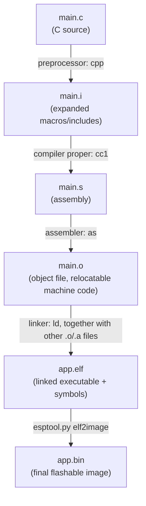

# How does a machine know C?

Obviously, a machine or more specifically, a CPU/MCU doesn't even know what C is. A machine only understands memory addresses, registers, and binary machine instructions (opcodes). So how do we get from a human readable C program to a *machine code* mesh of bits and addresses?

## Introduction.

Let's start with a simple example of a led turn on code for a esp32 mcu:

```c
#include "driver/gpio.h"

void app_main(void)
{
    gpio_reset_pin(GPIO_NUM_1);
    gpio_set_direction(GPIO_NUM_1, GPIO_MODE_OUTPUT);
    gpio_set_level(GPIO_NUM_1, 1);
    while(1){}
}
```

The project structure should be something like:

```
prj/
|-CMakeLists.txt
|-sdkconfig
|-build/
|-main/
|   |-CMakeLists.txt
|   |-main.c
```

- **CMakeLists.txt** (root): registers the project with the ESP-IDF build system and declares which components/directories (like `main/`) are part of it.
- **sdkconfig**: generated configuration file holding the project's build-time settings (chip target, partition table, driver options, etc.), usually produced by `idf.py menuconfig`.
- **build/**: output directory created by the build system; holds intermediate object files, the final binary, and other generated artifacts. Not meant to be edited by hand or committed to version control.
- **main/**: the default component containing the application's source code.
- **main/CMakeLists.txt**: registers the source files and include directories for the `main` component.
- **main/main.c**: the entry point of the application, containing `app_main()`.

To compile a C program for an esp32 target you must use Espressif's toolchain, ESP-IDF. The `idf.py` tool is a Python wrapper that internally launches:

- **CMake**: generates the actual build files (for Ninja, in this case) from the `CMakeLists.txt` files in the project.
- **Ninja**: the build system that runs the compilation and linking steps described by the files CMake generated.
- **xtensa-esp32-elf-gcc**: the cross-compiler that turns the C source into machine code for the target's architecture. The original esp32 uses the Xtensa architecture, so this is the Xtensa-targeted GCC; newer RISC-V-based chips (esp32-c3, esp32-c6, esp32-h2) instead use `riscv32-esp-elf-gcc`.
- **esptool.py**: flashes the compiled binary onto the chip over serial (UART/USB), and can also read/erase flash memory.

Here's how a `.c` file turns into the final `.bin` that gets flashed to the chip, and which intermediate file each step produces:



`xtensa-esp32-elf-gcc` (or `riscv32-esp-elf-gcc`) is actually a driver that invokes the preprocessor, compiler, and assembler steps in sequence — CMake/Ninja just orchestrate calling it (and the linker) for every source file in the project.

## From a .c to a .bin step by step.

As I've mentioned earlier, the tool that does all the hard work here is the core-specific gcc, commonly known as the compiler. Depending on the core you are targeting, you must compile differently — it sounds quite obvious, but the opcodes are not the same across all cores out there, even though RISC-V is gaining quite a bit of popularity recently. From core to core, addresses and memory maps also change, and you must specify that too. I'll use the following gcc example:
```
riscv32-esp-elf-gcc
```
This triple breaks down as `<architecture>-<vendor>-<abi>`: `riscv32` is a 32-bit RISC-V core, `esp` is Espressif (the vendor), and `elf` means the target is bare-metal (no OS) using the ELF format as its object/ABI convention — it's not saying "we're producing a .elf" directly, though in practice that's exactly what this toolchain outputs. This last part, "abi", is a little confusing — it's easy to mix up with API, but they're different things. The ABI (Application *Binary* Interface) doesn't tell the compiler which API to link against; it defines the low-level binary conventions for how compiled code talks to the system: calling convention (which registers/stack slots hold arguments, which registers are caller/callee-saved), the size and alignment of data types and structs, and how syscalls are made. If you target the wrong ABI (say, `gnueabihf` vs `gnueabi`, or glibc vs musl), your binary won't be binary-compatible with the precompiled libraries it needs to link against (libc, libgcc, the kernel) — you'll get link errors, or worse, silent memory corruption from mismatched struct layouts. This doesn't mean you'd have to recompile the whole OS to fix it, though; in bare-metal targets like this one (`elf`/`eabi`, no OS), there's simply no OS to link against — you supply your own minimal runtime instead (crt0, syscall stubs like newlib's "nosys", etc.).

Although this single command triggers several steps worth going through, in order to get from our "simple" .c to a fairly complex .bin.

### .i — Preprocessor.

This is the first intermediate step the compiler takes toward generating the .bin. To see the .i for ourselves, we can run:

```
riscv32-esp-elf-gcc -E main.c -o main.i
```

The `.i` file is the result of this preprocessing step. The output is still C, but with every preprocessor directive applied and resolved: every `#include` is textually pasted in place, and every `#define` macro is expanded. In practice this generates a gigantic C-like file, often thousands of lines long, since it also inlines every driver and FreeRTOS header transitively used by our project.

Here's a shortened, illustrative excerpt of what `main.i` would look like for our GPIO example (the real file would be far longer — this only shows the parts relevant to our code):

```c
# 1 "main.c"
# 1 "<built-in>"
# 1 "<command-line>"
# 1 "main.c"
# 1 ".../esp-idf/components/driver/include/driver/gpio.h" 1
# 1 ".../esp-idf/components/hal/include/hal/gpio_types.h" 1
typedef enum {
    GPIO_NUM_NC = -1,
    GPIO_NUM_0 = 0,
    GPIO_NUM_1 = 1,
    /* ... */
    GPIO_NUM_MAX,
} gpio_num_t;

typedef enum {
    GPIO_MODE_DISABLE = 0,
    GPIO_MODE_INPUT = 1,
    GPIO_MODE_OUTPUT = 2,
    /* ... */
} gpio_mode_t;
# 2 "main.c" 2

void app_main(void)
{
    gpio_reset_pin(GPIO_NUM_1);
    gpio_set_direction(GPIO_NUM_1, GPIO_MODE_OUTPUT);
    gpio_set_level(GPIO_NUM_1, 1);
    while(1){}
}
```

Note the `# <line> "<file>" <flags>` markers — these are the preprocessor's way of telling the next stages (and your debugger later on) "these lines came from this original file, at this line number", even though everything now lives in one flat `.i` file. Our own `app_main` code shows up untouched at the very end, after every header it depended on has been expanded above it.

### .s — Assembly code.

To see the `.s` for ourselves, we can run:

```
riscv32-esp-elf-gcc -S main.c -o main.s
```

The `.s` file is the `.i` C code translated into assembly for the target architecture. This is the step where "compiling" happens in the strict sense: the compiler proper (`cc1`, invoked internally by gcc) parses the preprocessed C, builds an intermediate representation, and emits assembly mnemonics for the target ISA. A `.s` file typically contains:

- Assembly instructions (mnemonics like `li`, `sw`, `call`, `jal`, `ret`, etc. on RISC-V)
- Section directives: `.text` (code), `.data` (initialized globals), `.bss` (zero-initialized globals), `.rodata` (read-only/const data)
- Labels marking function and symbol boundaries (e.g. `app_main:`)
- Assembler directives (`.global`, `.align`, `.size`, ...) — metadata for the next stage, the assembler

This is also the stage where most compiler optimizations happen (constant folding, dead code elimination, register allocation, inlining, ...) — passing `-O0` vs `-O2` to gcc will produce noticeably different `.s` output from the same `.i` input.

Here's a simplified, illustrative example of what `app_main`'s assembly might look like on RISC-V (an unoptimized build would keep every call explicit like this; a real one would also include stack alignment and ABI-mandated prologue/epilogue details omitted here for clarity):

```asm
	.file	"main.c"
	.option nopic
	.text
	.align	1
	.globl	app_main
	.type	app_main, @function
app_main:
	addi	sp,sp,-16
	sw	ra,12(sp)
	li	a0,1                # GPIO_NUM_1
	call	gpio_reset_pin
	li	a0,1                # GPIO_NUM_1
	li	a1,2                # GPIO_MODE_OUTPUT
	call	gpio_set_direction
	li	a0,1                # GPIO_NUM_1
	li	a1,1                # level = 1
	call	gpio_set_level
.L_loop:
	j	.L_loop
	.size	app_main, .-app_main
```

### .o — Relocatable machine code

To see the `.o` for ourselves, we can run:

```
riscv32-esp-elf-gcc -c main.s -o main.o
```

Basically, a `.o` file is the result of the assembler (`as`) translating the `.s` assembly into actual machine code (opcodes). A `.o` is essentially a relocatable ELF file — not an executable yet, but a piece of one.

It contains:

- `.text` — the machine code itself (the opcodes)
- `.data` — initialized global/static variables
- `.bss` — uninitialized (zero-initialized) global/static variables; this takes no space in the file itself, just a recorded size, since it's zeroed out at load time rather than stored
- `.rodata` — read-only data (string literals, `const` values)
- `.symtab` / `.strtab` — the symbol table and its string table, listing every function/variable this file defines and every one it references but doesn't define
- `.rela.text` — relocation entries: a list of "holes" left in `.text` wherever the code calls something (like `gpio_reset_pin`) that isn't defined in this file

That last point is the key to why it's called *relocatable*: `main.o` doesn't know the real address of `gpio_reset_pin`, `gpio_set_direction`, etc. — those live in the driver component's own `.o` file, not yet linked in. So instead of a real address, the assembler leaves a placeholder (typically `0`) plus a relocation entry telling the linker "patch this instruction with the real address of this symbol once you've figured out where everything lives." That's exactly the job of the next step, the linker — a `.o` on its own is missing addresses it needs to actually run.

Here's what disassembling our `main.o` looks like (via `riscv32-esp-elf-objdump -d -r main.o`), showing the placeholder addresses and relocations left for the linker:

```
main.o:     file format elf32-littleriscv

Disassembly of section .text:

00000000 <app_main>:
   0:	fe010113          	addi	sp,sp,-32
   4:	00112e23          	sw	ra,28(sp)
   8:	00100513          	li	a0,1
   c:	00000097          	auipc	ra,0x0
  10:	000080e7          	jalr	ra
			c: R_RISCV_CALL	gpio_reset_pin
  14:	00100513          	li	a0,1
  18:	00200593          	li	a1,2
  1c:	00000097          	auipc	ra,0x0
  20:	000080e7          	jalr	ra
			1c: R_RISCV_CALL	gpio_set_direction
  24:	00100513          	li	a0,1
  28:	00100593          	li	a1,1
  2c:	00000097          	auipc	ra,0x0
  30:	000080e7          	jalr	ra
			2c: R_RISCV_CALL	gpio_set_level
  34:	0000006f          	j	0x34 <app_main+0x34>
```

Note the `auipc ra,0x0` / `jalr` pairs: the address is `0x0`, a placeholder — it isn't real yet. The line right below each one (`R_RISCV_CALL gpio_reset_pin`, etc.) is the relocation entry that tells the linker exactly which instruction to patch and with which symbol's address, once linking resolves it.

### .elf — Executable and Linkable Format

This is roughly what CMake/Ninja run under the hood to produce it (simplified — in practice there are many more .o/.a inputs and a linker script):

```
riscv32-esp-elf-gcc main.o driver.o freertos.a ... -T esp32.ld -o app.elf
```

The `-T` flag points to the **linker script** (a `.ld` file): a text file describing the target chip's memory layout — where FLASH starts, where RAM starts, how big each region is, and which sections should end up where. This is how the linker knows to place `.text`/`.rodata` in flash and `.data`/`.bss` in RAM.

For a normal project, in which we'd like to generate an executable, the linker takes all the previously generated `.o` files (plus any static libraries, `.a`), resolves every symbol reference between them — following the relocation entries we saw in the `.o` step — and assigns final, absolute memory addresses for the whole project.

Conceptually, once the process is finished, something like this is the result:

```
FLASH (0x40000000)
|- .text     (code)
|- .rodata   (constants)

RAM (0x3FFB0000)
|- .data     (initialized variables)
|- .bss      (uninitialized variables)
|- Heap
|- Stack
```

(exact addresses vary by chip and are defined by the linker script — these are just illustrative.)

The linker assigns definitive memory addresses:
- Before -> `.o` -> `app_main()` lives at an *offset*, e.g. `0x20` (relative to the start of `.text` in that one file)
- After -> `.elf` -> `app_main()` lives at a *real* address, e.g. `0x40001234` (its final position in flash, once every `.o` has been merged together)

The `.elf` contains:

- **ELF header** — identifies the target architecture, endianness, and the entry point address (where execution starts; for ESP-IDF this is the reset/startup code, not `app_main` directly — `app_main` is only called later, once FreeRTOS has initialized)
- **Section headers & merged sections** — the same kinds of sections we saw in `.o` (`.text`, `.data`, `.bss`, `.rodata`, ...), now merged from every input file and placed at their final addresses
- **Program headers (segments)** — describe how sections are grouped for loading into memory; `esptool.py` uses these to know what actually needs to be written into the flash image
- **Symbol table (`.symtab`)** — every symbol now has a resolved, absolute address; the relocations from the `.o` stage have all been applied
- **Debug info (`.debug_*`)** — present if compiled with `-g`; maps addresses back to source lines and variable names, so tools like `gdb` or OpenOCD can do source-level debugging

Unlike `main.o`, `app.elf` is (almost) ready to run — the last step is that flash chips don't understand ELF directly, so `esptool.py` extracts just the loadable parts of the `.elf` and repackages them into the flat `app.bin` image that actually gets written to flash.
