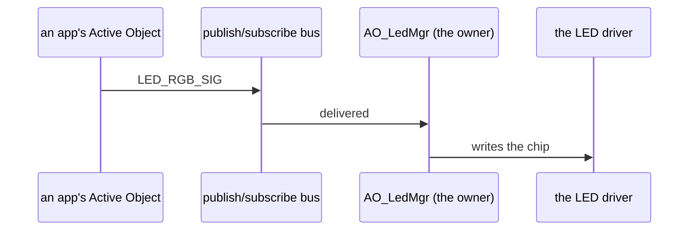

# Kode SDK

What every Kode Dot firmware is written against, [kodeOS](kodeos.md) included.

- **My role:** firmware.
- **What it is:** the drivers for every chip on the board, the Active Objects that own them, the QP/C runtime underneath, a UI kit, and one header, `kode.h`, that hides the lot.
- **Built with:** C (MISRA C, Doxygen), ESP-IDF, QP/C, FreeRTOS, LVGL.

## What it is.

A Kode Dot app starts like this:

```c
#include "kode.h"

void app_main(void)
{
    kode_init();                 /* the board, the runtime and every device owner */
    kode_led_rgb(0, 255, 0);     /* asks the LED's owner, never the chip          */
    kode_delay_ms(1000);
    kode_exit_to_os();           /* back to kodeOS                                */
}
```

The SDK arrives as one dependency line in the project's `idf_component.yml`, plus a second for the UI kit when the app draws, and the ESP-IDF component manager fetches every component behind them at the same version. kodeOS and an app use exactly the same SDK: kodeOS's own launcher reaches the system through the same door an app does.

## How it is put together.

The SDK is a stack of layers, each with one job, and a script checks that no file reaches past its own:

| Layer | What it holds |
| --- | --- |
| `kode` | The facade: `kode_init()` and everything an app calls. |
| `kaos` | Every Active Object: one owner per device, and the console. |
| `kdrv` | One driver per chip, each wrapping ESP-IDF or a registry component. |
| `khal` | What several drivers share: the I²C bus, the console transport, time. |
| `kbsp` | The board: pins, addresses, geometry, power rails. It describes and never acts. |
| `kqp` | The QP/C runtime's signals, event pools and priorities. |
| `klog` | Logging, including a path that still works inside a crash. |
| `kui` | The optional UI kit on LVGL: design tokens, styles and components. |

Below `kdrv` there is no layer of ours: ESP-IDF already is the hardware abstraction, and where a component exists it is wrapped, not rewritten. Where a new file belongs is not a matter of taste either: a file that knows a pin goes in `kbsp`, one that knows a part number goes in `kdrv`, and one that decides *when* something happens goes in `kaos`.

**Ask the owner, by event.** Each device has exactly one owning Active Object, and everything else, the OS or an app, asks it through the publish/subscribe bus. An interrupt is an event too. Events carry copies, never pointers into somebody else's tables:



**An Active Object never blocks.** Long work is cut into short steps, and the calls that do wait, such as a ping or an HTTP GET, are for a task of the app's own. That is what keeps the console and the screen responsive while an app downloads a file.

**Apps talk to the console too.** An app registers variables and functions by name, and a host reads, writes, watches and calls them over USB-C or BLE without the app writing any protocol code.

**Starting points.** Working example projects, one per thing an app does (buttons and the LED, storage, audio, motion, haptics, NFC, RFID, infrared, networking, MQTT, drawing on the screen), and an Arduino board definition: a sketch built for the Kode Dot installs itself as a kodeOS app. The pure logic is covered by host tests (Unity and CMock) that run in CI.
