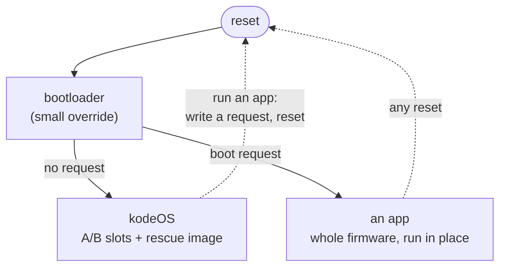

# kodeOS

The operating system of the **Kode Dot**, a handheld built around an ESP32-P4.

- **My role:** firmware.
- **Hardware:** ESP32-P4 (dual RISC-V at 400 MHz), 32 MB flash, 32 MB PSRAM, a 410x502 AMOLED with capacitive touch, audio, an IMU, haptics, NFC, 125 kHz RFID, microSD, and an ESP32-C5 radio coprocessor for Wi-Fi 6 and BLE.
- **Built with:** C, ESP-IDF, QP/C, FreeRTOS, LVGL, and Python for the host tools.

## What it is.

kodeOS is what the Kode Dot boots into. It shows a launcher on the screen, installs and runs apps, updates itself, and exposes the whole board to a host computer through a console. It is built on the [Kode SDK](kode_sdk.md): kodeOS is one consumer of the SDK, and every app is another, with nothing kodeOS may do that an app may not.

## How it is put together.

**Active Objects, not threads that share state.** kodeOS runs on QP/C: every part of the system is an Active Object, a hierarchical state machine with its own event queue and its own FreeRTOS priority. Every device on the board has exactly one owning Active Object, and everything else asks that owner by event. Nobody calls into somebody else's device, so there are no locks around hardware and no two paths to the same chip.

**Apps are whole firmwares.** An app is not a plugin loaded into kodeOS. It is a complete firmware image, with its own copy of the runtime, installed into a dedicated region of the flash and booted in place by a small bootloader override. Coming home is not the app's job: any reset, whether the button, a crash or a watchdog, returns to kodeOS without the app cooperating.

**Three ways in.**

- **The screen:** a launcher of apps grouped by category, with settings for sleep, sound and vibration.
- **The console:** a machine-first line protocol over USB-C or BLE, the same grammar on both. It is how a host program drives the board: installing apps, updating kodeOS and the radio coprocessor, taking screenshots, mirroring the screen live with remote touch, and reading every chip's registers.
- **The flash:** two kodeOS slots that update each other, a rescue image, the apps region, and a mailbox any host can write with a single `esptool` call. Arduino sketches arrive that way.

**Two firmwares, one product.** The ESP32-P4 has no radio, so Wi-Fi and BLE live on an ESP32-C5 running firmware of our own, reached over SDIO through ESP-Hosted. The TCP/IP stack runs on the P4, so the network code is the same code it would be on a chip with a radio. The C5 also serves the infrared transceiver. [What is ESP-Hosted and how does it work?](../notes/embedded-systems/what_is_esp_hosted_and_how_does_work.md) explains the mechanism.

**A production test in one command.** `test component=all` on the console checks every part of the board in turn, each check with a time budget. The things no chip can judge, such as the colour of the LED, the panel and the buttons, are answered by the operator on the board's own buttons.
